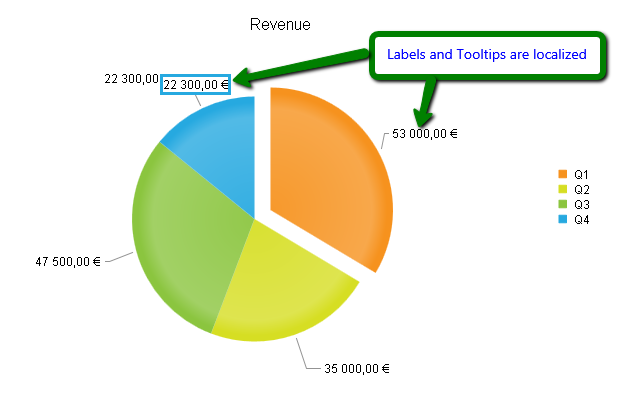

# Localization


Telerik makes it easy to localize __RadHtmlChart__. Some chart elements have custom strings that youlocalize before you pass them to the control and some text can be localized by using the KendoUI framework. ThisHelp article will show you how to use the KendoUI framework (__Example 1__) to create thelocalized __PieSeries__ shown in __Figure 1__.	__RadHtmlChart__ can use KendoUI framework localizations and in order to set a certain culture,you should follow the steps that are listed [here](http://docs.kendoui.com/getting-started/framework/globalization/overview). Here is a summary of the steps:

1. Add a reference in your page to the desired culture file. (You can find the KendoUI Culture files	in the "__js/cultures__" folder located in the root of the archive. You can download KendoUI from [this page](http://www.kendoui.com/download.aspx).)

>caution When using an external script the KendoUI culture script must be declared before setting the culture of the kendo object.
>


1. Set the desired culture through the kendo object.

1. Apply the desired numeric format either in the __DataFormatString__ property or in the __kendo.format()__ method when using templates. You can see an example on this regard in the [Format Numbers]()help article.

>important 
*  __ChartTitle__ , __XAxis.Title__ / __YAxis.Title__ , __Series.Names__ and text in categorical __Axes' Items__ are custom strings that developers pass to the chart and arenot localized by the control.
* Labels and tooltips of __SeriesItems__ , and labels of numeric or date axes can be localized by the KendoUI framework.>


## Example of a Localized Chart

You can see in __Example 1__ and __Figure 1__, an example of a localized __PieSeries RadHtmlChart__.

__Example 1__: Use the KendoUI framework JavaScript culture files to localize the labels and tooltips of a Pie chart.

````ASPNET
	    <script type="text/javascript" src="kendo/js/cultures/kendo.culture.fr-FR.min.js"></script>
	    <script type="text/javascript">
	        kendo.culture("fr-FR");
	    </script>
	    <!--Where "fr-FR" is the desired culture-->
	    <asp:ScriptManager runat="server" ID="ScriptManager1">
	    </asp:ScriptManager>
	    <telerik:RadHtmlChart runat="server" ID="RadHtmlChart1" Height="400px" Width="400px">
	        <PlotArea>
	            <Series>
	                <telerik:PieSeries>
	                    <SeriesItems>
	                        <telerik:PieSeriesItem Exploded="true" Y="53000" Name="Q1" />
	                        <telerik:PieSeriesItem Exploded="false" Y="35000" Name="Q2" />
	                        <telerik:PieSeriesItem Exploded="false" Y="47500" Name="Q3" />
	                        <telerik:PieSeriesItem Exploded="false" Y="22300" Name="Q4" />
	                    </SeriesItems>
	                    <LabelsAppearance DataFormatString="C">
	                    </LabelsAppearance>
	                    <TooltipsAppearance DataFormatString="C"></TooltipsAppearance>
	                </telerik:PieSeries>
	            </Series>
	            <YAxis>
	            </YAxis>
	        </PlotArea>
	        <ChartTitle Text="Revenue">
	        </ChartTitle>
	    </telerik:RadHtmlChart>
````


>caption Figure 1: Localized labels and tooltips using the KendoUI framework.



__Figure 1__ shows a Pie chart localized from the default culture of the page: "en-US" to "fr-FR" culture.The format of the indicated labels and tooltips has been changed from$22,300.00 and $53,000.00 to 22 300,00 € and 53 000,00 €.

# See Also

 * [KendoUI Get Kendo UI](http://www.kendoui.com/download.aspx)

 * [KendoUI Kendo Globalization Overview](http://docs.kendoui.com/getting-started/framework/globalization/overview)

 * [KendoUI Number Formatting](http://docs.kendoui.com/getting-started/framework/globalization/numberformatting)

 * [RadHtmlChart Formatting Numbers]()
