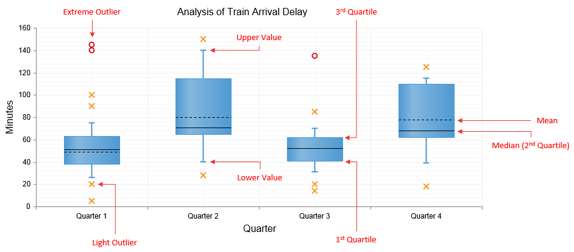

# Box Plot Chart


## 

A Box Plot chart depicts graphically numerical data by displaying a data distribution summary with six indicators(i.e., lower value, first quartile, median, mean, third quartile, upper value) and outliers for each set of data.

A single Box Plot __SeriesItem__ (__Figure 1__) consists of __Box__,__Whiskers__ and __Outliers__ elements. You can find a brief description of each element below.

__Box__ - the wide part of the __BoxPlotSeriesItem__ represents:

* 1st Quartile as the bottom of the box.

* Mean as the dotted line inside the box.

* Median (i.e., 2nd Quartile) as the solid line inside the box.

* 3rd Quartile as the top of the box.

__Whiskers__ - the long thin lines located above and below the box that represent the__Upper__ and __Lower__ values. The top of the upper whisker represents the__Upper__ value while the bottom of the lower whisker represents the __Lower__ value.

__Outliers__ - The data that is not included between the whiskers is considered as light and extremeoutliers that can be displayed as __Circle__ (default shape for extreme outliers),__Cross__ (default shape for light outliers), __Square__or __Triangle__ shapes.
>caption Figure 1: Describing the elements of Box Plot chart's SeriesItems.



You can customize the Box Plot Chart:

* The color of the __BoxPlotSeriesItem__ of each series is controlled via the __BackgroundColor__property of the __BoxPlotSeries -> Appearance -> FillStyle__ inner tag for a declaratively/programmatically created chart.For a data bound chart, you can use the __ColorField__ property.

* The name that is shown in the legend is chosen via the __Name__ property of the __BoxPlotSeries__.

* Lower value, first quartile, median, third quartile, upper value, mean and outliers of each item are controlled respectively by:

* __Lower__, __Q1__, __Median__, __Q3__,__Upper__ and __Mean__ properties and __Outliers__ collectionof the __BoxPlotSeriesItem__ object for a declaratively/programmatically created chart.

* __DataLowerField__, __DataQ1Field__, __DataMedianField__,__DataQ3Field__, __DataUpperField__, __DataMeanField__ and__DataOutliersField__ properties of the __BoxPlotSeries__ for a data bound chart.

>note The __DataOutliersField__ property must reference a	data source field that contains an array of decimal numbers.
>


* You can customize the __Outliers__' appearance:

* The shape and background color is controlled via __MarkersType__ and __BackgroundColor__properties exposed by the __OutliersAppearance__ and __ExtremesAppearance__ elementsfor light and extreme outliers, respectively.

* The width and color of the border is controlled via __BorderAppearance.Color__ and__BorderAppearance.Width__properties exposed by __OutliersAppearance__ and __ExtremesAppearance__ elementsfor light and extreme outliers, respectively.

* Each item can have a tooltip with an already predefined pattern by design. You can modify the tooltip pattern through the__DataFormatString__ property of the __TooltipsAppearance__ sections of theseries. The format string uses the__Lower__, __Q1__, __Median__, __Q3__,__Upper__, __Mean__ and the corresponding __x-axis item's value__.*(Series Labels in BoxPlotSeries are not supported.)*

* The axes are also fully customizable - they automatically adjust their scale to accommodate the data that comes in and forfiner tuning, there are numerous properties that can change each aspect:

* Directly in the axis tag you can use its properties to control color, major and minor tick types and sizes,minimal and maximal values for the y-axis (plus a step size) whereas the x-axis requires a set of items to matchthe number of __SeriesItems__ the series have. This is also the place where the crossing value with the other axiscan be set (the index of an item for an item axis) and whether the axis will be reversed.

* The inner tags of the axis tag can control the major and minor grid lines in terms of color and sizeand the labels can have a __DataFormatString__, position and visibility set through each inner tag's properties.

* The title, background colors and legend are controlled via the inner properties of the __RadHtmlChart__ control and are common for all charts.You can find more information in the [Server-side API]()and in the [Element structure]() articles.

The chart in __Figure 1__ is created with the code in __Example 1__.

>tip Not all properties are necessary; the __RadHtmlChart__ will match the axes to the values if you do not declare explicit values, steps and tick properties (although the __Items__ for axes that need them are necessary).
>


__Example 1__: The markup that creates the Box Plot chart in __Figure 1__.

````ASPNET
		<telerik:RadHtmlChart runat="server" ID="BoxPlotChart" Width="800px" Height="400px">
			<ChartTitle Text="Analysis of Train Arrival Delay"></ChartTitle>
			<PlotArea>
				<Series>
					<telerik:BoxPlotSeries>
						<SeriesItems>
							<telerik:BoxPlotSeriesItem Lower="26" Q1="38" Median="51" Q3="63" Upper="75" Mean="49">
								<Outliers>
									<telerik:Outlier Value="20" />
									<telerik:Outlier Value="140" />
									<telerik:Outlier Value="145" />
									<telerik:Outlier Value="5" />
									<telerik:Outlier Value="90" />
									<telerik:Outlier Value="100" />
								</Outliers>
							</telerik:BoxPlotSeriesItem>
							<telerik:BoxPlotSeriesItem Lower="40" Q1="65" Median="71" Q3="115" Upper="140" Mean="80">
								<Outliers>
									<telerik:Outlier Value="150" />
									<telerik:Outlier Value="28" />
								</Outliers>
							</telerik:BoxPlotSeriesItem>
							<telerik:BoxPlotSeriesItem Lower="31" Q1="41" Median="52" Q3="62" Upper="70" Mean="52">
								<Outliers>
									<telerik:Outlier Value="14" />
									<telerik:Outlier Value="20" />
									<telerik:Outlier Value="85" />
									<telerik:Outlier Value="135" />
								</Outliers>
							</telerik:BoxPlotSeriesItem>
							<telerik:BoxPlotSeriesItem Lower="39" Q1="62" Median="68" Q3="110" Upper="115" Mean="78">
								<Outliers>
									<telerik:Outlier Value="125" />
									<telerik:Outlier Value="18" />
								</Outliers>
							</telerik:BoxPlotSeriesItem>
						</SeriesItems>
						<OutliersAppearance MarkersType="Cross">
							<BorderAppearance Color="#fa9819" />
						</OutliersAppearance>
						<ExtremesAppearance MarkersType="Circle">
							<BorderAppearance Color="#d41414" />
						</ExtremesAppearance>
						<Appearance FillStyle-BackgroundColor="#4f99d2"></Appearance>
						<TooltipsAppearance Visible="false"></TooltipsAppearance>
					</telerik:BoxPlotSeries>
				</Series>
				<YAxis>
					<TitleAppearance Text="Minutes"></TitleAppearance>
					<MajorGridLines Color="#EFEFEF" Width="1"></MajorGridLines>
					<MinorGridLines Color="#F7F7F7" Width="1"></MinorGridLines>
				</YAxis>
				<XAxis>
					<TitleAppearance Text="Quarter">
					</TitleAppearance>
					<MajorGridLines Color="#EFEFEF" Width="1"></MajorGridLines>
					<MinorGridLines Color="#F7F7F7" Width="1"></MinorGridLines>
					<Items>
						<telerik:AxisItem LabelText="Quarter 1" />
						<telerik:AxisItem LabelText="Quarter 2" />
						<telerik:AxisItem LabelText="Quarter 3" />
						<telerik:AxisItem LabelText="Quarter 4" />
					</Items>
				</XAxis>
			</PlotArea>
		</telerik:RadHtmlChart>
````


# See Also

 * [Choose a Data Source for Your RadHtmlChart:]()

 * [- Configuration Wizard]()

 * [- SqlDataSource]()

 * [- LinqDataSource]()

 * [- EntityDataSource]()

 * [- ObjectDataSource]()

 * [- XmlDataSource]()

 * [- Generic List]()

 * [- DataSet]()

 * [- Array]()

 * [RadHtmlChart Element Structure]()

 * [RadHtmlChart Server-side API overview]()
