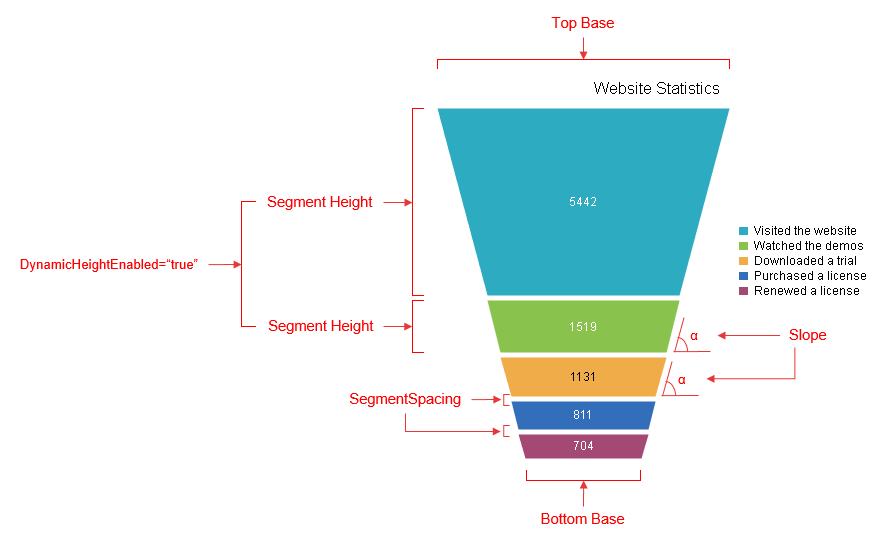
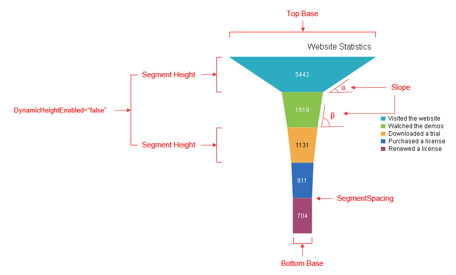

# Funnel Chart


## 

A Funnel chart displays a single series of data in progressively decreasing or increasing proportions, organized in segments, where each segment represents the value for the particularitem from the series. The items' values can also influence the height and the shape of the corresponding segments.

Funnel charts are usually used to represent stages in a sales process (e.g., show the amount of potential revenue for each stage);identify a potential problematic areas in any company's process; visualize website visitors trends, etc. This chart type is well suited for displaying several values.

The Funnel series has several properties that control the way a chart's segments are rendered.

* __SegmentSpacing__ - The property specifies the space between the different segments of the funnel chart in pixels.

* __DynamicHeightEnabled__ - A Boolean property thatindicates whether all the segments will share the same size (when __DynamicHeightEnabled__="__false__") orthe height of each segment is determined according to its value (when __DynamicHeightEnabled__="__true__").Default value is __true__.

* __NeckRatio__ - The property specifies the ratio between the top and the bottom bases of the whole funnel series. The propertycan take effect only if the __DynamicSlopeEnabled__ property is set to "__false__" (see the next line).

* __DynamicSlopeEnabled__ - A Boolean property that indicates whether the form of each segment will be based on the ratiobetween the value from the current and the next segment. Default value is __false__.

>note If the __DynamicSlopeEnabled__ property is set to __true__ , __NeckRatio__ property is neglected.
>


The code in __Example 1__ will showyou how to build a __FunnelSeries__ that has its__NeckRatio__ and __SegmentSpacing__ properties set (__Figure 1__), while __DynamicHeightEnabled__ is enabled.

The code in __Example 2__ will showyou how to build a __FunnelSeries__ that has its__DynamicSlopeEnabled__ property enabled (__Figure 2__), while __DynamicHeightEnabled__ is disabled.
>caption Figure 1: Display a Funnel chart that has its bottom base four times smaller than its top base and five pixels space between all segments. The code in	Example 1 shows this setup.



Example 1: Creating a __FunnelSeries__ that has its__NeckRatio__ and __SegmentSpacing__ properties set while __DynamicHeightEnabled__ is enabled.

````ASPNET
		<telerik:RadHtmlChart runat="server" ID="FunnelChart1" Width="450" Height="400" Skin="Silk">
			<PlotArea>
				<Series>
					<telerik:FunnelSeries DynamicSlopeEnabled="false" DynamicHeightEnabled="true" SegmentSpacing="5" NeckRatio="0.4">
						<SeriesItems>
							<telerik:FunnelSeriesItem Y="5442" Name="Visited the website" />
							<telerik:FunnelSeriesItem Y="1519" Name="Watched the demos" />
							<telerik:FunnelSeriesItem Y="1131" Name="Downloaded a trial" />
							<telerik:FunnelSeriesItem Y="811" Name="Purchased a license" />
							<telerik:FunnelSeriesItem Y="704" Name="Renewed a license" />
						</SeriesItems>
					</telerik:FunnelSeries>
				</Series>
			</PlotArea>
			<ChartTitle Text="Website Statistics">
			</ChartTitle>
		</telerik:RadHtmlChart>
````


>caption Figure 2: Illustrates how the widths of the bases for each segment are based on the ratio currentValue/nextValue. The code in	Example 2 shows this setup.



Example 2: Creating a __FunnelSeries__ that has its__DynamicSlopeEnabled__ property enabled while __DynamicHeightEnabled__ is disabled.

````ASPNET
		<telerik:RadHtmlChart runat="server" ID="FunnelChart2" Width="450" Height="400" Skin="Silk">
			<PlotArea>
				<Series>
					<telerik:FunnelSeries DynamicHeightEnabled="false" DynamicSlopeEnabled="true">
						<SeriesItems>
							<telerik:FunnelSeriesItem Y="5442" Name="Visited the website" />
							<telerik:FunnelSeriesItem Y="1519" Name="Watched the demos" />
							<telerik:FunnelSeriesItem Y="1131" Name="Downloaded a trial" />
							<telerik:FunnelSeriesItem Y="811" Name="Purchased a license" />
							<telerik:FunnelSeriesItem Y="704" Name="Renewed a license" />
						</SeriesItems>
					</telerik:FunnelSeries>
				</Series>
			</PlotArea>
			<ChartTitle Text="Website Statistics">
			</ChartTitle>
			</telerik:RadHtmlChart>
````


# See Also

 * [Choose a Data Source for Your RadHtmlChart:]()

 * [- Configuration Wizard]()

 * [- SqlDataSource]()

 * [- LinqDataSource]()

 * [- EntityDataSource]()

 * [- ObjectDataSource]()

 * [- XmlDataSource]()

 * [- Generic List]()

 * [- DataSet]()

 * [- Array]()

 * [RadHtmlChart Element Structure]()

 * [RadHtmlChart Server-side API Overview]()
