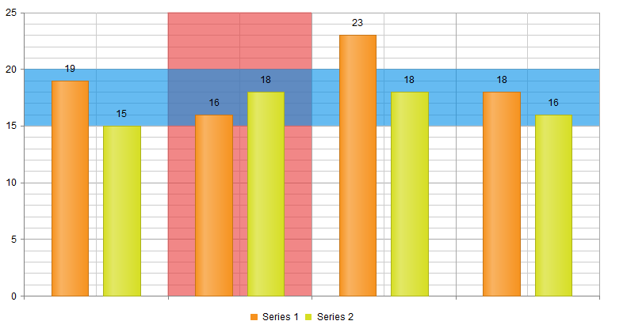

# Plot Bands

**Plot Bands** are colored ranges in **RadHtmlChart**, the purpose of which is to highlight areas of the chart by changing its background in a predefined axis range. Telerik introduced the plot bands in the Q1 2014 release.

The plot bands appear on the chart as colored areas that fill the entire space between two grid lines on the x-axis or on the y-axis.

You can set up such a range by creating **PlotBand** items and populating them in the **PlotBands** collection of the [axis element]() (XAxis and YAxis).

Each **PlotBand** item exposes four properties that allow you to specify how the colored area should be visualized:

* **From** - The starting grid line of the plot band on the X or Y axes.

* **To** - The ending grid line of the plot band on the X or Y axes.

* **Alpha** - The opacity of the plot band in range [0-255].

* **Color** - The color of the plot band.

The value of the properties **From** and **To** depends on the type of the chart:

* For the x-axis of categorical chart types (**Area**, **Bar**, **Column**, etc.), you need to set the index of the corresponding category.

* For numerical chart types (**Scatter**, **Scatter Line**, **Bubble**) and for the y-axis of categorical chart types, you need to set the actual value from the axis.
>caption Figure 1: A chart with two plot bands. The red band is on the x-axis and blue band is on the y-axis The code in Example 1 illustrates how to setup the chart.



>caption Example 1: Creating a chart that has two plot bands – one on the x-axis and one on the y-axis.

````ASP.NET
<telerik:RadHtmlChart ID="Chart" runat="server" Width="760px" Height="420px">
	<PlotArea>
		<XAxis>
			<PlotBands>
				<telerik:PlotBand From="1" To="2" Color="#e83737" Alpha="100" />
			</PlotBands>
		</XAxis>
		<YAxis>
			<PlotBands>
				<telerik:PlotBand From="15" To="20" Color="#008de7" Alpha="100" />
			</PlotBands>
		</YAxis>
		<Series>
			<telerik:ColumnSeries Name="Series 1">
				<SeriesItems>
					<telerik:CategorySeriesItem Y="19" />
					<telerik:CategorySeriesItem Y="16" />
					<telerik:CategorySeriesItem Y="23" />
					<telerik:CategorySeriesItem Y="18" />
				</SeriesItems>
			</telerik:ColumnSeries>
			<telerik:ColumnSeries Name="Series 2">
				<SeriesItems>
					<telerik:CategorySeriesItem Y="15" />
					<telerik:CategorySeriesItem Y="18" />
					<telerik:CategorySeriesItem Y="18" />
					<telerik:CategorySeriesItem Y="16" />
				</SeriesItems>
			</telerik:ColumnSeries>
		</Series>
	</PlotArea>
	<Legend>
		<Appearance Position="Bottom"></Appearance>
	</Legend>
</telerik:RadHtmlChart>
````


## See Also

 * [RadHtmlChart PlotBand Server-Side API](http://www.telerik.com/help/aspnet-ajax/t_telerik_web_ui_plotband.html)

 * [RadHtmlChart Configuring Axes]()

 * [RadHtmlChart AreaSeries]()

 * [RadHtmlChart BarSeries]()

 * [RadHtmlChart ColumnSeries]()

 * [RadHtmlChart ScatterSeries]()

 * [RadHtmlChart ScatterLineSeries]()

 * [RadHtmlChart BubbleSeries]()
