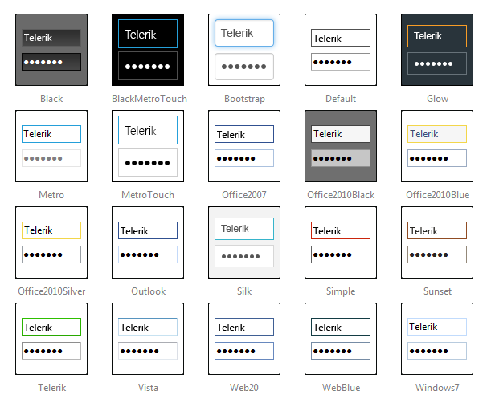

# Skins


The __RadInput__ controls use __skins__ to control their overall look-and-feel. A skin is a set of images and a *CSS**stylesheet *that can be applied to the control elements (textbox, buttons, label) and defines their look and feel. To apply a skin to a __RadInput__ control, set its __Skin__ property, either using the properties pane or the input control's [Smart Tag]().

The __RadInput__ controls are installed with a number of preset skins. These are shown below:



>note The __Hay__ , __Forest__ , __Sitefinity__ and __Transparent__ skins are obsolete and have been removed from the Telerik.Web.UI.Skins.dll assembly as of __Q1 2014__ .You can find more information on the matter in[this blog post](http://blogs.telerik.com/aspnet-ajax/posts/13-04-11/6-telerik-asp.net-ajax-skins-going-obsolete).
>


## Not using skins

If you do not set the __Skin__ property, the __RadInput__ control automatically uses the "*Default*" skin. If you do not want to use a skin with your __RadInput__ control, set its __Skin__ property to an empty string. If you also want to prevent the control's base stylesheet from registering, please set __EnableEmbeddedBaseStylesheet__ to __false__. The base stylesheet contains CSS styles, which are applied to the __RadInput__ control instances, regardless of their skin name, because these styles are the same for all skins. The RadInput base styles include alignment, border widths, paddings, etc.

When the input control is not skinned, its wrapper element class is rendered without the suffix "_[*SkinName*]" and the textbox element has no CSS class at all. The latter facilitates textbox styling with __RadFormDecorator__ or with some generic CSS styles from the web application. By default (when not skinned) the input element is rendered with border *2px* and padding *1px*. The default rendering of the input area has the style attribute "*width: 100%*" and is nested in a table cell. In *IE*, this causes the right border to be cut off. You can correct for this problem by setting padding-right to be twice the border (for both the left and the right side of the input). That is, you should set the "*padding-right: 6px*". The *CSS* class __RadInput__ is rendered to the input wrapper element, so you can apply the padding setting to it as shown below:

````ASPNET
	    <head runat="server">
	        <style type="text/css">
	            .RadInput, .RadInput table
	            {
	                padding-right: 6px;
	            }
	        </style>
	    </head>
	    <body class="body">
	        <form runat="server" id="mainForm" method="post">
	        <asp:ScriptManager ID="ScriptManager1" runat="server">
	        </asp:ScriptManager>
	        <telerik:RadTextBox ID="RadTextBox1" runat="server" EnableEmbeddedSkins="false" Skin="">
	        </telerik:RadTextBox>
	        </form>
	    </body>
````


## Customizing Skins

You can tweak the existing skins, or create your own. Each skin has two main elements: images and a stylesheet. When creating your own skin, it is a good idea to start with the stylesheet of an existing skin and alter that. See [Tutorial: Creating a Custom Skin]() for a step-by-step walk through. To use your own skin:

1. Add the new *CSS* file to your project.

1. Drag and drop the *CSS* file from the *Project Explorer* onto your *Web**page*.

1. Set the __EnableEmbeddedSkins__ property of the input control to __False__.

The RadInput base stylesheet is called __Input.css__ and is placed in the __...Skins/__ directory. The stylesheet for a __RadInput__ skin has the name __Input.[SkinName].css__ and can be found in the __...Skins/[SkinName]__ directory. The images are found in the __...Skins/[SkinName]/Input__ directory. For example, the stylesheet for the "*Black*" skin is called *Input.Black.css *and is located in the ...*Skins/Black* directory. The images are found in the ...*Skins/Black/Input *directory. The images are referenced by name from within the stylesheet.

For more information on the *CSS* File structure, see [Understanding the Skin CSS File]().

# See Also

 * [Styles]()
