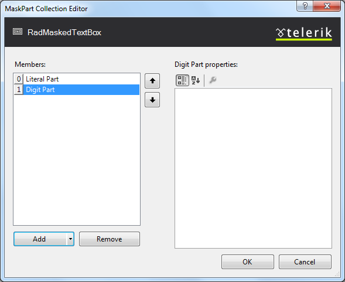

# MaskPart Collection Editor

## 

The __MaskPart Collection Editor__ lets you create and modify the masks that are the values of the __RadMaskedTextBox__ control's __Mask__ and __DisplayMask__ properties. You can display the MaskPart Collection Editor in two ways:

* From the __RadMaskedTextBox__ properties pane, click the ellipsis button next to the __MaskPart__ property. When you bring up the MaskPart Collection Editor in this way, the mask you create is assigned to the __Mask__ property, which controls the mask that is used when the user can edit the value.

* From the __RadMaskedTextBox__ properties pane, click the ellipsis button next to the __DisplayMaskPart__ property. When you bring up the MaskPart Collection Editor in this way, the mask you create is assigned to the __DisplayMask__ property, which controls the format of the value when the masked text box does not have focus.
>caption 

The __MaskPart Collection Editor__ lets you define an input mask by building it up out of its constituent parts.

* To add a new part to the mask, click the __Add__ button. Clicking the drop-down arrow on the Add button lets you choose the type of mask part to add next. The choices are

* __LiteralMaskPart__: A literal string that is included in the mask. When adding literal mask parts, set its __Text__ property to the string that is its value. The user is not required to enter literal mask parts.

* __DigitMaskPart__: A mask part where the user can enter a digit or space.

* __EnumerationMaskPart__: A mask part where the user must select one from a set of predefined options. When adding enumeration mask parts, set the mask part's __Items__ property to specify the enumerated values. When you click the ellipsis button next to the __Items__ property, the __String Collection Editor__ appears where you can enter the options.

* __NumericRangeMaskPart__: A mask part where the user must enter an integer between a specified minimum and maximum value (inclusive). When adding a numeric range mask part, use its __LowerLimit__ and __UpperLimit__ properties to specify the limits of the range.

* __LowerMaskPart__: A mask part where the user must enter a single lower-case letter. Only letters in the range __a..z__ are allowed (no extended characters).

* __UpperMaskPart__: A mask part where the user must enter a single upper-case letter. Only letters in the range __A..Z__ are allowed (no extended characters).

* __FreeMaskPart__: A mask part where the user can enter any text (including nothing at all).

* To remove a mask part, select the mask part and click the __Remove__ button.

* To rearrange the mask parts, select a mask part and click on the up or down button to change its position in the list.

# See Also

 * [Input Mask Dialog]()

 * [Masks]()
