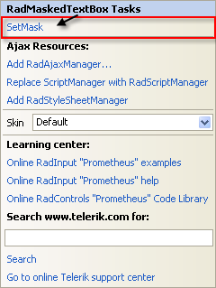
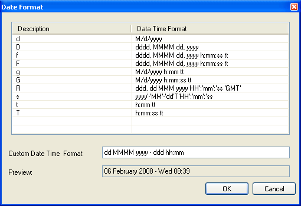
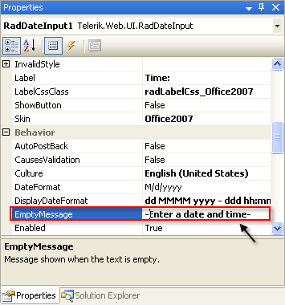
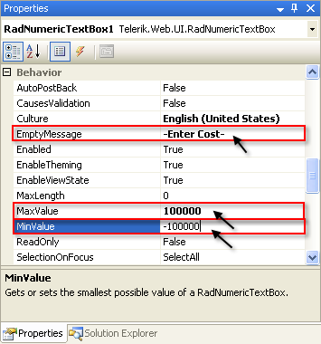

# Getting Started Overview

## 

This tutorial will walk you through creating a Web page that uses __RadInput__ controls. It shows how to:

* Use the four different RadInput controls (__RadTextBox__, __RadMaskedTextBox__, __RadDateInput__, and __RadNumericTextBox__).

* Apply a __Skin__ to customize the look and feel.

* Add labels to the input controls.

* Add messages to appear when nothing is entered.

* Customize the selection behavior when the control receives focus.

* Specify formats for display and editing.

* Specify maximum and minimum values.

1. Drag a __RadTextBox__ control from the toolbox onto your Web page. It's [Smart Tag]() should appear automatically.

1. In the __RadTextBox__ Smart Tag,

* Set the __Empty Message__ to "-Enter a name-". This message will appear in the text box when the user has not entered any text.

* Open the __Skin__ drop-down. It lets you preview the available skins and choose a skin to give the text box its general look-and-feel. Choose "Office2007".

1. In the designer, right-click the __RadTextBox__ control and choose __Properties__ from its context menu:

1. In the properties pane for the __RadTextBox__ control, set the __Label__ property to "Name:". Note that a label automatically appears in the __RadTextbox__ control.

1. In the __Behavior__ section of the properties pane, locate the __SelectionOnFocus__ property and change it to "SelectAll". This causes the entire text in the text box to become selected when focus moves to the text box so that it is replaced when the user starts typing. Other options move the caret to the beginning or end of the text box.

1. In the designer, type the enter key to add a line or two after the text box, and then drag a __RadMaskedTextBox__ control from the toolbox onto the design surface. It's Smart Tag should appear automatically.

1. In the __RadMaskedTextBox__ Smart Tag, click the link labelled __SetMask__:

1. The [Input Mask dialog]() appears. In the dialog, choose the mask for __Phone number__ hand click __OK__.

1. Choose the "Office2007" Skin in the Smart Tag so that the masked text box matches the other text box on your page.

1. In the designer, right-click on the __RadMaskedTextBox__ control and choose __Properties__ from its context menu.

1. In the properties pane, set the __Label__ property to "Phone:"

1. In the __Behavior__ section of the properties pane, set the __EmptyMessage__ property to "-Enter Phone Number-" and the __HideOnBlur__ property to __True__. Because the __Mask__ property is set, the masked text box displays the mask when no text has been entered. By setting the __HideOnBlur__ property, you cause the masked text box to show the value of __EmptyMessage__ instead when the control does not have focus.

1. In the designer, type the enter key to add a line or two after the masked text box, and then drag a __RadDateInput__ control from the toolbox onto the design surface. It's Smart Tag should appear automatically.

1. In the __RadDateInput__ Smart Tag, click the link labelled __Set Display Date Format__.

1. The [Date Format dialog]() appears. Enter the string "dd MMMM yyyy - ddd hh:mm" as a __CustomDate Time Format__ and click __OK.__The string you entered in the __Date Format dialog__ becomes the value of the __DisplayDate__ property. That is, it is the ASP.NET DateTime format string that the __RadDateInput__ control uses to display its current value when it does not have focus.

1. Back in the Smart Tag, click the link labelled __Set Date Format__ to bring up the __Data Format dialog__ a second time. This time, choose the pre-defined "g" format and click __OK__.The format you chose becomes the value of the __DateFormat__ property. That is, it is the ASP.NET DateTime format string that the __RadDateInput__ control uses to display its current value when it has input focus and the user can edit the value.

1. Set the __Skin__ property to "Office2007" so that the __RadDateInput__ control matches the two text box controls.

1. In the properties pane for the __RadDateInput__ control, set the __Label__ property to "Time:"

1. Set the __EmptyMessage__ property to "-Enter a date and time-"

1. In the designer, type the enter key to add a line or two after the __RadDateInput__ control, and then drag a __RadNumericTextBox__ control from the toolbox onto the design surface.

1. In the __RadNumericTextBox__ Smart Tag, set the __Numeric Type__ to "Currency" and the __Skin__ to "Office2007":

1. When you set the __Type__ of the __RadNumericTextBox__ control to "Currency", it automatically updated its __NumberFormat__ property to reflect the settings associated with the current value of its __Culture__ property. You can tweak that formatting by setting the __NegativeStyle__ and __NumberFormat__ properties. Do that now by changing the __ForeColor__ sub-property of the __NegativeStyle__ property to "Red":

1. In the __Appearance__ section of the properties pane, set the __Label__ of the numeric text box to "Cost:" and the __ShowSpinButtons__ property to __True__:

1. In the __Behavior__ section of the properties pane, set the __EmptyMessage__ property to "-Enter Cost-", the __MaxValue__ property to "100000" and the __MinValue__ property to "-100000":

1. Run the application. The strings you entered for the __EmptyMessage__ properties appear in the input controls, because they do not have any values entered. The labels all appear next to the input area. On the __RadNumericTextBox__ control, the spin buttons appear next to the input area:

1. Experiment with entering data in the controls:

* On the __RadTextBox__ control, note that the entire string becomes selected when you move focus to the control.

* On the __RadMaskedTextBox__ control, note that the edit mask appears when you move focus to the control. Try to enter a non-numeric value. It is rejected by the control because it does not match the mask.

* On the __RadDateInput__ control, enter a date and time value. Note that the control uses a different format, depending on whether it has input focus.

* On the __RadNumericTextBox__ control, click the up arrow of the spin button. Note that a value appears, formatted as currency. Try to type "-200000" in the input area. This value is less than the minimum value you specified, so when you exit the control, it sets the value to the minimum value of -100000. Note that this value appears in red because of the __NegativeStyle__ property:
