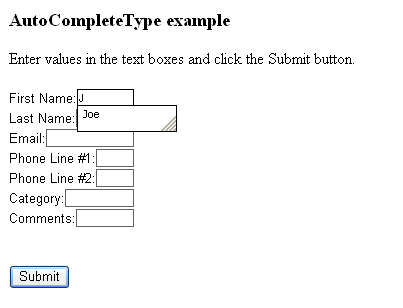

# AutoComplete


**AutoComplete** monitors a **RadTextBox** and creates a list of values entered by the user. When the user returns to the **RadTextBox** at a later time, the list is displayed. Instead of retyping a previously entered value, the user can simply select the value from this list. Not all browsers support the **AutoComplete** feature. Check with your browser documentation to determine compatibility.

To use the **AutoComplete** feature of **RadTextBox**, set its **AutoCompleteType** property.

By default, the value of the **AutoCompleteType** property is "None". With this setting, the **RadTextBox** control shares the list with other **RadTextBox** controls with the same **ID** property across different pages. For any other value of **AutoCompleteType**, the **RadTextBox** shares its list with all **RadTextBox** controls that have the same **AutoCompleteType** value.

To disable the **AutoComplete** feature, set the **AutoCompleType** property to "Disabled".

Refer to your browser documentation for details on configuring and enabling the **AutoComplete** feature. For example, to enable the **AutoComplete** feature in Internet Explorer version 6 or later, select Internet Options from the Tools menu, and then select the Content tab. Click the **AutoComplete** button to view and modify the various browser options for the **AutoComplete** feature.

>caution This property cannot be set by themes or style sheet themes.
>


## Example

The following code example demonstrates how to use the **AutoCompleteType** property to specify the **AutoComplete** category for a **RadTextBox** control. This example has a text box that accepts user input, which is a potential security threat. By default, ASP.NET Web pages validate that user input does not include script or HTML elements.

````ASPNET
<form id="form1" runat="server">
<asp:ScriptManager ID="ScriptManager1" runat="server" />
<h3>
	AutoCompleteType example</h3>
Enter values in the text boxes and click the Submit button.<br />
<br />
<!-- The following TextBox controls have different -->
<!-- categories assigned to their AutoCompleteType -->
<!-- properties. -->
<telerik:RadTextBox ID="FirstNameTextBox" AutoCompleteType="FirstName" runat="server"
	Label="First Name:" /><br />
<telerik:RadTextBox ID="LastNameTextBox" AutoCompleteType="LastName" runat="server"
	Label="Last Name:" /><br />
<telerik:RadTextBox ID="EmailTextBox" AutoCompleteType="Email" runat="server" Label="Email:" /><br />
<!-- The following TextBox controls have the same -->
<!-- categories assigned to their AutoCompleteType -->
<!-- properties. They share the same AutoComplete -->
<!-- list. -->
<telerik:RadTextBox ID="Phone1TextBox" AutoCompleteType="HomePhone" runat="server"
	Label="Phone Line #1:" /><br />
<telerik:RadTextBox ID="Phone2TextBox" AutoCompleteType="HomePhone" runat="server"
	Label="Phone Line #2:" /><br />
<!-- The following TextBox control has its -->
<!-- AutoCompleteType property set to -->
<!-- AutoCompleteType.None. All TextBox controls -->
<!-- with the same ID across different pages share -->
<!-- the same AutoComplete list. -->
<telerik:RadTextBox ID="CategoryTextBox" AutoCompleteType="None" runat="server" Label="Category:" /><br />
<!-- The following TextBox control has the -->
<!-- AutoComplete feature disabled. -->
<telerik:RadTextBox ID="CommentsTextBox" AutoCompleteType="Disabled" runat="server"
	Label="Comments:" /><br />
<br />
<br />
<asp:Button ID="SubmitButton" Text="Submit" runat="Server" /></form>
````


If you configure the browser to support the **AutoComplete** feature for forms, run this form and click the submit button. The next time you start to enter values in the text boxes, the browser pops up the autocomplete list:


