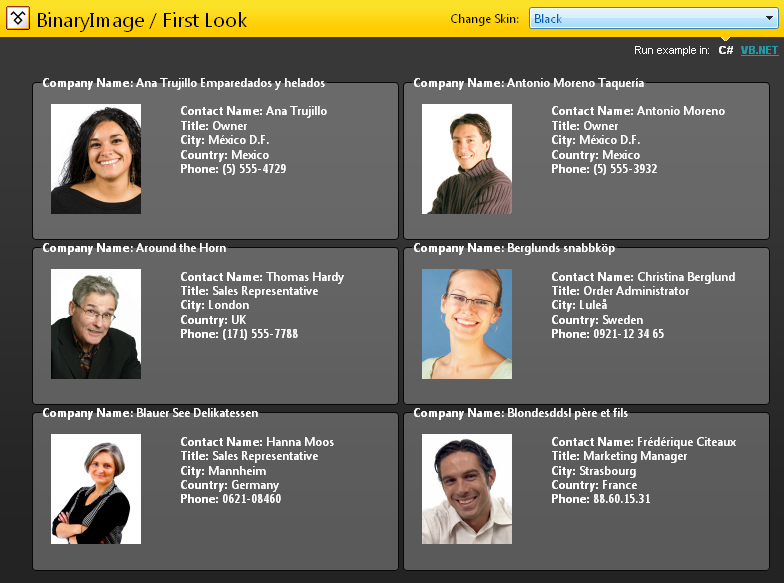

# ListView Data with Images from Database


## 

RadListView allows you to define your custom type of layout to display the necessary information in a suitable format. Thus you are able to output not only plain data from the listview's source but also images streamed from binary field in the data source or stored physically in the web site's folder structure. This type of presentation is useful when you would like to accompany the actual data with visual elements when displayed in the RadListView's items.

[This integration example](http://demos.telerik.com/aspnet-ajax/binaryimage/examples/default/defaultcs.aspx?product=listview) of RadListView and RadDataPager illustrate how to use tile layout and embed images (streamed in binary array format from the data source) in the listview's items:

The code snippets from the demo are provided below for further reference:

````ASPNET
	    <telerik:radscriptmanager id="RadScriptManager2" runat="server" />
	    <telerik:radformdecorator runat="server" id="radFormDecorator" decoratedcontrols="All" />
	    <telerik:radlistview id="RadListView1" runat="server" datasourceid="SqlDataSource2"
	        itemplaceholderid="ListViewContainer">
	        <LayoutTemplate>
	            <asp:PlaceHolder runat="server" ID="ListViewContainer" />
	        </LayoutTemplate>
	        <ItemTemplate>
	            <fieldset style="float: left; width: 350px; height: 150px;">
	                <legend><b>Company Name</b>:
	                    <%#Eval("CompanyName")%></legend>
	                <div class="details">
	                    <div class="photo-container">
	                        <telerik:RadBinaryImage runat="server" ID="RadBinaryImage1" DataValue='<%#Eval("Photo") %>'
	                            AutoAdjustImageControlSize="false" Width="90px" Height="110px" ToolTip='<%#Eval("ContactName", "Photo of {0}") %>'
	                            AlternateText='<%#Eval("ContactName", "Photo of {0}") %>' />
	                    </div>
	                    <div class="data-container">
	                        <ul>
	                            <li>
	                                <label>
	                                    Contact Name:</label>
	                                <%#Eval("ContactName")%>
	                            </li>
	                            <li>
	                                <label>
	                                    Title:</label>
	                                <%#Eval("ContactTitle")%>
	                            </li>
	                            <li>
	                                <label>
	                                    City:</label>
	                                <%#Eval("City")%>
	                            </li>
	                            <li>
	                                <label>
	                                    Country:</label>
	                                <%#Eval("Country")%>
	                            </li>
	                            <li>
	                                <label>
	                                    Phone:</label>
	                                <%#Eval("Phone")%>
	                            </li>
	                        </ul>
	                    </div>
	                </div>
	            </fieldset>
	        </ItemTemplate>
	    </telerik:radlistview>
	    <div style="clear: both">
	    </div>
	    <asp:SqlDataSource ID="SqlDataSource2" runat="server" ConnectionString="<%$ ConnectionStrings:TelerikConnectionString %>"
	        ProviderName="<%$ ConnectionStrings:TelerikConnectionString.ProviderName %>"
	        SelectCommand="SELECT TOP 6 * FROM [CustomerPhotos]"></asp:SqlDataSource>
	    </form>
````


