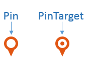

# Markers

This article will demonstrate how to add and configure **Markers** using the **RadMap** control. The marker functionality allows you to add points in the map. These points are defined by geographical position in the map and can show useful information to the user in a tooltip.

A simple illustration of a **Marker** in a **RadMap** is available in the [RadMap Structure]() article.

## How to Add Markers

The markers in the **RadMap** are represented as a collection of objects. To add a simple marker:

1. Use the **MarkersCollection** inner tag;

1. Add a **MapMarker** item;

1. Use the **LocationSettings** inner tag and its **Latitude** and **Longitude** attributes to define the location of the marker.

1. Optionally, you can set the **Shape** attribute to a desirable value (**Pin** or **PinTarget**);

1. Optionally, set the **Title** attribute with some HTML content (if a tooltip is not configured this content will be shown as a tooltip of the **Marker**).

In **Example 1** you can examine a sample markup created by following the above steps and a code behind approach is available in **Example 2**.

>caption **Example 1**: Adding a simple **Marker** in **RadMap** with ASP.NET markup

````ASP.NET
<telerik:RadMap RenderMode="Lightweight" runat="server" ID="RadMap1">
	<MarkersCollection>
		<telerik:MapMarker Shape="Pin" Title="This is <strong>HTML</strong> markup">
			<LocationSettings Latitude="51.500925" Longitude="-0.124507" />
		</telerik:MapMarker>
	</MarkersCollection>
</telerik:RadMap>
````

>caption **Example 2**: Programmatic approach to add a simple **Marker** in **RadMap**

````ASP.NET
<telerik:RadMap RenderMode="Lightweight" runat="server" ID="RadMap1">
</telerik:RadMap>
````
````C#
MapMarker myMarker = new MapMarker();
myMarker.Shape = Telerik.Web.UI.Map.MarkerShape.Pin;
myMarker.Title = "This is <strong>HTML</strong> markup";
myMarker.LocationSettings.Latitude = 51.500925;
myMarker.LocationSettings.Longitude = -0.124507;

RadMap1.MarkersCollection.Add(myMarker);
````
````VB
Dim myMarker As MapMarker = New MapMarker
myMarker.Shape = Telerik.Web.UI.Map.MarkerShape.Pin
myMarker.Title = "This is <strong>HTML</strong> markup"
myMarker.LocationSettings.Latitude = 51.500925
myMarker.LocationSettings.Longitude = -0.124507

RadMap1.MarkersCollection.Add(myMarker)
````

## Marker Shapes

The Markers in **RadMap** are two types - **Pin** and **PinTarget** (see **Figure 1**). They can be defined using the **Shape** attribute of the **MapMarker** item. The actual visual differences depend on the chosen Skin. The default visual appearance of the **Marker** is the **PinTarget**.

**Figure 1** shows the differences of the two types when **RadMap** is set to Default skin.	The markup that generates the displayed map is provided in **Example 3**.

>caption **Figure 1**: Different Marker Shapes with the Default Skin.



>caption **Example 3**: Setting **Marker** shapes.

````ASP.NET
<telerik:RadMap RenderMode="Lightweight" runat="server" ID="RadMap1" Skin="Default" Zoom="4">
	<CenterSettings Latitude="1" Longitude="1" />
	<MarkersCollection>
		<telerik:MapMarker Shape="Pin">
			<LocationSettings Latitude="1" Longitude="1" />
		</telerik:MapMarker>
		<telerik:MapMarker Shape="PinTarget">
			<LocationSettings Latitude="1" Longitude="10" />
		</telerik:MapMarker>
	</MarkersCollection>
</telerik:RadMap>
````

## Using Tooltip Settings

The **TooltipSettings** tag allows you to fine tune the tooltips content, appearance and options. You can add HTML, use templates or load an entire page in the tooltip. You can then configure animations,show and hide delays, etc. You can find a full list of the available settings in the [API reference]().

In **Example 4** you can see how the marker tooltip is configured to show a [Kendo-type HTML template](http://docs.telerik.com/kendo-ui/api/dataviz/map#configuration-layerDefaults-marker-tooltip-template) and how the open and close behaviors can be changed.

>caption **Example 4**: Creating a complex tooltip.

````ASP.NET
<telerik:RadMap RenderMode="Lightweight" runat="server" ID="RadMap1" Zoom="4">
	<CenterSettings Latitude="1" Longitude="1" />
	<MarkersCollection>
		<telerik:MapMarker Shape="Pin">
			<LocationSettings Latitude="1" Longitude="1"/>
			<TooltipSettings Template="This marker is located at <br /> <strong>#= location.lat #, #= location.lng #</strong>" 
				Width="120" Height="100" AutoHide="false">
				<AnimationSettings>
					<CloseSettings Duration="600" Effects="zoom:out" />
					<OpenSettings Duration="600" Effects="zoom:in" />
				</AnimationSettings>
			</TooltipSettings>
		</telerik:MapMarker>
	</MarkersCollection>
</telerik:RadMap>
````

# See Also

 * [Server-side Programming]()

 * [Client-side]()

 * [Kendo Map documentation](http://docs.telerik.com/kendo-ui/api/dataviz/map)
