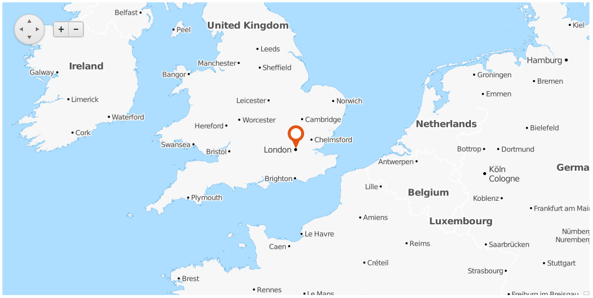

# Getting Started Overview


This article demonstrates how you can start using the __RadMap__ control in an ASP.NET project.	The illustrated Map in __Figure 1__ will be generated after following the steps and the code examples in the following sections.
>caption Figure 1: Result of a basic RadMap configuration



## Add a RadMap control into an ASP.NET project

To add a Map control into the page you can simply drag it from the Visual Studio Toolbox into anASP.NET page with correctly set __ScriptManager__ control or paste the markup from __Example 1__ into the __form__ element.

__Example 1__: Start-up __RadMap__ declaration

````ASPNET
			<telerik:RadScriptManager runat="server" ID="RadScriptManager1" />
	
			<telerik:RadMap runat="server" ID="RadMap1">
			</telerik:RadMap>
````


## Add a Tile Layer

The layer of type __Tile__ is basically rendered using images requested from a corresponding web service. This article uses the	[OpenCycleMap](http://www.opencyclemap.org/)service to populate the map images.

To configure the __RadMap__ with the chosen service provider, follow these steps:

1. Use the __LayersCollection__ inner tag of the RadMap;

1. Add a __MapLayer__ item;

1. Use the __Type__ attribute to set the layer type to __Tile__;

1. Use the __UrlTemplate__ to set the URL template provided by the service.

These steps will lead you to a markup similar to the one in __Example 2__ and a rendered Map in the page.

__Example 2__: Sample __RadMap__ markup with configured Tile Layer

````ASPNET
			<telerik:RadMap runat="server" ID="RadMap1">
				<LayersCollection>
					<telerik:MapLayer Type="Tile" 
						UrlTemplate="http://a.tile.opencyclemap.org/transport/#= zoom #/#= x #/#= y #.png">
					</telerik:MapLayer>
				</LayersCollection>
			</telerik:RadMap>
````


## Configure the Layout of the Map

At this point you will already have a Map rendered if you run the page. The following instructions are optional and will explain how to configure it.

With the Telerik Map you can set initial zoom level, initial center location and change the size of the control:

1. Use the __Zoom__ property of the __RadMap__ to set a value for the initialzoom level (when using the OpenCycleMap service, this value should be between 0 and 18);

1. Set the __Width__ and __Height__ properties with desirable values to change the size of the map;

1. Add the __CenterSettings__ inner tag;

1. Use its __Latitude__ and __Longitude__ attributes to set the exact location of the map center.

In __Example 3__ you can examine a sample code achieved by following these steps.

__Example 3__: Simple layout configuration of the __RadMap__.

````ASPNET
			<telerik:RadMap runat="server" ID="RadMap1" Zoom="6" Width="1000" Height="500" >
				<CenterSettings Latitude="51.525619" Longitude="-0.111802" />
				<LayersCollection>
					<telerik:MapLayer Type="Tile" 
						UrlTemplate="http://a.tile.opencyclemap.org/transport/#= zoom #/#= x #/#= y #.png">
					</telerik:MapLayer>
				</LayersCollection>
			</telerik:RadMap>
	
````


## Place Markers in the Map

Based on the purpose of the Map, you may want to show points of interest. To do so, use the[markers collection]().

To configure a __Marker__:

1. Add the __MarkerCollection__ inner tag;

1. Add a __MapMarker__ item;

1. Use the __Shape__ attribute to set the desired look of the __Marker__ (__Pin__ or __PinTarget__);

1. Use the __Title__ attribute to set the text shown as a tooltip on mouse over;

1. Use the __LocationSettings__ inner tag to set the exact position of the marker through the __Latitude__ and	__Longitude__ attributes.

The code in __Example 4__ is a final result of the steps from the above sections and will render the Map displayed in __Figure 1__.

__Example 4__: Adding Markers in the __RadMap__.

````ASPNET
			<telerik:RadMap runat="server" ID="RadMap1" Zoom="6" Width="1000" Height="500" >
				<CenterSettings Latitude="51.525619" Longitude="-0.111802" />
				<LayersCollection>
					<telerik:MapLayer Type="Tile" 
						UrlTemplate="http://a.tile.opencyclemap.org/transport/#= zoom #/#= x #/#= y #.png">
					</telerik:MapLayer>
				</LayersCollection>
				<MarkersCollection>
					<telerik:MapMarker Shape="Pin" Title="London, UK">
						<LocationSettings Latitude="51.525619" Longitude="-0.111802"/>
					</telerik:MapMarker>
				</MarkersCollection>
			</telerik:RadMap>
````


# See Also

 * [RadMap Structure]()

 * [Tile Layers]()

 * [Markers]()
