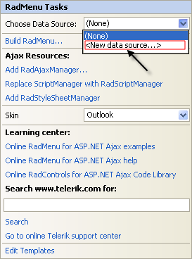
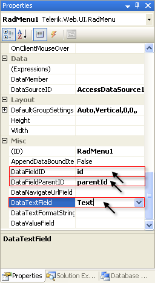
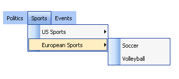

# Binding to a Data Source

## 

This tutorial will show how to bind __RadMenu__ to an __AccessDataSource__:

1. Drag a __RadMenu__ component from the toolbox onto your Web page. The __RadMenu__[Smart Tag]() should appear automatically:

1. In the __RadMenu__ Smart Tag, use the __Skin__ drop-down to change the [skin]() for the __RadMenu__ to "Outlook":

1. Still in the Smart Tag, open the __Choose Data Source__ drop-down and select __New Data Source__.

1. The Data Source Configuration Wizard appears. In the Select a DataSource Type screen, specify an __AccessDataSource__ and click __OK.__

1. In the __Choose a Database__ screen, click the __Browse__ button, and select a data file. Then choose __Next__ to continue:

1. In the __Configure the Select Statement__ screen, choose __Specify columns from a table or view__, and select the columns for the RadMenuItem __ID__, parent RadMenuItem __ID__, and RadMenuItem __Text__ properties. Then choose __Next__ to continue:

1. The data should have a structure something like the following:

1. Click the __Finish__ button to exit the Wizard.

1. In the Properties pane for the __RadMenu__ component, set the __DataFieldId__, __DataFieldParentId__ and __DataTextField__ properties by selecting the appropriate fields from the drop-down list:

1. Run the application. The final result should look like the following:

# See Also

 * [Overview]()

 * [Overview]()

 * [Creating a Simple Context Menu]()
