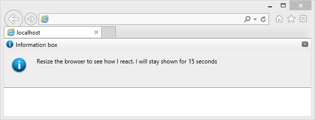

# Mobile Support


This article explains the __responsive design capabilities RadNotification offers__.	RadNotification is built semantically, using CSS for defining rounded corners, shadows and gradients. In the example	bellow you will find a very simple way, allowing you to resize and scale the control only by	changing its default font size or set its dimensions in percent.

Generally, responsive design means that the page and its content are able to adapt to different screen resolutions without deteriorating	the user experience. This often includes changing the font size and having dimensions set in percent.

## Elastic Design with RadNotification
>caption Figure 1: Comparison between appearance of a RadNotification with regular font size and with increased font size


__RadNotification__ does not create elastic design by itself, but can fit in a page that follows this pattern.This means that RadNotification does not support dimensions set in percent, but supports __changing the font size__without breaking the control's appearance - if the new size is larger than the original,the elements in the control will simply increase their size as well to accommodate the text.This fluid layout is achieved by using `em` units for setting dimensions and paddings in the control, instead of `px`because `em` units are tied to the font size. This allows dimensions and sizes to scale with the font size.

Elements that use images or images sprites, however, cannot be increased in size, so the commands will keep having their original dimensions and position(aligned to the top of the titlebar).

__Example 1:__ how to increase the font size of a RadNotification and the effect can be seen in comparison in Figure 1.

````ASPNET
			<style type="text/css">
				div.RadNotification
				{
					font-size: 18px;
				}
			</style>
			<telerik:RadNotification ID="RadNotification1" runat="server" ShowCloseButton="true" VisibleOnPageLoad="true"
				Title="This is a very very very long title" AutoCloseDelay="100000000" Position="Center">
				<ContentTemplate>
					<p>Hello World</p>
				</ContentTemplate>
			</telerik:RadNotification>
````


## Fluid Design with RadNotification
>caption Figure 2: RadNotification with Width=100% that occupies the entire browser viewport width



You can set the __Width__ and __Height__ properties of a __RadNotification in percent__.Since the control is always pinned (i.e., fixed) in the viewport according to its __Position__property, we have enabled size settings in percent so it can take up the entire viewport width, for example, so you can create full width/height notification bars.The resizing logic is tied to the window.resize event, so if the browser size changes, the control will also change size.

You can see this feature in the [Size in percent](http://demos.telerik.com/aspnet-ajax/notification/examples/sizeinpercent/defaultcs.aspx) online demo.

__Example 2:__ create a full width notification bar at the top of the page:

````ASPNET
		<telerik:RadNotification ID="RadNotification1" runat="server" Width="100%" Height="100px" Position="TopCenter" Animation="Slide"
			Title="Information box" Text="Resize the browser to see how I react. I will stay shown for 15 seconds"
			VisibleOnPageLoad="true" AutoCloseDelay="15000">
		</telerik:RadNotification>
````


