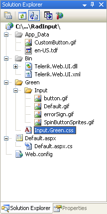

# Creating a Custom Skin


The following tutorial demonstrates creating a custom **RadNumericTextBox** skin, using the default skin as a base. This new skin will take the appearance of the input controls from their default look:


to the following:


See [Understanding the Skin CSS File]() for more information on specific CSS file properties.

## Prepare the Project

1. Drag  a **RadNumericTextBox** control from the toolbox onto a new AJAX-enabled application Web form.

1. Set the properties of these input control so that it shows a label and a button:

1. In the Solution Explorer, create a new "Green" directory in your project.

1. Copy the default **RadNumericTextBox** skin files from the installation directory to the "Green" directory; copy both the \Input directory that contains the images for this skin and the Input.Default.css file that defines the skin styles.
>note The file path will typically be similar to this example: *\Program Files\Telerik\<Your Version of UI for ASP.NET.AJAX>\Skins\Default.* 
>

1. In the Solution Explorer, rename "Input.Default.css" to "Input.Green.css".

1. Open Input.Green.css and replace all instances of _Default with _Green. Then save the file:


1. Drag the "Input.Green.Css" file from the Solution Explorer onto your Web page. This automatically adds a reference to the page "<head>" tag as a "<link>" to the new stylesheet:


1. Change the **Skin** property of your four **RadInput** controls to "Green".

1. Set the **EnableEmbeddedSkins** property of your four **RadInput** controls to "False".

1. Run the application. The new "Green" skin looks just like the Default skin:


## Editing the CSS classes

1. The classes that control the background for spin buttons are **.riUp** and **.riDown**. Locate the mentioned selectors. The class definitions are qualified by the **.RadInput_Green** class, which is the class definition for the entire control. Add a property to the selectors, setting the background color for the spin buttons:

	````CSS
	.RadInput_Green a.riUp
	{
		background-position: 4px -98px;
		vertical-align: top;
		background-color: #ddffe0;
	}
````

	````CSS
	.RadInput_Green a.riDown
	{
		background-position: 4px -199px;
		vertical-align: top;
		background-color: #ddffe0;
	}
````

1. The class that controls the background of the button is **.riButton**. There is currently no definition for this class in the skin file. Add one, setting a background for the button:

	````CSS
	.RadInput_Green a.riButton
	{
		background-color: #ddffe0;
	}
````


1. The text area when the control is enabled has the **.riEnabled** class applied. Locate this selector. Change the border color to Green and add a background color:

	````CSS
	.RadInput_Green .riEnabled
	{ 
		color: #333; 
		border: solid 1px Green; 
		background:#eeffee;
	}
````


1. The class that controls the text area when the mouse hovers over the control is **.riHover**. Locate this selector, and change the border color from "#000" to "Green".

	````CSS
	.RadInput_Green .riHover
	{ 
		color: #333; 
		border: solid 1px Green;
	}
````


1. The class that controls the text area when it is displaying the empty message is **.riEmpty**. Locate this selector and change the color and border colors to "Green". Add in a background color as well:

	````CSS
	.RadInput_Green .riEmpty
	{ 
		color: Green; 
		border: solid 1px Green; 
		background:#ddeedd;
	}
````


1. The class that controls the text area when it has focus is **.riFocused**. Change the border color to "Green":

	````CSS
	.RadInput_Green .riFocused
	{ 
		border: solid 1px Green; 
		color: #000; 
	}
````


1. The class that controls the text area of **RadNumericTextBox** when it's value is negative is **.riNegative**. Change the border color to "Green":

	````CSS
	.RadInput_Green .riNegative
	{ 
		border: solid 1px Green; 
		color: #333;
	}
````


1. The class that controls the text area when it's value is invalid is **.riError**. Add a **background-color** of "#ddd", and change the color and border-color attributes to "#ffcc55":

	````CSS
	.RadInput_Green .riError
	{ 
		background-image: url('Input/errorSign.gif'); 
		background-position: center right; 
		background-repeat: no-repeat; 
		background-color:#ddd; 
		border: solid 1px #ffcc55; color: #ffcc55;
	}
````


1. The class that controls the Label is **.riLabel**. Change the font color to "Green":

	````CSS
	.RadInput_Green .riLabel
	{ 
		color: Green; 
		font-size: small; 
		white-space:nowrap;
	}
````


1. Run the application. The input controls should now look as follows:

