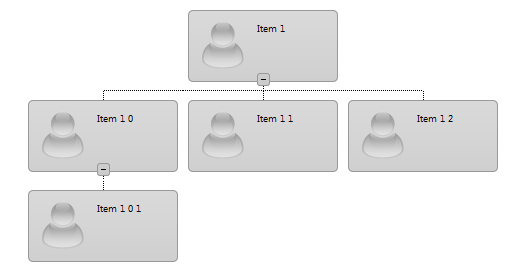
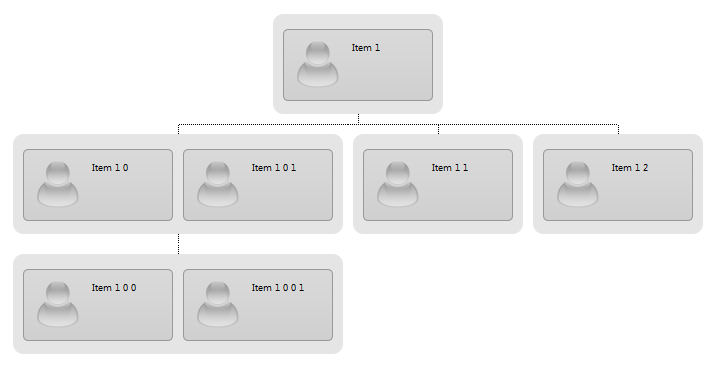
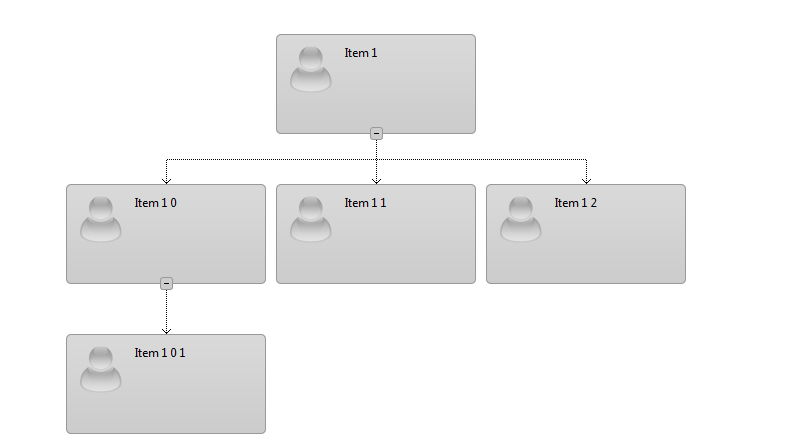

# Connecting Lines


## How to change the style of the connecting lines?

In case you would like to change the length of the connecting linesyou can add styles as in the following code:

````ASPNET
			  html .RadOrgChart .rocLineUp
	        {
	            height:10px ;
	            top: -10px;
	        }
	       
	        html .RadOrgChart .rocLineDown
	        {
	            height:10px;
	
	        }
	        html .RadOrgChart .rocLineHorizontal
	        {
	            top: -10px;
	        }
	       
	        html .RadOrgChart .rocNodeList
	        {
	            margin: 20px auto 0;
	        }
	       
	        .rocItem
	        {
	            width:150px!important;
	            height:70px!important;
	        }
	       
	        .rocItemContent
	        {
	            height:50px!important;
	            font-size: 10px;
	        }
````



If you want to make the lines __invisible__ you can use the code below:

````ASPNET
			 .rocLineHorizontal, .rocLineUp, .rocLineDown
	        {
	            visibility:hidden;
	        }
````


If you want to add arrows to the ends of the connecting lines you can add the following css styles:

````ASPNET
			.rocLineUp:after 
	    {
	        content: "";
	        width: 9px;
	        height: 5px;
	        background: url("rocDownArrow.gif") no-repeat center center;
	        position: absolute;
	        bottom: 0;
	        left: -4px;
	    }
	  
````


Such implementation is not supported in IE6 and IE7 browsers because they do not implement the __":after"__ css selector.
