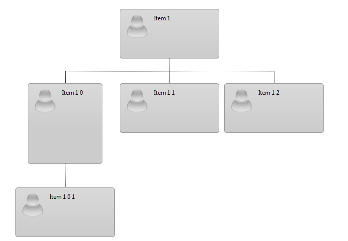

# Node Size


## How to change the size of some nodes?

In case you would like to set a different size of a node, you can change it by adding a specific __CssClass__ to the node or groupItem.

This appearence can ba achieved in the NodeDataBound event by association the index as it is shown in the following code:

1: In Simple Binding:

````ASPNET
	    <style type="text/css"> 
	        .newItemSizeSimple
	        {
	            width:150px !important;
	            height:160px !important;
	        }
	
	        .newItemSizeSimple .rocItemContent
	        {
	            height:140px !important;
	        }
	        </style>
	          <telerik:RadOrgChart runat="server" ID="RadOrgChart1"
	            OnNodeDataBound="RadOrgChart1_NodeDataBound">
	        </telerik:RadOrgChart>
````


>tabbedCode

````C#
	
	    protected void RadOrgChart1_NodeDataBound(object sender, Telerik.Web.UI.OrgChartNodeDataBoundEventArguments e)
	    {
	        if (e.Node.ID == "2")
	            foreach (var groupItem in e.Node.GroupItems)
	                groupItem.CssClass = "newItemSizeSimple";
	    }
	
	
	    protected void Page_Init(object sender, EventArgs e)
	    {
	        DataTable table = new DataTable();
	        table.Columns.Add("ID");
	        table.Columns.Add("ParentID");
	        table.Columns.Add("Text");
	
	        table.Rows.Add(new String[] { "1", null, "Item 1" });
	        table.Rows.Add(new String[] { "2", "1", "Item 1 0" });
	        table.Rows.Add(new String[] { "3", "1", "Item 1 1" });
	        table.Rows.Add(new String[] { "4", "1", "Item 1 2" });
	        table.Rows.Add(new String[] { "5", "2", "Item 1 0 1" });
	
	
	        RadOrgChart1.DataFieldID = "ID";
	        RadOrgChart1.DataFieldParentID = "ParentID";
	        RadOrgChart1.DataTextField = "Text";
	        RadOrgChart1.DataSource = table;
	        RadOrgChart1.DataBind();
	
	    }
	
````


````VB.NET
	    Protected Sub RadOrgChart1_NodeDataBound(sender As Object, e As Telerik.Web.UI.OrgChartNodeDataBoundEventArguments)
	        If e.Node.ID = "2" Then
	            For Each groupItem In e.Node.GroupItems
	                groupItem.CssClass = "newItemSizeSimple"
	            Next
	        End If
	    End Sub
	
	
	    Protected Sub Page_Init(sender As Object, e As EventArgs)
	        Dim table As New DataTable()
	        table.Columns.Add("ID")
	        table.Columns.Add("ParentID")
	        table.Columns.Add("Text")
	
	        table.Rows.Add(New [String]() {"1", Nothing, "Item 1"})
	        table.Rows.Add(New [String]() {"2", "1", "Item 1 0"})
	        table.Rows.Add(New [String]() {"3", "1", "Item 1 1"})
	        table.Rows.Add(New [String]() {"4", "1", "Item 1 2"})
	        table.Rows.Add(New [String]() {"5", "2", "Item 1 0 1"})
	
	        RadOrgChart1.DataFieldID = "ID"
	        RadOrgChart1.DataFieldParentID = "ParentID"
	        RadOrgChart1.DataTextField = "Text"
	        RadOrgChart1.DataSource = table
	        RadOrgChart1.DataBind()
	
	    End Sub
````


>end

2: In Group-Enabled Binding:

````ASPNET
	  <style type="text/css"> 
	         .newItemSizeGroup .rocItem
	        {
	            width:150px !important;
	            height:80px !important;
	        }
	        
	        .newItemSizeGroup .rocItemContent
	        {
	            height:60px !important;
	        }
	         </style>
	        <telerik:RadOrgChart runat="server" ID="RadOrgChart2"
	            OnNodeDataBound="RadOrgChart2_NodeDataBound">
	        </telerik:RadOrgChart>
````


>tabbedCode

````C#
	    protected void RadOrgChart2_NodeDataBound(object sender, Telerik.Web.UI.OrgChartNodeDataBoundEventArguments e)
	    {
	        if (e.Node.ID == "2")
	            foreach (var groupItem in e.Node.GroupItems)
	                groupItem.CssClass = "newItemSizeGroup";
	    }
	    protected void Page_Init(object sender, EventArgs e)
	    {
	        DataTable table = new DataTable();
	        table.Columns.Add("ID");
	        table.Columns.Add("ParentID");
	        table.Columns.Add("Text");
	
	        table.Rows.Add(new String[] { "1", null, "Item 1" });
	        table.Rows.Add(new String[] { "2", "1", "Item 1 0" });
	        table.Rows.Add(new String[] { "3", "1", "Item 1 1" });
	        table.Rows.Add(new String[] { "4", "1", "Item 1 2" });
	        table.Rows.Add(new String[] { "5", "2", "Item 1 0 1" });
	
	        DataTable items = new DataTable();
	        items.Columns.Add("ID");
	        items.Columns.Add("NodeID");
	        items.Columns.Add("Text");
	
	        items.Rows.Add(new String[] { "1", "1", "Item 1" });
	        items.Rows.Add(new String[] { "2", "2", "Item 1 0" });
	        items.Rows.Add(new String[] { "3", "2", "Item 1 0 1" });
	        items.Rows.Add(new String[] { "4", "3", "Item 1 1" });
	        items.Rows.Add(new String[] { "5", "4", "Item 1 2" });
	        items.Rows.Add(new String[] { "6", "5", "Item 1 0 0" });
	        items.Rows.Add(new String[] { "7", "5", "Item 1 0 0 1" });
	
	
	        RadOrgChart2.GroupEnabledBinding.GroupItemBindingSettings.DataFieldID = "ID";
	        RadOrgChart2.GroupEnabledBinding.GroupItemBindingSettings.DataFieldNodeID = "NodeID";
	        RadOrgChart2.GroupEnabledBinding.GroupItemBindingSettings.DataTextField = "Text";
	        RadOrgChart2.GroupEnabledBinding.GroupItemBindingSettings.DataSource = items;
	
	        RadOrgChart2.GroupEnabledBinding.NodeBindingSettings.DataFieldID = "ID";
	        RadOrgChart2.GroupEnabledBinding.NodeBindingSettings.DataFieldParentID = "ParentID";
	        RadOrgChart2.GroupEnabledBinding.NodeBindingSettings.DataSource = table;
	        RadOrgChart2.DataBind();
	    }
````


````VB.NET
	    Protected Sub RadOrgChart2_NodeDataBound(sender As Object, e As Telerik.Web.UI.OrgChartNodeDataBoundEventArguments)
	        If e.Node.ID = "2" Then
	            For Each groupItem As var In e.Node.GroupItems
	                groupItem.CssClass = "newItemSizeGroup"
	            Next
	        End If
	    End Sub
	    Protected Sub Page_Init(sender As Object, e As EventArgs)
	        Dim table As New DataTable()
	        table.Columns.Add("ID")
	        table.Columns.Add("ParentID")
	        table.Columns.Add("Text")
	
	        table.Rows.Add(New [String]() {"1", Nothing, "Item 1"})
	        table.Rows.Add(New [String]() {"2", "1", "Item 1 0"})
	        table.Rows.Add(New [String]() {"3", "1", "Item 1 1"})
	        table.Rows.Add(New [String]() {"4", "1", "Item 1 2"})
	        table.Rows.Add(New [String]() {"5", "2", "Item 1 0 1"})
	
	        Dim items As New DataTable()
	        items.Columns.Add("ID")
	        items.Columns.Add("NodeID")
	        items.Columns.Add("Text")
	
	        items.Rows.Add(New [String]() {"1", "1", "Item 1"})
	        items.Rows.Add(New [String]() {"2", "2", "Item 1 0"})
	        items.Rows.Add(New [String]() {"3", "2", "Item 1 0 1"})
	        items.Rows.Add(New [String]() {"4", "3", "Item 1 1"})
	        items.Rows.Add(New [String]() {"5", "4", "Item 1 2"})
	        items.Rows.Add(New [String]() {"6", "5", "Item 1 0 0"})
	        items.Rows.Add(New [String]() {"7", "5", "Item 1 0 0 1"})
	
	
	        RadOrgChart2.GroupEnabledBinding.GroupItemBindingSettings.DataFieldID = "ID"
	        RadOrgChart2.GroupEnabledBinding.GroupItemBindingSettings.DataFieldNodeID = "NodeID"
	        RadOrgChart2.GroupEnabledBinding.GroupItemBindingSettings.DataTextField = "Text"
	        RadOrgChart2.GroupEnabledBinding.GroupItemBindingSettings.DataSource = items
	
	        RadOrgChart2.GroupEnabledBinding.NodeBindingSettings.DataFieldID = "ID"
	        RadOrgChart2.GroupEnabledBinding.NodeBindingSettings.DataFieldParentID = "ParentID"
	        RadOrgChart2.GroupEnabledBinding.NodeBindingSettings.DataSource = table
	        RadOrgChart2.DataBind()
	    End Sub
````


>end
