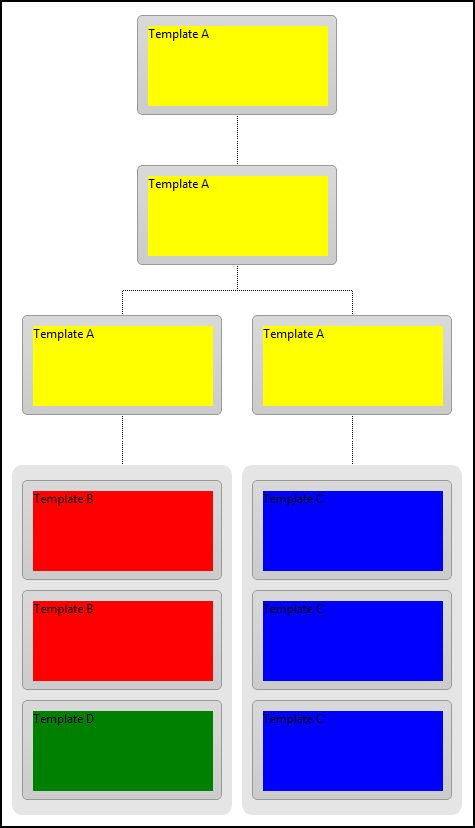

# Templates Overview


## 

__RadOrgChart__ is highly customizable. Besides the built-in skins that you can apply you can customize the appearance of the nodes by using templates. For example if the sizes of images does not apply to already collected number of employee profile pictures, a template can be created without the restrain of 48x48 pixels (which is the default image size for RadOrgChart). When a template is used the rendered fields of the GroupItem are not applied.

In order to facilitate that we have implemented a __3-level__ templating engine giving the power of applying templates on:

1. __OrgChart level (ItemTemplate)__ - for all items that doesn't have template nor does their node;

1. __Node level (ItemTemplate)__ - for all items within the node which doesn't have template;

1. __GroupItem level (simply Template)__ - for the item, with disregard of node or global (OrgChart.ItemTemplate) template.

Here is an example that demonstrates how the above mentioned templated can be applied:

````ASPNET
			
			<telerik:RadOrgChart runat="server" ID="RadOrgChart1" Skin="Default" GroupColumnCount="1">
				<ItemTemplate>
					<div style="background-color: Yellow; height: 80px; width: 180px;">
						Template A</div>
				</ItemTemplate>
				<Nodes>
					<telerik:OrgChartNode>
						<GroupItems>
							<telerik:OrgChartGroupItem Text="CEO">
							</telerik:OrgChartGroupItem>
						</GroupItems>
						<Nodes>
							<telerik:OrgChartNode>
								<GroupItems>
									<telerik:OrgChartGroupItem Text="UnitManager" />
								</GroupItems>
								<Nodes>
									<telerik:OrgChartNode>
										<GroupItems>
											<telerik:OrgChartGroupItem Text="TeamLeader1" />
										</GroupItems>
										<Nodes>
											<telerik:OrgChartNode>
												<ItemTemplate>
													<div style="background-color: Red; height: 80px; width: 180px;">
														Template B</div>
												</ItemTemplate>
												<GroupItems>
													<telerik:OrgChartGroupItem Text="Member1" />
													<telerik:OrgChartGroupItem Text="Member2" />
													<telerik:OrgChartGroupItem Text="TechnicalLeader">
														<Template>
															<div style="background-color: Green; height: 80px; width: 180px;">
																Template D</div>
														</Template>
													</telerik:OrgChartGroupItem>
												</GroupItems>
											</telerik:OrgChartNode>
										</Nodes>
									</telerik:OrgChartNode>
									<telerik:OrgChartNode>
										<GroupItems>
											<telerik:OrgChartGroupItem Text="TeamLeader2" />
										</GroupItems>
										<Nodes>
											<telerik:OrgChartNode>
												<ItemTemplate>
													<div style="background-color: Blue; height: 80px; width: 180px;">
														Template C</div>
												</ItemTemplate>
												<GroupItems>
													<telerik:OrgChartGroupItem Text="Member1" />
													<telerik:OrgChartGroupItem Text="Member2" />
													<telerik:OrgChartGroupItem Text="Member3" />
												</GroupItems>
											</telerik:OrgChartNode>
										</Nodes>
									</telerik:OrgChartNode>
								</Nodes>
							</telerik:OrgChartNode>
						</Nodes>
					</telerik:OrgChartNode>
				</Nodes>
			</telerik:RadOrgChart>
			
````


Here is how the above code will look like:



## 

Here is an example that demonstrates how to add dynamically a template:

````ASPNET
	        <telerik:RadOrgChart runat="server" ID="RadOrgChart2">
	        </telerik:RadOrgChart>
````


>tabbedCode

````C#
	
	        var node = new OrgChartNode();
	        var item = new OrgChartGroupItem() { Template = new LabelTemplate() };
	
	        node.GroupItems.Add(item);
	        RadOrgChart2.Nodes.Add(node);
	
````


````VB.NET
	
	        Dim node = New OrgChartNode()
	        Dim item = New OrgChartGroupItem() With {.Template = New LabelTemplate()}
	
	        node.GroupItems.Add(item)
	        RadOrgChart2.Nodes.Add(node)
	
````


>end

>tabbedCode

````C#
	
	class LabelTemplate : ITemplate
	{
	    public void InstantiateIn(Control container)
	    {
	        Label label1 = new Label();
	        label1.ID = "ItemLabel";
	        label1.Text = "Text";
	        label1.Font.Size = 10;
	        label1.Font.Bold = true;
	
	        container.Controls.Add(label1);
	    }
	}
	
````


````VB.NET
	
	Class LabelTemplate
	    Implements ITemplate
	
	
	    Public Sub InstantiateIn(container As Control) Implements System.Web.UI.ITemplate.InstantiateIn
	        Dim label1 As New Label()
	        label1.ID = "ItemLabel"
	        label1.Text = "Text"
	        label1.Font.Size = 10
	        label1.Font.Bold = True
	
	        container.Controls.Add(label1)
	    End Sub
	End Class
	
````


>end

## 

Here is an example that demonstrates how to evaluate a template. Please keep in mind that the __Container__ is the object reference against which the expression is evaluated and the __Container.DataItem__ is the reference to row from the data source to which the item is bound.

````C#
	        <telerik:RadOrgChart runat="server" ID="RadOrgChart3" DataFieldID="ID" DataFieldParentID="ParentID">
	            <ItemTemplate>
	                <span>Identifier: <%#Eval("ID")%></span>
	                <br />
	                <span>Name: <%#DataBinder.Eval(Container.DataItem, "Name")%></span>
	                <br />
	                <span>Location: <%#DataBinder.Eval(Container.DataItem, "Location")%></span>
	            </ItemTemplate>
	        </telerik:RadOrgChart>
````


>tabbedCode

````C#
	
	        RadOrgChart3.DataSource = GetDataSource();
	        RadOrgChart3.DataBind();
	
````


````VB.NET
	
	        RadOrgChart3.DataSource = GetDataSource()
	        RadOrgChart3.DataBind()
	
````


>end

>tabbedCode

````C#
	
	    private DataTable GetDataSource()
	    {
	        DataTable table = new DataTable();
	        table.Columns.Add("ID");
	        table.Columns.Add("ParentID");
	        table.Columns.Add("Name");
	        table.Columns.Add("Location");
	
	        table.Rows.Add(new string[] { "1", null, "Peter", "Sofia" });
	        table.Rows.Add(new string[] { "2", "1", "Nick", "London" });
	        table.Rows.Add(new string[] { "3", "1", "Kate", "Vienna" });
	        table.Rows.Add(new string[] { "4", "3", "Kelly", "New York" });
	
	        return table;
	    }
	
````


````VB.NET
	
	    Private Function GetDataSource() As DataTable
	        Dim table As New DataTable()
	        table.Columns.Add("ID")
	        table.Columns.Add("ParentID")
	        table.Columns.Add("Name")
	        table.Columns.Add("Location")
	
	        table.Rows.Add(New String() {"1", Nothing, "Peter", "Sofia"})
	        table.Rows.Add(New String() {"2", "1", "Nick", "London"})
	        table.Rows.Add(New String() {"3", "1", "Kate", "Vienna"})
	        table.Rows.Add(New String() {"4", "3", "Kelly", "New York"})
	
	        Return table
	    End Function
	
````


>end

# See Also

 * [Online Demo](http://demos.telerik.com/aspnet-ajax/orgchart/examples/templates/defaultcs.aspx)
