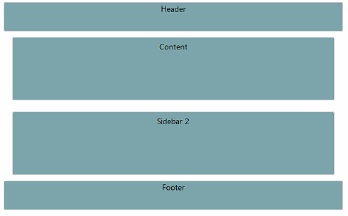

# React to Viewport Change


This article will show you how to use the __RadPageLayout__ control and its viewport breakpoints to create a responsive	layout that changes according to the browser viewport size.

The breakpoints represents the predefined viewport sizes at which a __LayoutColumn__ could be set to be hidden	(e.g. __HiddenSm__ attribute) or to fit into different __Span__ size (e.g. __SpanSm__ attribute).

More about the breakpoints and the available attributes is explained in the [Viewport Breakpoints]() article.

## Creating a Page that Reacts to the Viewport Size

__Example 1__ shows how to hide the first __LayoutColumn__ and change the __Span__ size of the second and third one when the viewport	size appear to be less than 768px. The results of this example can be examined in __Figure 1__ and __Figure 2__.
>caption Figure 1: Result from the markup in Example 1 when the viewport size is greater than 768px.


>caption Figure 2: Result from the markup in Example 1 when the viewport size is less than 768px.



__Example 1__: Using Breakpoints to create a responsive layout.

````ASPNET
	<!DOCTYPE html>
	<html xmlns="http://www.w3.org/1999/xhtml">
	<head id="Head1" runat="server">
		<title></title>
		<style type="text/css">
			body {
				margin: 0;
				padding: 0;
				padding-top: 20px;
				font: 14px/normal "Segoe UI", sans-serif;
			}
		
			.col, .header, .footer {
				background-color: #78a6ab;
				border: 1px solid #cccccc;
				text-align: center;
				border-radius: 3px;
			}
	
			.header, .footer {
				height: 50px;
			}
	
			.col {
				margin: 10px 0;
				padding: 5px 10px;
				height: 100px;
			}
		</style>
	</head>
	<body>
		<form id="form1" runat="server">
			<telerik:RadScriptManager ID="ScriptManager" runat="server">
			</telerik:RadScriptManager>
			
			<telerik:RadPageLayout runat="server" GridType="Fluid">
				<Rows>
					<telerik:LayoutRow>
						<Content>
							<div class="header">Header</div>
						</Content>
					</telerik:LayoutRow>
					<telerik:LayoutRow>
						<Columns>
							<telerik:LayoutColumn Span="2" HiddenXs="true" HiddenSm="true">
								<div class="col">Sidebar 1</div>
							</telerik:LayoutColumn>
							<telerik:LayoutColumn Span="7" SpanXs="12" SpanSm="12">
								<div class="col">
									Content
								</div>
							</telerik:LayoutColumn>
							<telerik:LayoutColumn Span="3" SpanXs="12" SpanSm="12">
								<div class="col">
									Sidebar 2
								</div>
							</telerik:LayoutColumn>
						</Columns>
					</telerik:LayoutRow>
					<telerik:LayoutRow>
						<Content>
							<div class="footer">Footer</div>
						</Content>
					</telerik:LayoutRow>
				</Rows>
			</telerik:RadPageLayout>
		</form>
	</body>
	</html> 
````


# See Also

 * [Viewport Breakpoints]()
