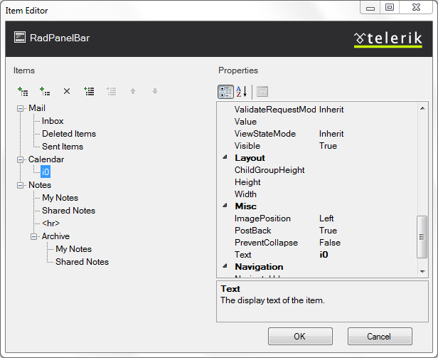

# RadPanelBar Item Builder

The __RadPanelBar Item Editor__ lets you populate your panel bar with a hierarchy of items that do not come from a separate data source. There are three ways to bring up the RadPanelBar Item Editor:

* From the __RadPanelBar__[ Smart Tag ](), click on the __Build RadPanelBar__ link.

* Right-click on the __RadPanelBar__ component and select __Build RadPanelBar__ from its context menu.

* In the Properties pane, with __RadPanelBar__ selected, click on the ellipsis button next to the __Items__ property.

## RadPanelBar Item Editor

The __RadPanelBar Item Editor__ lets you add, rearrange, configure, and delete panel items. These actions are initiated using the tool bar at the upper left of the Item editor:

The following table describes the controls in the tool bar:

>caption  

|  __Button__  |  __Function__  |
| ------ | ------ |
||Adds a root item to the panel bar in the next available position. Root items are the top-level items (panel items with no parent item).|
||Adds a child item to the currently selected panel item. The child can belong to either a root item or another child item.|
||Deletes the currently selected panel item. When you delete a panel item, its child items are deleted as well.|
||Moves the currently selected panel item up a level, making it a sibling to its parent item (following the parent item).|
||Moves the currently selected panel item down a level, making it the child of its previous sibling.|
||Moves the currently selected panel item backward in its current list of siblings, so that it precedes the previous sibling.|
||Moves the currently selected panel item forward in its current list of siblings, so that it follows the next sibling.|

When a panel item (either a root item or a child item) is selected, the properties pane on the right of the __RadPanelBar Item Editor__ lets you configure the item by setting its properties. For each item,

* __Text__ is the text of the item as it appears in the panel bar.

* __ToolTip__ is the text of a tooltip that appears when the user hovers the mouse over the item.

* __Enabled__ controls whether the item is initially enabled or disabled.

* __IsSeparator__ specifies whether the panel item [acts as a separator]().

* __Expanded__ specifies whether the item is initially expanded.

* __PreventCollapse__ specifies whether the user can collapse the item once it is expanded.

* __Selected__ specifies whether the item is initially selected.

* __Value__ lets you associate a text value with the panel item that you can use when programming the panel bar behavior.

* __NavigateUrl__ and __Target__ cause the panel item to automatically launch another Web page (specified by __NavigateUrl__) in the window specified by __Target__. If the __Target__ property is not set, the new Web page uses the current browser window.

* __PostBack__ specifies whether the item causes a postback.

* __CssClass__, __ClickedCssClass__, __DisabledCssClass__, __ExpandedCssClas__, and __FocusedCssClass__[control the appearance of the panel item]() when it is in its normal state, clicked, disabled, expanded, and holds input focus, respectively.

* __ImageUrl__, __SelectedImageUrl__, __DisabledImageUrl__, __ExpandedImageUrl__, and __HoveredImageUrl__ let you [specify an image]() that appears on the left of the panel item when it is in its normal state, clicked, disabled, expanded, and when the mouse hovers over it, respectively.

* __ImagePosition__ specifies the position of the image in the panel item.

# See Also

 * [Overview]()
