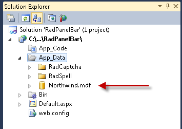
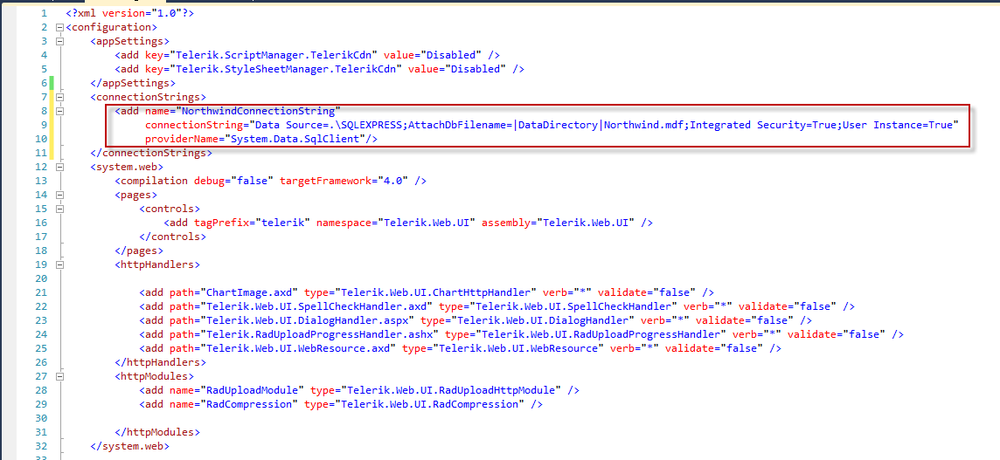
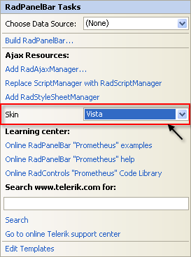
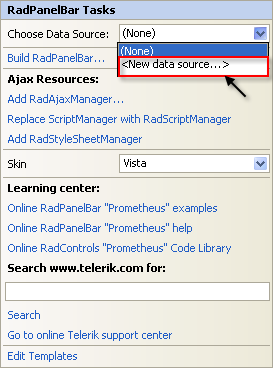
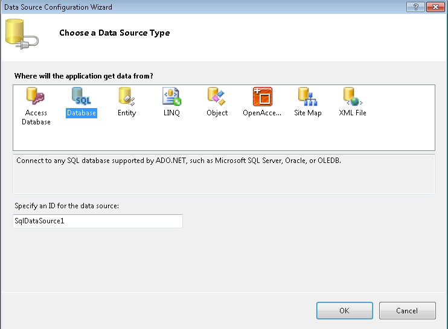
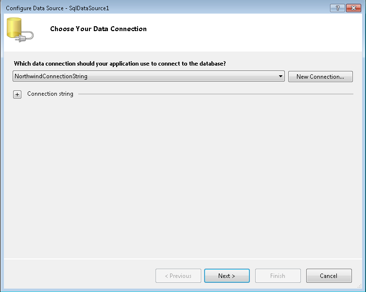
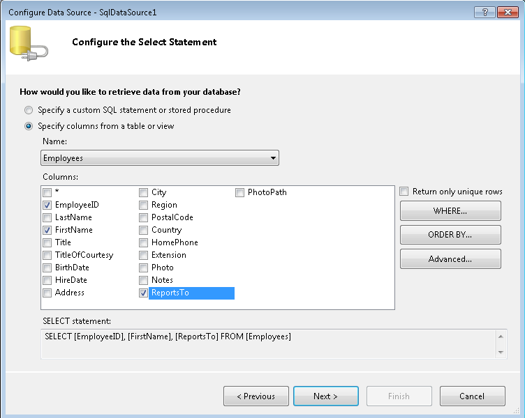
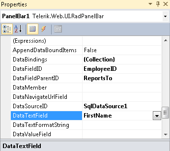
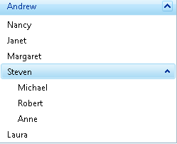

# Binding to a Data Source

## 

This tutorial will show how to bind __RadPanelBar__ to an __AccessDataSource__:

1. Locate the "Nwind.mdb" file that appears in the "Live Demos\App_Data" sub-folder of the folder where you installed RadControls "for ASP.NET Ajax".

1. Drag this file ("Northwind.mdf") to the "App_Data" folder in the Solution Explorer for your project:

1. Add the following connection string in the web config file under the connection string section:

1. Drag a __RadPanelBar__ component from the toolbox onto your Web page. The __RadPanelBar__[Smart Tag]() should appear automatically:

1. In the __RadPanelBar__ Smart Tag, use the __Skin__ drop-down to change the [skin]() for the __RadPanelBar__ to "Vista":

1. Still in the Smart Tag, open the __Choose Data Source__ drop-down and select __New Data Source__.

1. The Data Source Configuration Wizard appears. In the Select a DataSource Type screen, specify an __SqlDataSource__ and click __OK.__

1. In the __Choose your Data Connection__ screen, click the __Browse__ button, and select the "NorthwindConnectionString". Then choose __Next__ to continue:

1. In the __Configure the Select Statement__ screen, choose __Specify columns from a table or view__.

1. In the __Name__ drop-down, select the "Employees" table.

1. In the __Columns__ panel, Select the "EmployeeID", "FirstName", and "ReportsTo" fields. Then choose __Next__ to continue:

1. Click the __Test Query__ button to see the data. Then click __Finish__ to exit the Configure Data Source Wizard:

1. In the Properties pane for the __RadPanelBar__ component,

* Set the __DataFieldId__ property to "EmployeeID".

* Set the __DataFieldParentId__ property to "ReportsTo".

* Set the __DataTextField__ property to "FirstName":

1. Run the application. The panel bar has a single root level item (for the one record with a null value in the "ReportsTo" field). When you expand this item, you can see level 1 items for every record that had Andrew's ID in the "ReportsTo" field. You can expand the item labelled "Steven" to see the level 2 items for records that had Steven's ID in the "ReportsTo" field:

# See Also

 * [Overview]()

 * [Overview]()
