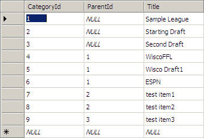
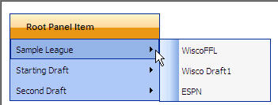

# RadPanelBar with Dynamically Created RadMenu


## 

The sample code below shows how to dynamically create Radmenu inside a RadPanelItem template.

````ASPNET
	    <form id="form2" runat="server">
	   <asp:ScriptManager ID="ScriptManager1" runat="server">
	   </asp:ScriptManager>
	   <telerik:RadPanelBar ID="RadPanelBar1" runat="server" Skin="Outlook" Width="190px">
	       <Items>
	           <telerik:RadPanelItem runat="server" Text="Root Panel Item" Expanded="true" Selected="true">
	               <Items>
	                   <telerik:RadPanelItem runat="server" Value="templateHolder">
	                   </telerik:RadPanelItem>
	               </Items>
	           </telerik:RadPanelItem>
	       </Items>
	       <CollapseAnimation Duration="100" Type="None" />
	       <ExpandAnimation Duration="100" Type="None" />
	   </telerik:RadPanelBar>
	</form> 
````


````C#
	     
	
	using System;
	using System.Data;
	using System.Data.SqlClient;
	using System.Configuration;
	using System.Collections;
	using System.Web;
	using System.Web.Security;
	using System.Web.UI;
	using System.Web.UI.WebControls;
	using System.Web.UI.WebControls.WebParts;
	using System.Web.UI.HtmlControls;
	using Telerik.Web.UI;
	public partial class _Default : System.Web.UI.Page
	{
	   protected void Page_Load(object sender, EventArgs e)
	   {
	       if (!IsPostBack)
	       {
	           SqlDataAdapter adapter = new SqlDataAdapter("SELECT * FROM myMenuLinks", ConfigurationManager.ConnectionStrings["TestDBConnectionString"].ConnectionString);
	           DataSet links = new DataSet();
	           adapter.Fill(links);
	           RadPanelItem panelItem = (RadPanelItem)RadPanelBar1.FindItemByValue("templateHolder");
	           RadMenu myMenu = new RadMenu();
	           myMenu.Width = Unit.Percentage(100);
	           myMenu.Skin = "Outlook";
	           myMenu.Flow = ItemFlow.Vertical;
	           myMenu.DataTextField = "Title";
	           myMenu.DataFieldID = "CategoryId";
	           myMenu.DataFieldParentID = "ParentId";
	           myMenu.DataSource = links;
	           myMenu.DataBind();
	           panelItem.Controls.Add(myMenu);
	           foreach (RadMenuItem myItems in myMenu.GetAllItems())
	           {
	               myItems.Width = Unit.Percentage(100);
	           }
	       }
	   }
	}
	
				
````
````VB.NET
	
	
	Imports System
	Imports System.Data
	Imports System.Data.SqlClient
	Imports System.Configuration
	Imports System.Collections
	Imports System.Web
	Imports System.Web.Security
	Imports System.Web.UI
	Imports System.Web.UI.WebControls
	Imports System.Web.UI.WebControls.WebParts
	Imports System.Web.UI.HtmlControls
	Imports Telerik.Web.UI
	    Partial Public Class _Default
	        Inherits System.Web.UI.Page
	        Protected Sub Page_Load(ByVal sender As Object, ByVal e As EventArgs)
	            If Not IsPostBack Then
	                Dim adapter As New SqlDataAdapter("SELECT * FROM myMenuLinks", ConfigurationManager.ConnectionStrings("TestDBConnectionString").ConnectionString)
	                Dim links As New DataSet()
	                adapter.Fill(links)
	                Dim panelItem As RadPanelItem = DirectCast(RadPanelBar1.FindItemByValue("templateHolder"), RadPanelItem)
	                Dim myMenu As New RadMenu()
	                myMenu.Width = Unit.Percentage(100)
	                myMenu.Skin = "Outlook"
	                myMenu.Flow = ItemFlow.Vertical
	                myMenu.DataTextField = "Title"
	                myMenu.DataFieldID = "CategoryId"
	                myMenu.DataFieldParentID = "ParentId"
	                myMenu.DataSource = links
	                myMenu.DataBind()
	                panelItem.Controls.Add(myMenu)
	                For Each myItems As RadMenuItem In myMenu.GetAllItems()
	                    myItems.Width = Unit.Percentage(100)
	                Next
	            End If
	        End Sub
	    End Class
````


myMenuLinkis SQL Table:




This is the result:


