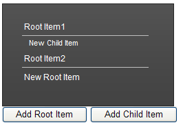

# Working With Items at the Server


Using the server-side API, you can programmatically add, remove, and edit panel items.

## Adding Items on page load

After simply adding a **RadPanelBar** control to your Web page, use the following server-side code to add items when the page loads:


````C#
	
protected void Page_Load(object sender, EventArgs e) 
{ 
    if (!Page.IsPostBack) 
    { 
        RadPanelItem item1 = new RadPanelItem(); 
        item1.Text = "Item 1"; 
        RadPanelItem item11 = new RadPanelItem(); 
        item11.Text = "Child 1"; item1.Items.Add(item11); 
        RadPanelItem item2 = new RadPanelItem();
        item2.Text = "Item 2"; 
        RadPanelItem item3 = new RadPanelItem();
        item3.Text = "Go to the Telerik site"; 
        item3.NavigateUrl = "http://www.telerik.com"; 
        RadPanelBar1.Items.Add(item1); 
        RadPanelBar1.Items.Add(item2); 
        RadPanelBar1.Items.Add(item3); 
    } 
}
	
````
````VB.NET
	
Protected Sub Page_Load(ByVal sender As Object, ByVal e As EventArgs) Handles Me.Load
    If Not Page.IsPostBack Then
        Dim item1 As New RadPanelItem()
        item1.Text = "Item 1"
        Dim item11 As New RadPanelItem()
        item11.Text = "Child 1"
        item1.Items.Add(item11)
        Dim item2 As New RadPanelItem()
        item2.Text = "Item 2"
        Dim item3 As New RadPanelItem()
        item3.Text = "Go to the Telerik site"
        item3.NavigateUrl = "http://www.telerik.com"
        RadPanelBar1.Items.Add(item1)
        RadPanelBar1.Items.Add(item2)
        RadPanelBar1.Items.Add(item3)
    End If
End Sub
	
````


## Adding items dynamically

You can dynamically update the **Items** collection of **RadPanelBar** and **RadPanelItem** in response to a postback as well. Consider the following panel bar declaration:

````ASPNET
<telerik:RadPanelBar ID="RadPanelBar1" runat="server">
   <Items>
       <telerik:RadPanelItem runat="server" Text="Root Item1">
       </telerik:RadPanelItem>
       <telerik:RadPanelItem runat="server" Text="Root Item2">                  
       </telerik:RadPanelItem>               
   </Items>           
</telerik:RadPanelBar>
<asp:Button ID="Button1" runat="server" Text="Add Root Item" OnClick="Button1_Click" />
<asp:Button ID="Button2" runat="server" Text="Add Child Item" OnClick="Button2_Click"/> 
````


A root item will be added upon a button click (**Add Root Item** button)A child item will be added to the first root item upon another button click (**Add Child Items**)


````C#
	
protected void Button1_Click(object sender, EventArgs e) 
{ 
    RadPanelBar1.Items.Add(new RadPanelItem("New Root Item")); 
}

protected void Button2_Click(object sender, EventArgs e) 
{ 
    RadPanelBar1.Items[0].Items.Add(new RadPanelItem("New Child Item")); 
    RadPanelBar1.Items[0].Expanded = true; 
}
	
````
````VB.NET
	
Protected Sub Button1_Click(ByVal sender As Object, ByVal e As EventArgs)
    RadPanelBar1.Items.Add(New RadPanelItem("New Root Item"))
End Sub

Protected Sub Button2_Click(ByVal sender As Object, ByVal e As EventArgs)
    RadPanelBar1.Items(0).Items.Add(New RadPanelItem("New Child Item"))
    RadPanelBar1.Items(0).Expanded = True
End Sub
	
````


Clicking on both the buttons will result in the following:



## Removing, disabling, and enabling items

To remove a panel item in server-side code, use the **Remove** method of the **RadPanelItemCollection** object that contains it. To enable or disable a panel item, use the **Enabled** property of the **RadPanelItem** object itself. The following example demonstrates these techniques:

Consider the following panel bar:

````ASPNET
<telerik:RadPanelBar ID="RadPanelBar1" runat="server">
   <Items>
       <telerik:RadPanelItem runat="server" Text="Root Item1" Expanded="true">
           <Items>
               <telerik:RadPanelItem runat="server" Text="Child Item"></telerik:RadPanelItem>
           </Items>
       </telerik:RadPanelItem>
       <telerik:RadPanelItem runat="server" Text="Root Item2">                  
       </telerik:RadPanelItem>               
   </Items>           
</telerik:RadPanelBar>
<asp:Button ID="Button1" runat="server" Text="Remove the Child Item" OnClick="Button1_Click" /> 
````


````C#
	
protected void Button1_Click(object sender, EventArgs e)
{ 
    RadPanelItem item = RadPanelBar1.FindItemByText("Child Item"); 
    item.Owner.Items.Remove(item); 
}
	
````
````VB.NET
	
Protected Sub Button1_Click(ByVal sender As Object, ByVal e As EventArgs)
    Dim item As RadPanelItem = RadPanelBar1.FindItemByText("Child Item")
    item.Owner.Items.Remove(item)
End Sub
	
````


# See Also

 * [Working With Items at the Client]()

 * [Overview]()

 * [Accessing Items]()
