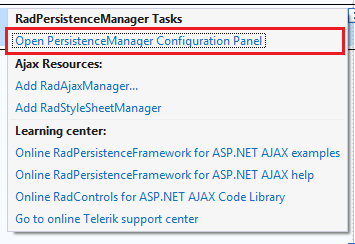
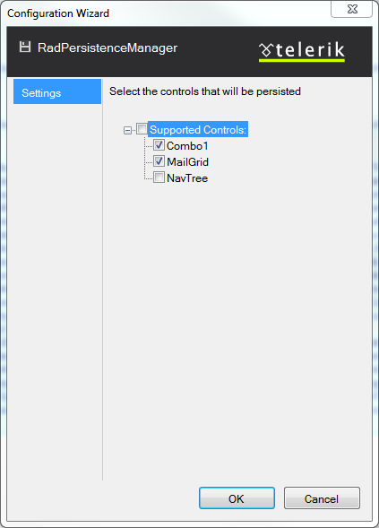

# Getting Started Overview


The below tutorial will walk you through enabling a state persistence for a page containing several Telerik controls.

1. Drag a RadPersistenceManager from the Toolbox onto your webpage.

1. The [Smart Tag]() should appear automatically. From there, choose __Open PersistenceManager configuration wizard__.

1. From the Configuration Wizard select the controls which state should be persisted.

1. Add button controls that will be used to trigger RadPersistenceManager's Save and Load methods

````C#
				<telerik:RadPersistenceManager id="RadPersistenceManager1" runat="server">
					.......
				</telerik:RadPersistenceManager>
	
				<telerik:RadButton ID="saveBtn" Text="Save State" runat="server" Width="67px" OnClick="saveBtn_Click">
				</telerik:RadButton>
				<telerik:RadButton ID="loadBtn" Text="Load State" runat="server" Width="67px" OnClick="loadBtn_Click">
				</telerik:RadButton>
````


>tabbedCode

````C#
		protected void loadBtn_Click(object sender, EventArgs e)
		{
			RadPersistenceManager1.LoadState();
		}
		protected void saveBtn_Click(object sender, EventArgs e)
		{
			RadPersistenceManager1.SaveState();
		}
````


````VB.NET
		Protected Sub loadBtn_Click(sender As Object, e As EventArgs)
			RadPersistenceManager1.LoadState()
		End Sub
	
		Protected Sub saveBtn_Click(sender As Object, e As EventArgs)
			RadPersistenceManager1.SaveState()
		End Sub
	
````


>end

# See Also

 * [Persistence Framework online demos](http://demos.telerik.com/aspnet-ajax/persistence-framework/examples/overview/defaultcs.aspx)
