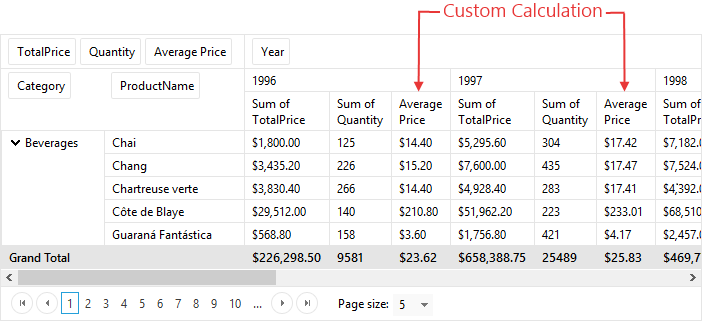
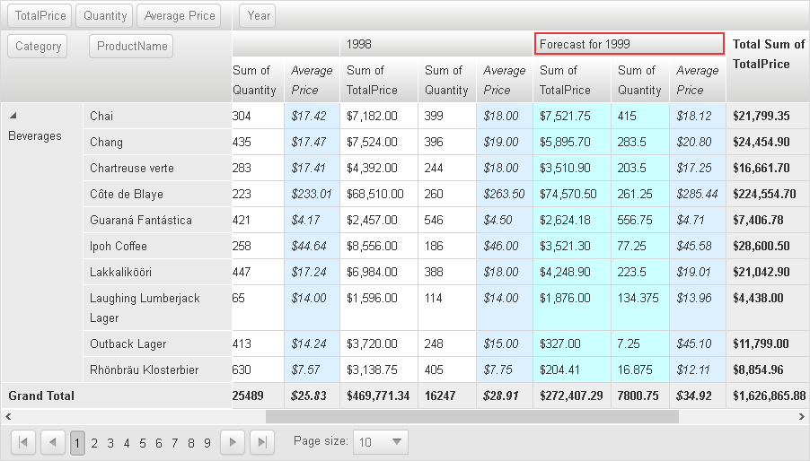

# Custom Data Calculations


## 

This article will cover the types of custom calculations supported by Telerik **RadPivotGrid** control:

* Calculated Fields (type of AggregateField)

* Calculated Items

These calculations will help you generate efficient statistical reports in your production or business application depending on your specific requirements.

## Calculated Fields

The Calculated Fields, which are type of Aggregate Field, do not directly compute their cell values based on the **DataField** from the data source. Instead, they use **CalculationDataFields** for setting one or more required fields and thereby, they calculate the values using an expression based on these data fields (**Figure 1**).

````ASPNET
<telerik:PivotGridAggregateField DataField="Average Price"      
  CalculationDataFields="TotalPrice,Quantity" CalculationExpression="{0}/{1}">
</telerik:PivotGridAggregateField>
````


**Figure 1: The Average Price field displays custom calculation depending on the used expression.**

In case you need a greater control over the calculations, you can also achieve the sample scenario demonstrated above programmatically, which will enable you to make further custom alterations dynamically using your specific conditions.


````ASPNET
<telerik:PivotGridAggregateField DataField="TotalPrice" Aggregate="Sum" 
  DataFormatString="{0:C}">
</telerik:PivotGridAggregateField>
<telerik:PivotGridAggregateField DataField="Quantity" Aggregate="Sum">
</telerik:PivotGridAggregateField>
<telerik:PivotGridAggregateField DataField="Average Price" 
  CalculationDataFields="TotalPrice,Quantity">
</telerik:PivotGridAggregateField>
````
````C#
protected void RadPivotGrid1_ItemNeedCalculation(object sender, PivotGridCalculationEventArgs e)
 {
     if (e.DataField == "Average Price")
     {
         AggregateValue totalPrice = e.GetAggregateValue("TotalPrice");
         AggregateValue quantity = e.GetAggregateValue("Quantity");

         if (totalPrice != null && quantity != null)
         {
             long totalPriceVal = (long)totalPrice.GetValue();
             decimal quantityVal = (decimal)quantity.GetValue();

             // Check for division by zero
             if (quantityVal == 0)
             {
                 if (totalPriceVal == 0) // Result is NaN
                 {
                     e.CalculatedValue = new DoubleAggregateValue(0);
                 }
                 else // Result is Infinity
                 {
                     e.CalculatedValue = totalPrice;
                 }
             }
             else
             {
                 double avg = (double)(totalPriceVal / quantityVal);
                 e.CalculatedValue = new DoubleAggregateValue(avg);
             }
         }
     }
 }
````
````VB
Protected Sub RadPivotGrid1_ItemNeedCalculation(sender As Object, e As PivotGridCalculationEventArgs)
    If e.DataField = "Average Price" Then
        Dim totalPrice As AggregateValue = e.GetAggregateValue("TotalPrice")
        Dim quantity As AggregateValue = e.GetAggregateValue("Quantity")

        If totalPrice IsNot Nothing AndAlso quantity IsNot Nothing Then
            Dim totalPriceVal As Long = CLng(totalPrice.GetValue())
            Dim quantityVal As Decimal = CDec(quantity.GetValue())

            ' Check for division by zero
            If quantityVal = 0 Then
                If totalPriceVal = 0 Then
                    ' Result is NaN
                    e.CalculatedValue = New DoubleAggregateValue(0)
                Else
                    ' Result is Infinity
                    e.CalculatedValue = totalPrice
                End If
            Else
                Dim avg As Double = CDbl(totalPriceVal / quantityVal)
                e.CalculatedValue = New DoubleAggregateValue(avg)
            End If
        End If
    End If
End Sub	
````


Note that even if you set the **CalculationExpression** declaratively in the mark-up, you can still modify the default value of the **e.CalculatedValue** property during the **ItemNeedCalculation** event.

## Calculated Items

Calculated items are summary values that extend items from existing **GroupField** (Row or Column field). You can define such items for each **PivotGridColumnField** or **PivotGridRowField** using their **CalculatedItems** collection.

You can use Calculated Items to place a custom summary at the end of your products, month sales, orders by city, etc.

The following sample will calculate prediction values of products for the year 1999 using the information from the previous years. **Figure 2** shows the result when we implement the logic demonstrated in the code snippets below.


````ASPNET
<telerik:PivotGridColumnField DataField="Year">
    <CalculatedItems>
       <telerik:PivotGridCalculatedItem 
          GroupName="Forecast for 1999">
       </telerik:PivotGridCalculatedItem>
    </CalculatedItems>
</telerik:PivotGridColumnField>
````
````C#
protected void RadPivotGrid1_ItemNeedCalculation(object sender, PivotGridCalculationEventArgs e)
   {
       if (e.GroupName.ToString() == "Forecast for 1999")
       {
           //Calculation of AggregateSummaryValue for our CalculatedItem, based on the values from other items
           try
           {
               LagrangeInterpolate interpolate = new LagrangeInterpolate();
               interpolate.Add(1996, double.Parse(e.GetAggregateSummaryValue(1996).GetValue().ToString()));
               interpolate.Add(1997, double.Parse(e.GetAggregateSummaryValue(1997).GetValue().ToString()));
               interpolate.Add(1998, double.Parse(e.GetAggregateSummaryValue(1998).GetValue().ToString()));

               //Set new calculated value for given field.
               e.CalculatedValue = new DoubleAggregateValue(Math.Max(interpolate.InterpolateX(1998.5), 0));
           }
           catch (Exception)
           {
               //If unable to predict the forecast, leave the cell empty.
               e.CalculatedValue = null;
           }
        }
    }
````
````VB
	    Protected Sub RadPivotGrid1_ItemNeedCalculation(sender As Object, e As PivotGridCalculationEventArgs)
	        If e.GroupName.ToString() = "Forecast for 1999" Then
	            'Calculation of AggregateSummaryValue for our CalculatedItem, based on the values from other items
	            Try
	                Dim interpolate As New LagrangeInterpolate()
	                interpolate.Add(1996, Double.Parse(e.GetAggregateSummaryValue(1996).GetValue().ToString()))
	                interpolate.Add(1997, Double.Parse(e.GetAggregateSummaryValue(1997).GetValue().ToString()))
	                interpolate.Add(1998, Double.Parse(e.GetAggregateSummaryValue(1998).GetValue().ToString()))
	
	                'Set new calculated value for given field.
	                e.CalculatedValue = New DoubleAggregateValue(Math.Max(interpolate.InterpolateX(1998.5), 0))
	            Catch generatedExceptionName As Exception
	                'If unable to predict the forecast, leave the cell empty.
	                e.CalculatedValue = Nothing
	            End Try
	        End If
	    End Sub
	#End Region
	
	End Class
````


**Figure 2: For a live demo of this sample please check the links in the Other Resources section.**

## SolveOrder property

Since *Q3 2014*, **PivotGridCalculatedItem** exposes **SolveOrder** property, which could be used in complex scenarios with multiple **CalculatedItems**, where one (or more) calculation(s) depend on the calculated values of other calculated items. With **SolveOrder** property you can specify the order by which the calculations will be performed.

## Limitations

Currently, custom data calculations are not applicable for pivot Fields with defined **GroupInterval** property.

# See Also

 * [Overview]()

 * [Live Demo](http://demos.telerik.com/aspnet-ajax-dev/pivotgrid/examples/calculations/defaultcs.aspx)

 * [Calculations]()
