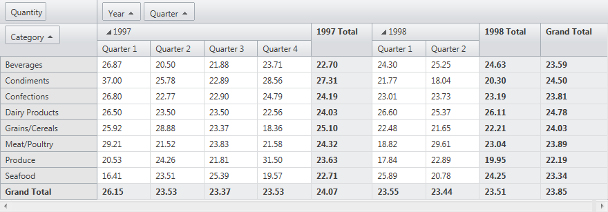

# Sorting


## 

**RadPivotGrid** has a built in sorting functionality. To enable to sorting function in **RadPivotGrid** you should set the **AllowSorting** property to True. After that arrow buttons appear in row headers that are used to select a sort mode. List of the available options is:

* **Ascending**

* **Descending**

RadPivotGrid could sort columns and rows. By default when sorting is enabled, the results are returned in ascending order. The sorting operation is executed when you click on the field that you want to sort:


You could click on the field and the sort order will be changed. After clicking the field RadPivotGrid will return the sorted result set:


Since **Q1 2014 SP1** version, **RadPivotGrid** provides two additional improvements to its sorting functionality.

First option is to set the **AllowNaturalSort** to True within the definition of the RadPivotGrid. When this property is enabled, each field will now have third possible order of its sorting state in addition to **Asc** and **Desc**: **None**. When the **None** sorting is active, the sort order will be determined by the original sort order from the data source.

Second option is available only when the control is [ bound to an OLAP source](). **RadPivotGrid** now provides a new **PrepareDescriptionForField** event handler, which you can use to set **OlapGroupComparer** for the description of each field that you want to sort naturally. This will enable you to sort numeric fields naturally as numbers instead of strings.


````C#
protected void RadPivotGrid1_PrepareDescriptionForField(object sender, PivotGridPrepareDescriptionForFieldEventArgs e)
{
    // You can execute your logic only for fields that match a given condition
    //if (e.Field.UniqueName == "MyFieldName")

    var desc = e.Description as OlapGroupDescription;

    if (desc != null)
    {
        desc.GroupComparer = new OlapGroupComparer();

        foreach (OlapLevelGroupDescription levelGroupDescription in desc.Levels)
        {
            levelGroupDescription.GroupComparer = new OlapGroupComparer();
        }
    }
}
````
````VB.NET
Protected Sub RadPivotGrid1_PrepareDescriptionForField(sender As Object, e As PivotGridPrepareDescriptionForFieldEventArgs)
    ' You can execute your logic only for fields that match a given condition
    'if (e.Field.UniqueName == "MyFieldName")

    Dim desc = TryCast(e.Description, OlapGroupDescription)

    If desc IsNot Nothing Then
        desc.GroupComparer = New OlapGroupComparer()

        For Each levelGroupDescription As OlapLevelGroupDescription In desc.Levels
            levelGroupDescription.GroupComparer = New OlapGroupComparer()
        Next
    End If
End Sub
````


## Sort Expressions

Internally the sort function uses sort expressions in order to sort the data in the data source. These sort expressions could be modified either declaratively or dynamically at runtime and thus to control the sort order.
