# Aggregates Position


RadPivotGrid offers several options for setting its aggregate position depending on the row table layout. These options could be set my using the **RowTableLayout**, **AggregatesPosition** and **AggregatesLevel** properties of the control. The aggregate position could be set to **Rows** or **Column**.

Below follow descriptions of the Aggregate positions based on the **RowTableLayout** and the and **AggregatesLevel**.

## AggregatesPosition="Rows"

### **RowTableLayout="Tabular"**

* Below is an example with aggregates on level three:
````ASPNET
<telerik:RadPivotGrid RenderMode="Lightweight" ID="RadPivotGrid1" runat="server" DataSourceID="SqlDataSource1" Skin="Metro" AggregatesPosition="Rows" RowTableLayout="Tabular" AggregatesLevel="3">
````           

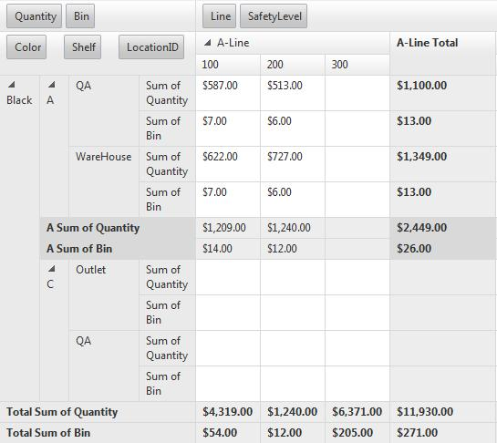
Here is the same layout with items on the first level collapsed:
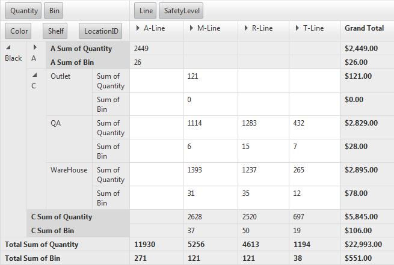

* Below is an example with aggregates on level two:
````ASPNET
<telerik:RadPivotGrid RenderMode="Lightweight" ID="RadPivotGrid1" runat="server" DataSourceID="SqlDataSource1" Skin="Metro" AggregatesPosition="Rows" RowTableLayout="Tabular" AggregatesLevel="2">
````                


Here is the same layout with some collapsed items:


* Below is an example with aggregates on level one:
````ASPNET
<telerik:RadPivotGrid RenderMode="Lightweight" ID="RadPivotGrid1" runat="server" DataSourceID="SqlDataSource1" Skin="Metro" AggregatesPosition="Rows" RowTableLayout="Tabular" AggregatesLevel="1">
````                

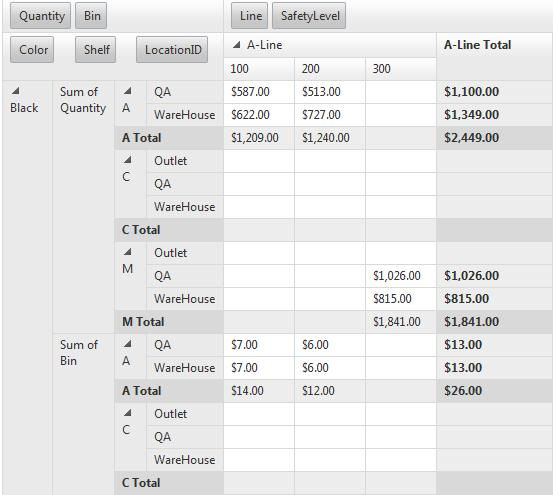
Here is the same layout with some collapsed items:
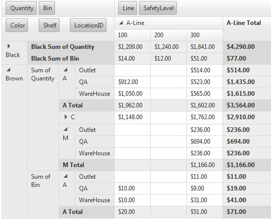

* Below is an example with aggregates on level zero:
````ASPNET
<telerik:RadPivotGrid RenderMode="Lightweight" ID="RadPivotGrid1" runat="server" DataSourceID="SqlDataSource1" Skin="Metro" AggregatesPosition="Rows" RowTableLayout="Tabular" AggregatesLevel="0">
````                

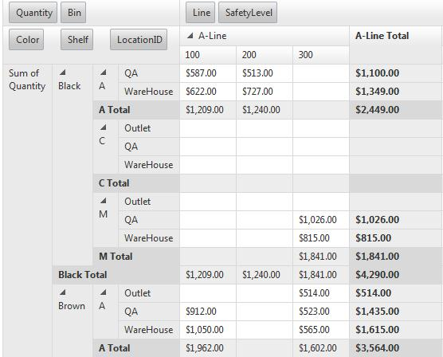
Here is the same layout with some collapsed items:


### **RowTableLayout="Outline"**

* Below is an example with aggregates on level three:
````ASPNET
<telerik:RadPivotGrid RenderMode="Lightweight" ID="RadPivotGrid1" runat="server" DataSourceID="SqlDataSource1" Skin="Metro" AggregatesPosition="Rows" RowTableLayout="Outline" AggregatesLevel="3">
````                

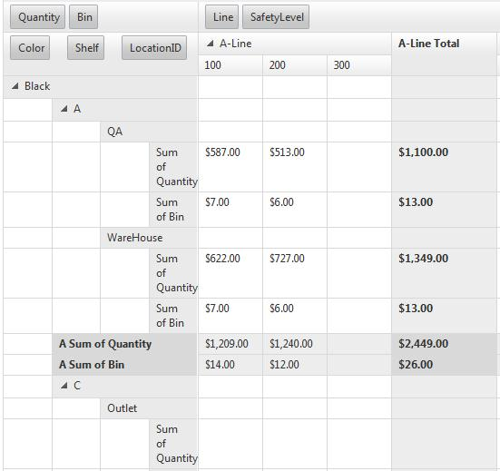
Here is the same layout with some collapsed items:
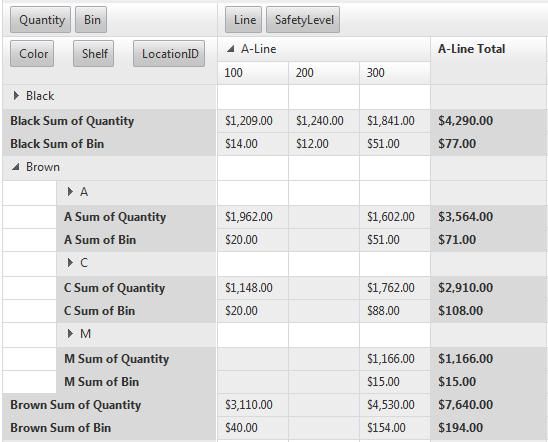

* Below is an example with aggregates on level two:
````ASPNET
<telerik:RadPivotGrid RenderMode="Lightweight" ID="RadPivotGrid1" runat="server" DataSourceID="SqlDataSource1" Skin="Metro" AggregatesPosition="Rows" RowTableLayout="Outline" AggregatesLevel="2">
````                


* Below is an example with aggregates on level one with collapsed items:
````ASPNET
<telerik:RadPivotGrid RenderMode="Lightweight" ID="RadPivotGrid1" runat="server" DataSourceID="SqlDataSource1" Skin="Metro" AggregatesPosition="Rows" RowTableLayout="Outline" AggregatesLevel="1">
````                

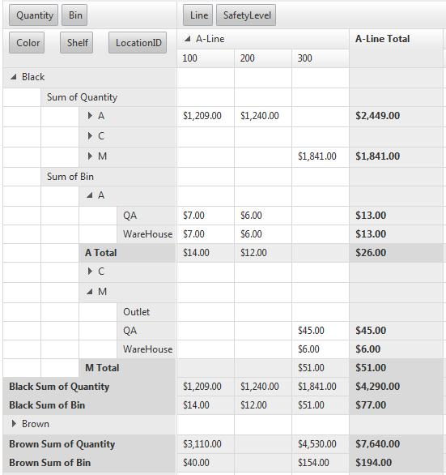

* Below is an example with aggregates on level zero with collapsed items:
````ASPNET
<telerik:RadPivotGrid RenderMode="Lightweight" ID="RadPivotGrid1" runat="server" DataSourceID="SqlDataSource1" Skin="Metro" AggregatesPosition="Rows" RowTableLayout="Outline" AggregatesLevel="0">
````                

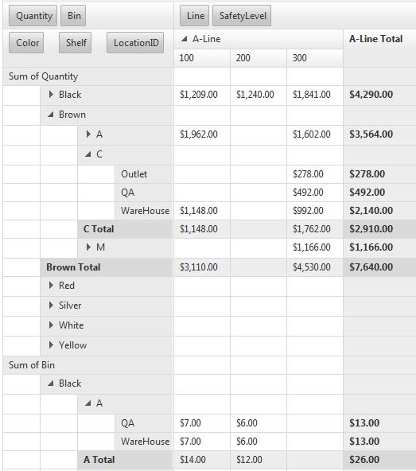

### **RowTableLayout="Compact"**

* Below is an example with aggregates on level three:
````ASPNET
<telerik:RadPivotGrid RenderMode="Lightweight" ID="RadPivotGrid1" runat="server" DataSourceID="SqlDataSource1" Skin="Metro" AggregatesPosition="Rows" RowTableLayout="Compact" AggregatesLevel="3">
````                

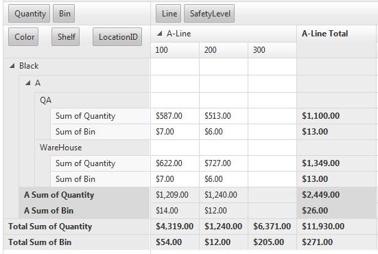 
Here is the same layout with items on the first level collapsed:
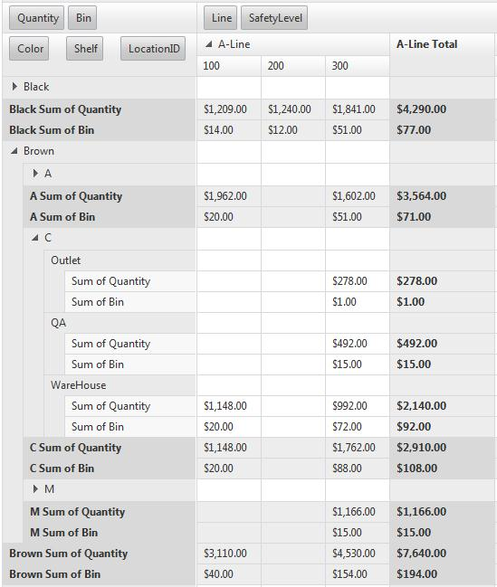

* Below is an example with aggregates on level two:
````ASPNET
<telerik:RadPivotGrid RenderMode="Lightweight" ID="RadPivotGrid1" runat="server" DataSourceID="SqlDataSource1" Skin="Metro" AggregatesPosition="Rows" RowTableLayout="Compact" AggregatesLevel="2">
````                

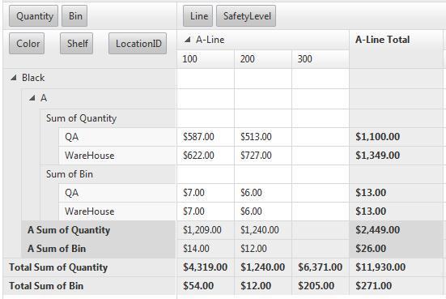

* Below is an example with aggregates on level one with some collapsed items:
````ASPNET
<telerik:RadPivotGrid RenderMode="Lightweight" ID="RadPivotGrid1" runat="server" DataSourceID="SqlDataSource1" Skin="Metro" AggregatesPosition="Rows" RowTableLayout="Compact" AggregatesLevel="1">
````                

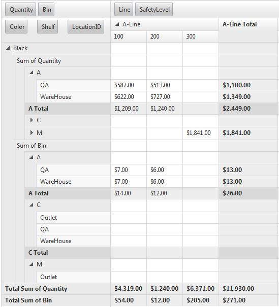

* Below is an example with aggregates on level zero with some collapsed items:
````ASPNET
<telerik:RadPivotGrid RenderMode="Lightweight" ID="RadPivotGrid1" runat="server" DataSourceID="SqlDataSource1" Skin="Metro" AggregatesPosition="Rows" RowTableLayout="Compact" AggregatesLevel="0">
````                

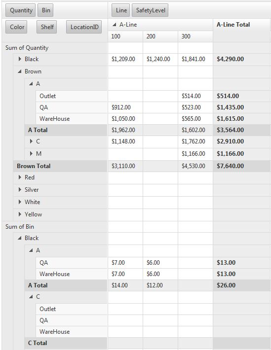

## AggregatesPosition="Columns"

### **RowTableLayout="Tabular"**

* Below is an example with aggregates on level two:
````ASPNET
<telerik:RadPivotGrid RenderMode="Lightweight" ID="RadPivotGrid1" runat="server" DataSourceID="SqlDataSource1" Skin="Metro" AggregatesPosition="Columns" RowTableLayout="Tabular" AggregatesLevel="2">
````                

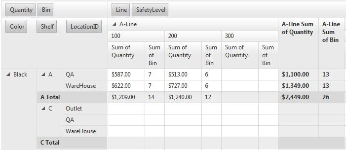

* Below is an example with aggregates on level one:
````ASPNET
<telerik:RadPivotGrid RenderMode="Lightweight" ID="RadPivotGrid1" runat="server" DataSourceID="SqlDataSource1" Skin="Metro" AggregatesPosition="Columns" RowTableLayout="Tabular" AggregatesLevel="1">
````                

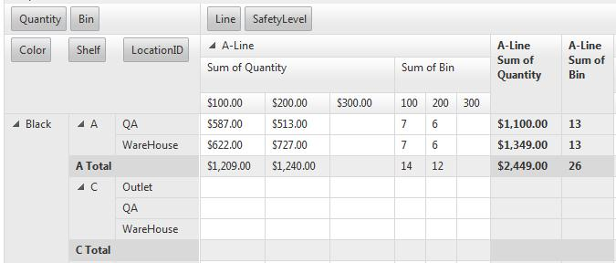
Here is the same layout with some collapsed items:
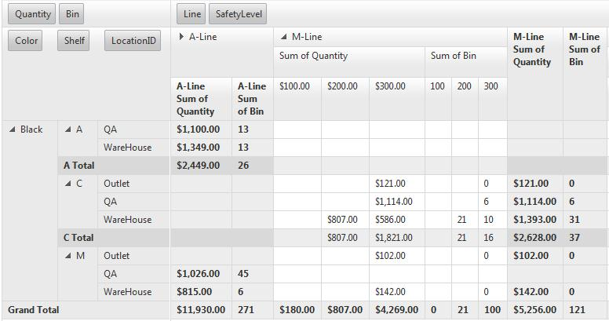

* Below is an example with aggregates on level zero:
````ASPNET
<telerik:RadPivotGrid RenderMode="Lightweight" ID="RadPivotGrid1" runat="server" DataSourceID="SqlDataSource1" Skin="Metro" AggregatesPosition="Rows" RowTableLayout="Tabular" AggregatesLevel="0">
````                

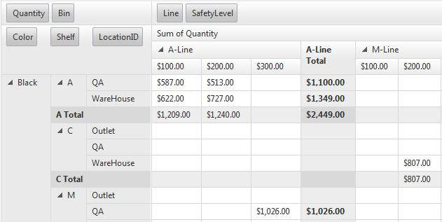

### **RowTableLayout="Outline"**

* Below is an example with aggregates on level two:
````ASPNET
<telerik:RadPivotGrid RenderMode="Lightweight" ID="RadPivotGrid1" runat="server" DataSourceID="SqlDataSource1" Skin="Metro" AggregatesPosition="Columns" RowTableLayout="Outline" AggregatesLevel="2">
````                

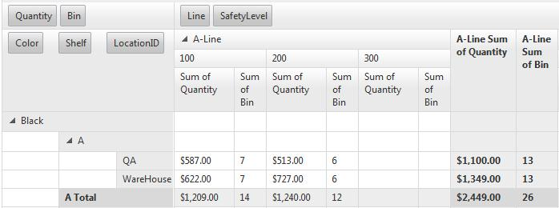

* Below is an example with aggregates on level one :
````ASPNET
<telerik:RadPivotGrid RenderMode="Lightweight" ID="RadPivotGrid1" runat="server" DataSourceID="SqlDataSource1" Skin="Metro" AggregatesPosition="Columns" RowTableLayout="Outline" AggregatesLevel="1">
````                

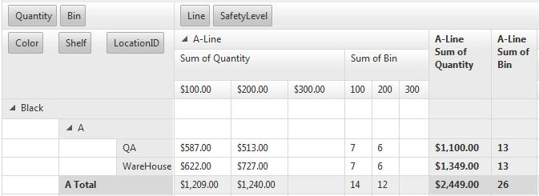

* Below is an example with aggregates on level zero:
````ASPNET
<telerik:RadPivotGrid RenderMode="Lightweight" ID="RadPivotGrid1" runat="server" DataSourceID="SqlDataSource1" Skin="Metro" AggregatesPosition="Columns" RowTableLayout="Outline" AggregatesLevel="0">
````                

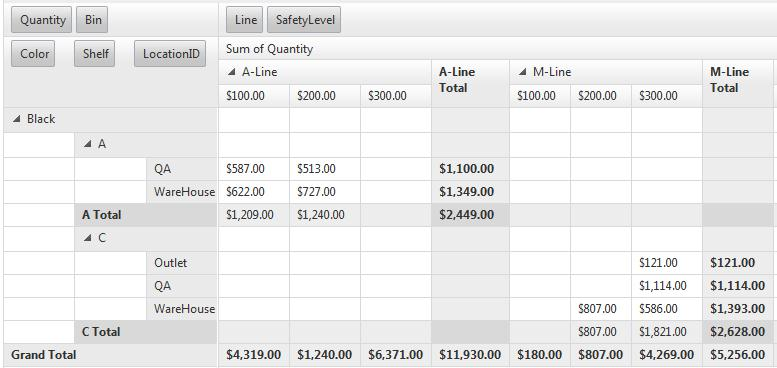

### **RowTableLayout="Compact"**

* Below is an example with aggregates on level two:
````ASPNET
<telerik:RadPivotGrid RenderMode="Lightweight" ID="RadPivotGrid1" runat="server" DataSourceID="SqlDataSource1" Skin="Metro" AggregatesPosition="Columns" RowTableLayout="Compact" AggregatesLevel="2">
````                


Here is the same layout with three column fields and some collapsed items:


* Below is an example with aggregates on level one with three column fields and some collapsed items:
````ASPNET
<telerik:RadPivotGrid RenderMode="Lightweight" ID="RadPivotGrid1" runat="server" DataSourceID="SqlDataSource1" Skin="Metro" AggregatesPosition="Columns" RowTableLayout="Compact" AggregatesLevel="1">
````                

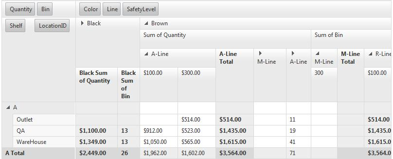

* Below is an example with aggregates on level zero with three column fields and some collapsed items:
````ASPNET
<telerik:RadPivotGrid RenderMode="Lightweight" ID="RadPivotGrid1" runat="server" DataSourceID="SqlDataSource1" Skin="Metro" AggregatesPosition="Columns" RowTableLayout="Compact" AggregatesLevel="0">
````


