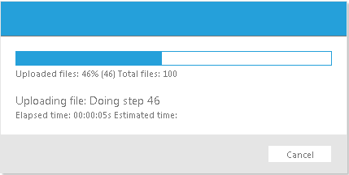

# Custom Progress


__RadProgressArea__ can be used to monitor the progress of any measurable process.

To monitor custom progress:

1. Register [ RadUploadHttpModule and RadUploadProgressHandler ]() in web.config.

1. Put a __RadProgressManager__ control on the Web page.

1. Put a __RadProgressArea__ control on the Web page.

* Set its __ProgressIndicators__ property to include only those controls you want to use. In the __Page_Load__ event handler, set the __Localization__ property of the __RadProgressArea__ object to change the labels so that they reflect your custom process.

1. In the code-behind, when the custom process executes, use the __RadProgressContext.Current__ property to access the progress context.

* At each measurable step of the process, updates the fields of the progress context to indicate the values that __RadProgressArea__ should display.

The following table lists the fields of the progress context that you can set:


>caption  

| Name | Description |
| ------ | ------ |
|PrimaryTotal|The maximum value of the primary progress indicators. By default, __RadProgressArea__ d isplays the request size.|
|PrimaryValue|The current value of the primary progress indicators. By default, __RadProgressArea__ displays the uploaded bytes count.|
|PrimaryPercent|The current value of the primary progress, expressed as a percentage of PrimaryTotal.|
|SecondaryTotal|The maximum value of the secondary progress indicators. By default, __RadProgressArea__ displays the total number of files.|
|SecondaryValue|The current value of the secondary progress indicators. By default, __RadProgressArea__ displays the number of files already uploaded.|
|SecondaryPercent|The current value of the secondary progress, expressed as a percentage of SecondaryTotal.|
|CurrentOperationText|The description of the current operation. By default, __RadProgressArea__ displays the name of the currently uploading file.|
|TimeEstimated|The estimated time until the operation completes.|
|TimeElapsed|The time that has elapsed from the beginning of the operation.|
|Speed|The speed of the process. By default, RadProgressArea displays the upload speed.|

>note If you set some of these properties before upload begins, they are not used for file upload monitoring.
>


## Example

This example shows how to use __RadProgressArea__ to display the progress of a custom process:

The __RadProgressManager__ has __SuppressMissingHttpModuleError__set to "true", and the __RadProgressArea__ hides the primary progress indicators and__Speed__ indicator, as these all provide units to the value that reflect size:

````ASPNET
	    <telerik:radprogressmanager id="RadProgressManager1" runat="server" />
	    <telerik:radprogressarea id="RadProgressArea1" runat="server" displaycancelbutton="True"
	        progressindicators="FilesCountBar,
	                              FilesCount,
	                              FilesCountPercent,                      
	                              SelectedFilesCount,                      
	                              CurrentFileName,                      
	                              TimeElapsed,                      
	                              TimeEstimated">
	    </telerik:radprogressarea>
	    <asp:Button ID="Button1" runat="server" OnClick="Button1_Click" Text="Initiate Process" />
````


In the __Page_Load__ event handler, the __Localization__property is set to reflect the new process:


>tabbedCode

````C#
	     
	
	protected void Page_Load(object sender, EventArgs e)
	{
	 
	   RadProgressArea1.Localization.UploadedFiles = "Completed Steps: ";
	   RadProgressArea1.Localization.CurrentFileName = "Step: ";
	   RadProgressArea1.Localization.TotalFiles = "Total Steps:";
	 
	} 
				
````
````VB.NET
	     
	
	    Protected Sub Page_Load(ByVal sender As Object, ByVal e As EventArgs) Handles Me.Load
	
	        RadProgressArea1.Localization.UploadedFiles = "Completed Steps: "
	        RadProgressArea1.Localization.CurrentFileName = "Step: "
	        RadProgressArea1.Localization.TotalFiles = "Total Steps:"
	
	    End Sub
				
````
>end

The button's __Click__ event handler performs the lengthy process, and at each measurablestep, updates the progress context:

>tip In addition to the __Dictionary__ type, the __RadProgressContext__ now offers strongly named properties:
>context["CurrentOperationText"] = "Doing step " + i.ToString();
>is the same as
>context.CurrentOperationText = "Doing step " + i.ToString();
>


>tabbedCode

````C#
	
	
	protected void Button1_Click(object sender, EventArgs e)
	{
	    RadProgressContext context = RadProgressContext.Current;
	    context.SecondaryTotal = "100";
	    for (int i = 1; i < 100; i++)
	    {
	        context.SecondaryValue = i.ToString();
	        context.SecondaryPercent = i.ToString();
	        context.CurrentOperationText = "Doing step " + i.ToString();
	        if (!Response.IsClientConnected)
	        {
	            //Cancel button was clicked or the browser was closed, so stop processing
	            break;
	        }
	        // simulate a long time performing the current step
	        System.Threading.Thread.Sleep(100);
	    }
	} 
````
````VB.NET
	     
	
	    Protected Sub Button1_Click(ByVal sender As Object, ByVal e As EventArgs) Handles Button1.Click
	        Dim context As RadProgressContext = RadProgressContext.Current
	        context.SecondaryTotal = "100"
	        Dim i As Integer = 1
	        While i < 100
	            context.SecondaryValue = i.ToString()
	            context.SecondaryPercent = i.ToString()
	            context.CurrentOperationText = "Doing step " + i.ToString()
	            If Not Response.IsClientConnected Then
	                'Cancel button was clicked or the browser was closed, so stop processing
	                Exit While
	            End If
	            ' simulate a long time performing the current step
	            System.Threading.Thread.Sleep(100)
	            i = i + 1
	        End While
	    End Sub
	
````
>end


For a live example that shows how to use custom progress monitoring in combination with a file upload, see [Monitoring Custom Progress](http://demos.telerik.com/aspnet-ajax/Upload/Examples/CustomProgress/DefaultCS.aspx).


