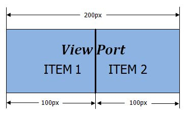

# Getting Started Overview

**These steps should be followed in order to configure RadRotator control:**

**RadRotator** is a dynamic control that moves its content. To do that the control should be "aware" of its items size. The *ItemWidth* and *ItemHeight* properties are intended to provide this information to the control. If these properties are not set accordingly to the ItemTemplate's *size*, then the **RadRotator** may behave inconsistently in different browsers.

* The items are not shown when the control is first loaded. After clicking the "Refresh" button the items become visible.

* Rotator shows only a part of a loaded item (the items are not synchronized)

* A gap occurs between the item like an empty item.

* Rotator does not rotate its content

This example demonstrates the purpose of the [Width, ItemWidth, Height and ItemHeight]() properties:

* Add the control on the page. You can simply drag and drop it from the Visual Studio's Toolbox. Please note that it requires an asp:ScriptManager to be declared on the page as well

* Add a data source control and set the RadRotator's DataSourceID property to its ID

* Declare the ItemTemplate's content

* It is recommended, if multiple elements are declared inside the rotator's ItemTemplate, to add a div that wraps the content in the ItemTemplate and set a class to that div. The *width* and *height* CSS properties applied through this class should be synchronized with the values set to the RadRotator's *ItemWidth* and *ItemHeight* properties. The margin and padding of the elements declared inside the ItemTemplate should be taken into account as well.

* Set the [Width, ItemWidth, Height and ItemHeight]() properties:

````XML
<telerik:RadRotator ID="RadRotator1" runat="server" Width="200" ItemWidth="100" Height="100"
	ItemHeight="100" DataSourceID="XmlDataSource1" FrameDuration="1000">
	<ItemTemplate>
		<asp:Image CssClass="itemTemplate" ID="Image1" runat="server" ImageUrl='<%# XPath("ImageURL") %>'
			AlternateText="IMAGE" />
	</ItemTemplate>
</telerik:RadRotator>
````

* This is the implementation of the itemTemplate class:

````XML
.itemTemplate
{
	width: 100px;
	height: 100px;
}
````

After implementing the above steps two items will be shown in the **RadRotator**'s viewport, because of the *Width="200"* and *ItemWidth="100"* properties.



In case that the requirement is to show 3 items in the viewport, then the *Width* property should be changed to "300". Also, if one of the **RadRotator**'s buttons' type is used , then the *Width* property should be set to *"240"* (the buttons have dimensions: 20x20 pixels).

All of the explained logic stays the same if the *ScrollDirection="Up, Down"* is set, but it should be applied to the *Height* and *ItemHeight* properties, respectively.

>important The built-in skin **MetroTouch** (introduced with the Q2 2012 release) requires some additional modifications of the values that should be set in the properties **Width** and **Height** of **RadRotator** :
* You should always add 14px to the **Width** and the **Height** of **RadRotator** .
* If the **RadRotator** is configured in a mode that uses control buttons (for example **Buttons** , **ButtonsOver** ) you should add 28px for every button (the buttons have dimensions: 28x28 pixels). In case the **RadRotator** has horizontal orientation the pixels are added to the **Width** property and in case the rotator control is oriented vertically, you should increase the **Height** property.

>important The **RadRotator** control does not support percent values and all of the above properties should be set in pixels.
