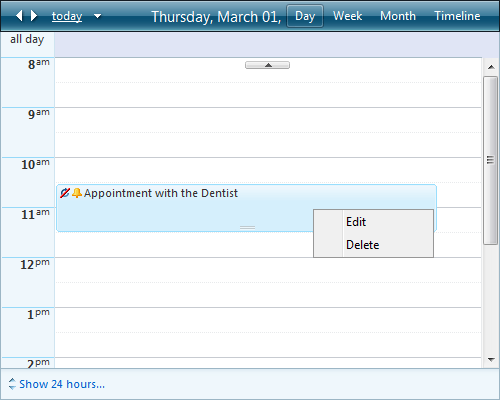
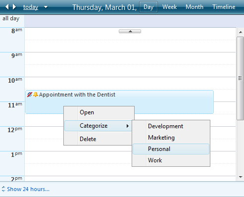
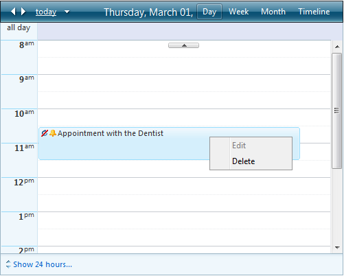

# Appointment Context Menu


## 

With Q3 2009, RadScheduler gives you the option to enable a default appointment context menu.

If **AppointmentContextMenuSettings**-**EnableDefault** is set to **true**, right-clicking on an appointment will display a default context menu with two action items - **Edit** and **Delete**. The default appointment context menu is disabled by default.

You can use the AppointmentContextMenuSettings to also style the menu through a [skin registration](), or to [disable its embedded resources]():


If not specified, the above settings will be inherited from those of the RadScheduler instance.




The default appointment context menu can be customized declaratively:

````ASPNET
	
<telerik:RadScheduler RenderMode="Lightweight" ID="RadScheduler1" runat="server">
   <AppointmentContextMenus>
	   <telerik:RadSchedulerContextMenu runat="server" ID="ContextMenu1">
		   <Items>
			   <telerik:RadMenuItem Text="Open" Value="CommandEdit" />
			   <telerik:RadMenuItem IsSeparator="True" />
			   <telerik:RadMenuItem Text="Categorize">
				   <Items>
					   <telerik:RadMenuItem Text="Development" Value="1" />
					   <telerik:RadMenuItem Text="Marketing" Value="2" />
					   <telerik:RadMenuItem Text="Personal" Value="3" />
					   <telerik:RadMenuItem Text="Work" Value="4" />
				   </Items>
			   </telerik:RadMenuItem>
			   <telerik:RadMenuItem IsSeparator="True" />
			   <telerik:RadMenuItem Text="Delete" Value="CommandDelete" />
		   </Items>
	   </telerik:RadSchedulerContextMenu>
   </AppointmentContextMenus>
</telerik:RadScheduler>      
	
````





The functionality of the default menu items can be achieved by setting the **Value** property of the menu item to a command name.RadScheduler's appointment context menu will recognize the following commands:

* CommandEdit

* CommandDelete

To allow associating other functionality to a menu item, RadScheduler exposes the following events:

**Client Side**

* [OnClientAppointmentContextMenuItemClicking]()

* [OnClientAppointmentContextMenuItemClicked]()

**Server Side**

* [OnAppointmentContextMenuItemClicking]()

* [OnAppointmentContextMenuItemClicked]()

For more information, please see the [Context menu](http://demos.telerik.com/aspnet-ajax/scheduler/examples/contextmenu/defaultcs.aspx) online demo.

If more than one appointment context menu is declared, you can specify which one to be opened for a specific appointmentvia the Appointment's **ContextMenuID** property. For example:


````C#
	
protected void RadScheduler1_AppointmentDataBound(object sender, SchedulerEventArgs e)
{
	e.Appointment.ContextMenuID = "SchedulerAppointmentContextMenu2";
} 
	
````
````VB.NET
	
Protected Sub RadScheduler1_AppointmentDataBound(ByVal sender As Object, ByVal e As SchedulerEventArgs)
	e.Appointment.ContextMenuID = "SchedulerAppointmentContextMenu2"
End Sub
		
````


If the RadScheduler is read-only (via the **ReadOnly** property) – then you will not be able to edit or delete appointments. This reflects on the context menu items too. The two options of the default appointment context menu will be disabled. Also if **AllowEdit** or **AllowDelete** properties of the RadScheduler are set to **“False”** – the corresponding menu item will be disabled.

The picture below demonstrates disabled **“Edit”** item as the **AllowEdit** property of the RadScheduler is set to **“False”**:


