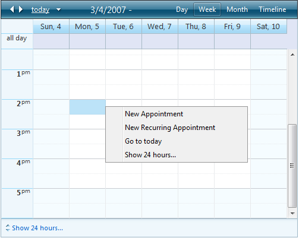
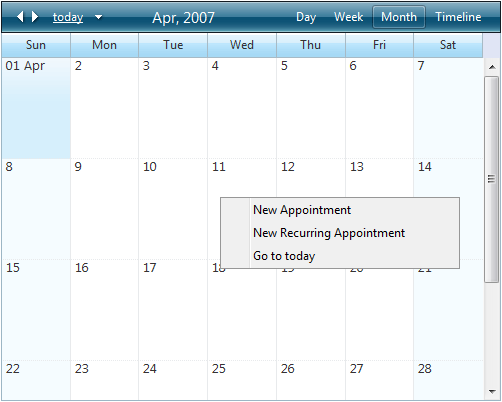
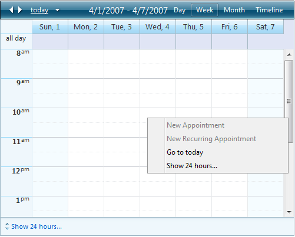

# Time Slot Context Menu


## 

With Q3 2009, RadScheduler gives you the option to enable a default time slot context menu.

If __TimeSlotContextMenuSettings-EnableDefault__ is set to __true__, right-clicking on a time slot will display a context menu.The default time slot context menu is disabled by default.

You can use the TimeSlotContextMenuSettings to also style the menu through a [skin registration](CC071FB0-3F19-408A-8AEA-7A82330F6831), or to [disable its embedded resources](F02D3323-FFA7-46E6-A4DE-303D5EF15A43):


If not specified, the above settings will be inherited from those of the RadScheduler instance.

The items of the default time slot context menu depend on the currently selected view.

For __Day__ and __Week__ view the context menu has four items as shown below:



For __Month__ and __Timeline__ view the context menu has three items:



The default time slot context menu can be customized declaratively:

````ASPNET
	
	<TimeSlotContextMenus>
	   <telerik:RadSchedulerContextMenu ID="SchedulerTimeSlotContextMenu" runat="server">
	       <Items>
	           <telerik:RadMenuItem Text="New Appointment" Value="CommandAddAppointment" />
	           <telerik:RadMenuItem Text="New All Day Event" />
	           <telerik:RadMenuItem IsSeparator="True" />
	           <telerik:RadMenuItem Text="New Recurring Appointment" Value="CommandAddRecurringAppointment" />
	           <telerik:RadMenuItem Text="New Recurring Event" />
	           <telerik:RadMenuItem IsSeparator="True" />
	           <telerik:RadMenuItem Text="Go to today" Value="CommandGoToToday" />
	           <telerik:RadMenuItem Text="Show 24 hours..." Value="CommandShow24Hours" />
	       </Items>
	   </telerik:RadSchedulerContextMenu>
	</TimeSlotContextMenus>     
	
````


The functionality of the default menu items such as adding an appointment or navigating to today's date can be achieved by setting the__Value__ property of the menu item to a command name. RadScheduler's time slot context menu will recognize the following commands:

* CommandAddAppointment

* CommandAddRecurringAppointment

* CommandGoToToday

* CommandShow24Hours

To allow associating other functionality to a menu item, RadScheduler exposes the following events:

__Client Side__

* [OnClientTimeSlotContextMenuItemClicking]()

* [OnClientTimeSlotContextMenuItemClicked]()

__Server Side__

* [OnTimeSlotContextMenuItemClicking]()

* [OnTimeSlotContextMenuItemClicked]()

If the RadScheduler is read-only (via the __ReadOnly__property) or the __AllowInsert__property is set to __“False”__– then you will not be able to insert appointments. The two menu items __“New Appointment”__ and __“New Recurring Appointment”__ will be disabled:



For more information, please see the [Context menu](http://demos.telerik.com/aspnet-ajax/scheduler/examples/contextmenu/defaultcs.aspx) online demo.


