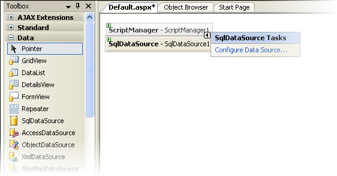
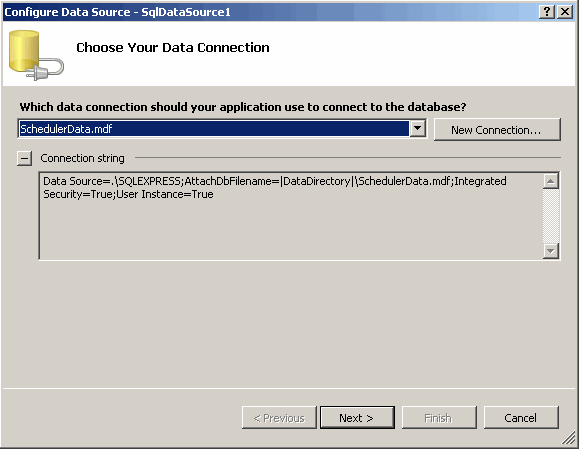
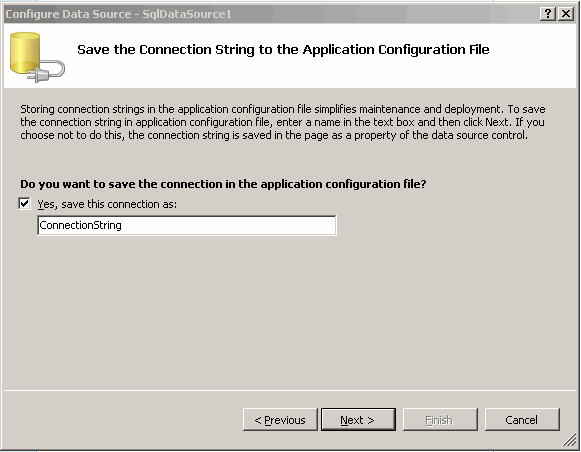
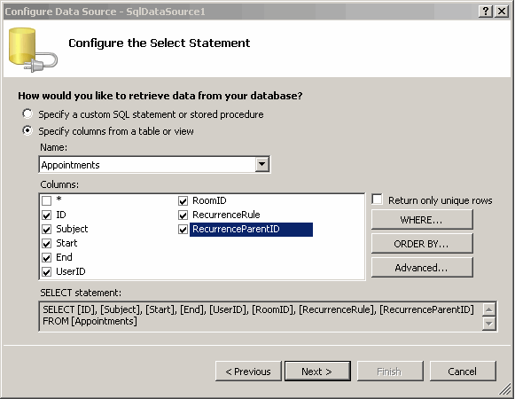
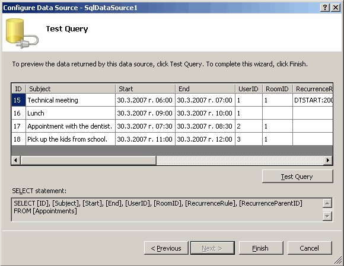
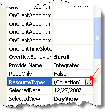

# Declarative Data Binding

Declarative data source controls, which were introduced in ASP.NET 2.0, let you access and modify the scheduler's data with minimal amount of code. Binding __RadScheduler__ to such a data source can be completed without writing any code: you need only configure the data source and set a few properties to link the scheduler to the data source and indicate which fields the scheduler is to use.

## Example

The example below shows how to bind RadScheduler to a SQLDataSource component at design time, and demonstrates how to set up user-defined resources:

## Setting up the data source

1. Drag a SqlDataSource component from the toolbox onto your page.

1. The Smart Tag for the __SQLDataSource__ component should automatically come up.If it does not, right click on the __SQLDataSource__ component and choose __Show Smart Tag__.On the Smart Tag, choose __Configure Data Source...__

1. The __Configure Data Source__ Wizard appears.

1. Choose a database and a connection that your application will use to connect to that database.

1. Click __Next__ to continue. Save the connection string, and choose __Next__ again.

1. Configure the __SELECT__ statement. Check the columns for the appointment information andclick the "__Advanced..."__button.Select the first option to auto-generate statements forINSERT, UPDATE, DELETE and SELECT

1. Click __Next__, test the Query, and finish the data source configuration byclicking the __Finish__ button:

## Setting up the Scheduler

1. Drag a __RadScheduler__ control onto your page. The Smart Tag should automatically come up. If it does not, right click on the __RadScheduler__ control and choose __Show Smart Tag__.On the Smart Tag, choose __Configure Data Source...__

1. Select your SQLDataSource as the data source, and specify the fields for the key, start time, end time,subject, recurrence storage, and recurrence parent key as shown below. Then click OK.

1. Add another __SQLDataSource__ to your page and configure it to select__ID__ and __UserName__ from the Users table. The names ofthese fields should be different form the fields of the RadScheduler.You only need a SELECT statement for this data source.

1. Select the __RadScheduler__ in the designer, and click the ellipsis button on the__ResourceTypes__ property in the property pane.

1. In the Resource Type Collection Editor, add a new resource type and configure it to bind to the second SQLDataSource:

>caution The __ForeignKeyField__ , __KeyField__ and __TextField__ properties must be set.
>

You have now bound the RadScheduler to a data source. Run the application and note that the Users custom resourceis available in the edit form.

For another example of declarative data binding, using an Object data source instead of a SQL data source, see[Getting Started]().

# See Also

 * [Using the Data Source Property]()

 * [Using a Data Provider]()
