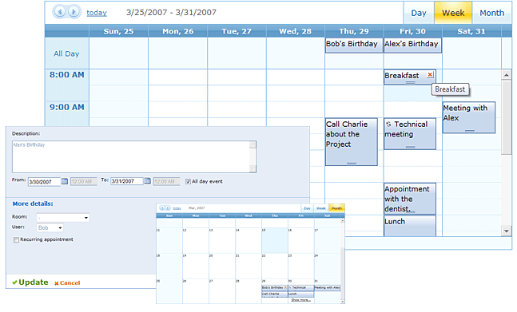

# Scheduler Overview

## 

Using the Telerik __RadScheduler__ control, you can build powerful ASP.NET applications to allow users to create and manage tasks. __RadScheduler__ displays and edits scheduled appointments that are stored in a separate data source.A variety of [data binding]() options allows you to work with data sources that are as simple or as powerful as you want.

Using __RadScheduler__, users can

* [Add](), [edit](),[resize, move, and delete]() appointments.

* Set up recurring appointments, and make exceptions to the recurring series.

* See appointments in [Day, Week, Month, or Resource view](),whichever is most convenient.

* [Navigate]() between different representations of the appointment data.

__RadScheduler__ is highly configurable, letting you customize the user interface to your purpose. You can

* Use [skins]() to customize the look and feel of __RadScheduler__.

* Use [templates]() to customize the appearance of appointments in the scheduler, or the look and behavior of the editors.

* [Replace the edit form]() so that it matches the look and feel of your Web site.

* [Customize the user interface]() to show only those controls you want.

* Add [Custom Resources and Attributes]() to make the information you store with appointments as rich as you want.

* [Localize]() the scheduler for different cultures, including adjusting to different[time zones]().

A rich assortment of both [client-side]() and [server-side]() eventslets you adapt the scheduler's behavior to your own special purposes. The programming API lets you manage [recurring events](),[custom resources](), and even interact with the [ICalendar interface]().

