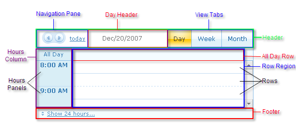
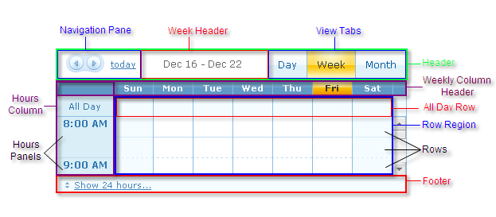

# RadScheduler Structure

The structure of the **RadScheduler** control varies slightly, depending on the [View]():

## Day View structure

* In Day View, **RadScheduler** contains four major regions: a header, an hours column, a row region, and a footer. The header consists of a navigation pane, the day header, and the view tabs. The hours column contains the label for the all day row (if it is present) as well as the hours panels. The row region contains the all day row and several additional rows that can hold appointments. The footer displays the control to toggle between showing a 24 hour day and showing only the hours between the **DayStartTime** and the **DayEndTime**.

## Week View structure

In Week View, **RadScheduler** contains the same four major regions as Day View, plus an additional region:the weekly column header. The header region in Week View differs from that of Day View in that it contains the week header in placeof the day header. The hours column and footer are identical to the regions in Day View. The row region differs in that the rows aredivided into columns for each day of the week. The weekly column header contains labels for each of the columns.

## Month View structure

In Month View, **RadScheduler** contains only three major regions: a header, the monthly column header, and a set ofcells for displaying the appointments for each day. The header region in Month View differs from that of Day or Week View in that itcontains the month header in place of the day or week header. The monthly column header labels each column of cells, and represents aday of the week.Instead of a row region, there are the cells for the days of the month. There is no hours column or footer in Month View.

# See Also

 * [Controlling Appearance]()
