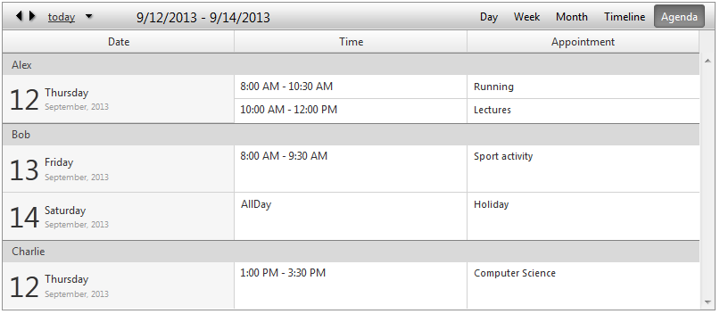

# Agenda View

## Agenda View

As of Q3 2013 the new __Agenda View__ is introduced for the __RadScheduler__ control.

The __Agenda View__ is a table structured like a simple list, which lists appointments for a specific period of time that is defined by the property __NumberOfDays__.

>note Please note that each Appointment represents a separate row. Unlike the other available views in the __RadScheduler__ , it doesn’t have empty rows/cell representing timeslots since days with no appointments are not shown. Therefore user is not able to insert, move or resize appointments . However, editing is allowed and a delete operation could be achievedby using the delete handler shown on hover.
>

## Agenda View Settings:

* __ResourceMarkerType__ - This property will be an enumeration with three values – __None__ (default) , __Block__ and __Bar__. Combined with Resource style mappings, this will enable the appointments to show a colored square or bar at the beginning of the appointment to indicate it’s resource.

* __ResourceColumnWidth__ - Sets the resource column's width when the __RadScheduler__ is grouped by resource.

* __DateColumnWidth__ - Sets the date column's width.

* __TimeColumnWidth__ - Sets the width of the column showing the appointment start and end time.

* __ShowColumnHeaders__ - Shows/hides the header text of all __AgendaView__ columns.

* __NumberOfDays__ - Indicates number of days to be displayed. For example if you want to show a week you can set it that value to 7.

## Grouping

__Agenda View__ will provide full support for Resource and Date grouping, namely:

* Basic look (__Horizontal__ grouping)

* Basic look (__Vertical__ grouping)

* Grouped by Resource (__Horizontal__)

* Grouped by Resource (__Vertical__)

* Grouped by Date, Resource (__Horizontal__)

* Grouped by Date, Resource (__Vertical__)

# See Also>
     
