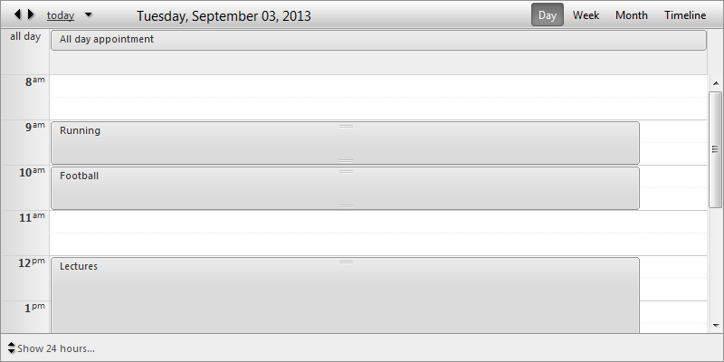
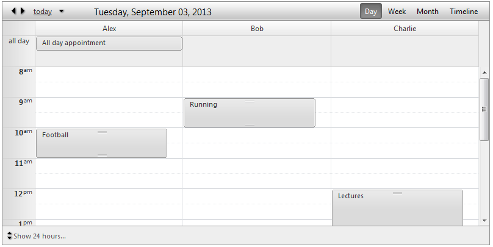

# Day View

## Day View

The __Day View__ is a standard table list, which shows all appointments for a specific day. Each row represents a time span controlled by __MinutesPerRow__ property. One specific feature in __Day__ and __Week View__ is the __All day__ row. This is a special row positioned at the top of the calendar area (when enabled) to show the appointmentsfor the entire day. This is an easy and quick access to your all day appointments without occupying the entire calendar area.

## Day View Settings:

* __DayStartTime__ - Sets the day start time of the current view.

* __DayEndTime__- Sets the day end time of the current view.

* __WorkDayStartTime__- Sets the day start time of the business hours.

* __WorkDayEndTime__- Sets the day end time of the business hours.

* __ShowAllDayRow__- Shows/hides the __all day__ row for all day appointments on the top of the calendar area.

* __EnableExactTimeRendering__- When it is enabled the appointment does not occupy the entire time slot if its start/end time does not match the time slot start/end time. The default value is __false__, so the advanced edit form is the only way to determine what is exact appointment start/end time.

* __ShowAllDayInsertArea__- When enabled it keeps an extra space in the __all day__ row where user to double click and have the ability to add an appointment.

* __ShowHiddenAppointmentsIndicator__- Indicates whether there is an appointment in current non-visible area. Clicking on that indicator will navigate to that area in order to show the appointment.

* __ShowInsertArea__- When enabled it keeps an extra space in each row where user to double click and have the ability to add an appointment.

* __ShowFullTime__- When enabled it shows entire day hours (complete 24 hours) instead of the business hours which is the default behavior (9am to 5 pm).

## Grouping

__Day View__ will provide full support for Resource and Date grouping, namely:

* No groping (Basic look)

* Grouped by Resource (__Horizontal__)

* Grouped by Resource (__Vertical__)

>note Please note that the __DateGrouping__ in __DayView__ (both __Horizontal__ and __Vertical__ ) actually has no difference from the __Horizontal__ Resource Grouping. If you are looking for DateGrouping in __DayView__ please refer to the layout Horizontal Resource Grouping.
>

