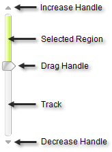

# Slider Overview

## Slider Elements

**RadSlider** was designed to be as simple as possible and consists of the following elements:

* **Increase handle:** Increases the value of the slider by a single step.

* **Selected region:** Visualizes the selected range.

* **Drag handle:** Changes the value of the slider by dragging the handle with the mouse.

* **Track:** Visualizes the slider and changes its value when clicked.

* **Decrease handle:** Decreases the value of the slider by a single step.

## Behavior

Control the position and value behavior of RadSlider by setting [MinimumValue, MaximumValue, Value and LargeChange]() properties. MinimumValue and MaximumValue set the lower and upper bounds that Value can be, Value is the current position of the slider and LargeChange controls the amount of increment or decrement caused by a mouse click on the slider.

## Layout

The layout of RadSlider is controlled by the [Orientation]() property and can be **Vertical** or **Horizontal**.

## Animation

The [AnimationDuration]() property controls the length of the slide animation in milliseconds. If you set AnimationDuration to 0, the drag handle is displayed immediately at the new clicked on value.

## Handles

RadSlider has three "handle" [visual elements](): the drag handle, increment handle and decrement handle. The visibility for handles are controlled by [ShowDragHandle, ShowDecreaseHandle and ShowIncreaseHandle]() properties respectively. Tooltip text for handles is set in the [DragText, DecreaseText and IncreaseText]() properties.

## Mouse Wheel Support

Mouse wheel support is enabled through the **TrackMouseWheel** property (true by default) and further controlled by the **SmallChange** property. **SmallChange** represents the amount that the slider moves in response to the mouse wheel.

## State Persistence

The state of the RadSlider is automatically persisted across partial and full postbacks. All the properties set on the client including the current **Value** property will be available in the code-behind and after page refresh, they will be persisted on the client.

## Multi-Touch Support

The two drag handles of RadSlider can be moved simultaneously when the control is used in a mobile touch device by pressing both of them and dragging.

## See Also

 * [Behavior]()

 * [Layout]()

 * [Animation Duration]()

 * [Handles]()

 * [Mouse Wheel Support]()

 * [Structure]()
