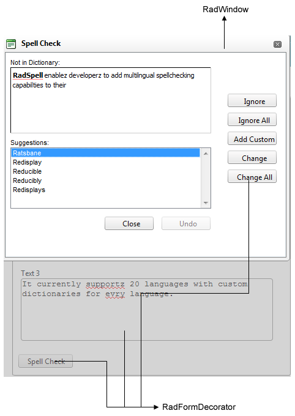

# Creating a Custom Skin

Each of the controls included in the Telerik UI for ASP.NET AJAX suite is styled with two CSS files that are loaded in a certain order. The first one - **ControlName.css**, also called base stylesheet contains CSS properties and values that are common for all skins, i.e it is layout-specific, not skin-specific. These are CSS float, padding, margin, font-size, font-family, etc. In the general case, when creating a custom skin for a control this file should not be edited, unless the custom skin needs different sizes, padding and/ or margins.

The second file represents the actual skin of the control, and its name consists of the control name plus the skin name, e.g. - **Rating.Default.css**. Upon creating a custom skin for the control, one should edit that particular file, as it contains skin-specific CSS properties, and references to images, colors, borders and backgrounds.

Unlike the rest of the controls, **RadSpell**, however uses only one CSS file – **Spell.css**. This is so because **RadSpell** consists of two controls from Telerik AJAX Web UI Suite: **RadFormDecorator** and **RadWidnow**. Each one of these controls is styled with two CSS files that are loaded in a certain order.

**Spell.css RadFormDecorator RadWidnow RadSpell RadFormDecorator RadWidnow**

# See Also

 * [Creating Custom RadFormDecorator Skin](http://www.telerik.com/help/aspnet-ajax/radformdecorator-creating-custom-skins.html)

 * [RadFormDecorator's CSS Classes](http://www.telerik.com/help/aspnet-ajax/formdecorator-css-classes.html)

 * [RadWindow's CSS Classes](http://www.telerik.com/help/aspnet-ajax/appearance-css-classes-usage.html)
