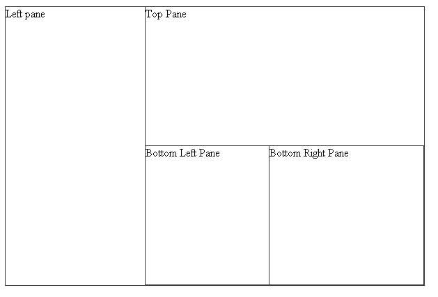

# Fixed Layout

You can use RadSplitter to create several non-resizable regions. To do this, simply add **RadPane** controls to the splitter without any **RadSplitBar** controls between them:



>tip The borders of the panes can be removed by setting the **PanesBorderSize** property to 0.


The layout above was produced by the following declaration:

````ASP.NET	 
<telerik:RadSplitter runat="server" id="RadSplitter1"
   Orientation="Vertical" width="600px" height="400px">
 <telerik:RadPane runat="server" id="LeftPane" Width="200px">
   Left pane
 </telerik:RadPane>
 <telerik:RadPane runat="server" id="RightPane" Width="400px">
   <telerik:RadSplitter runat="server" id="RadSplitter2"
	   Orientation="Horizontal">
	 <telerik:RadPane runat="server" id="TopPane">
	   Top Pane
	 </telerik:RadPane>
	 <telerik:RadPane runat="server" id="BottomPane">
	   <telerik:RadSplitter runat="server"
		   Orientation="Vertical" Width="400px">
		 <telerik:RadPane runat="server" Width="40%">
		   Bottom Left Pane
		 </telerik:RadPane>
		 <telerik:RadPane runat="server">
		   Bottom Right Pane
		 </telerik:RadPane>
	   </telerik:RadSplitter>
	 </telerik:RadPane>
   </telerik:RadSplitter>
 </telerik:RadPane>
</telerik:RadSplitter> 			
````

>tip If you want to make changes to some of the panes at runtime, such as resizing or collapsing them, you can use the [client-side API]().

