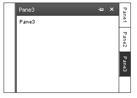
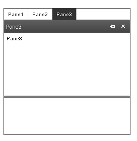

# Sliding Direction

## 

You can position a __RadSlidingZone__ at the left, right, top or bottom end of the splitter. In any of these cases, the __SlideDirection__ property lets you configure the sliding zone so that the panes slide in the expected direction:

* Set the __SlideDirection__ property to "Left" to configure the sliding zone so that panes slide from right to left. When __SlideDirection__ is "Left", the sliding zone lays out its tabs vertically:
>caption 

* Set the __SlideDirection__ property to "Right" to configure the sliding zone so that panes slide from left to right. When __SlideDirection__ is "Right", the sliding zone lays out its tabs vertically:
>caption 

* Set the __SlideDirection__ property to "Bottom" to configure the sliding zone so that panes slide from top to bottom. When __SlideDirection__ is "Bottom", the sliding zone lays out its tabs horizontally:
>caption 

* Set the __SlideDirection__ property to "Top" to configure the sliding zone so that panes slide from bottom to top. When __SlideDirection__ is "Top", the sliding zone lays out its tabs horizontally:
>caption 

# See Also

 * [Specifying Tab appearance]()

 * [Sliding Pane Behavior]()
