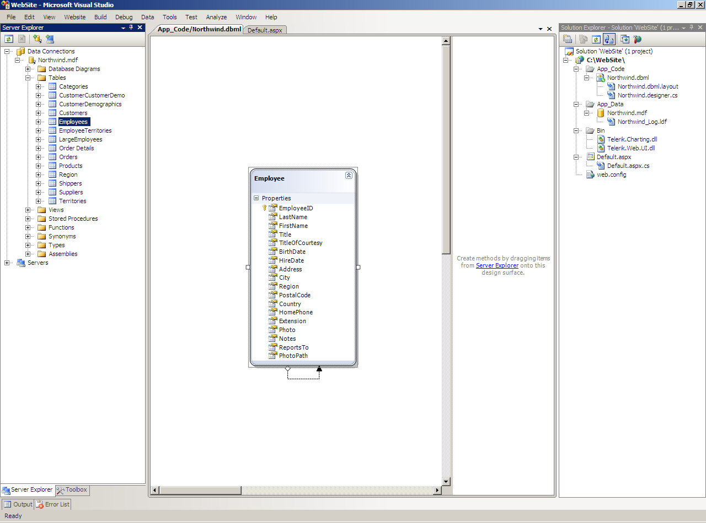
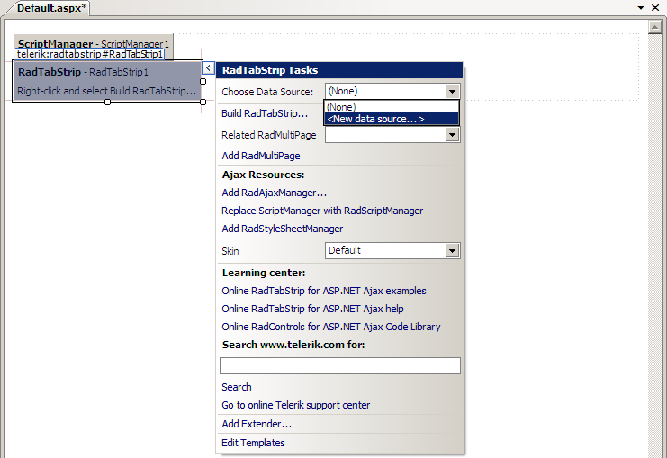
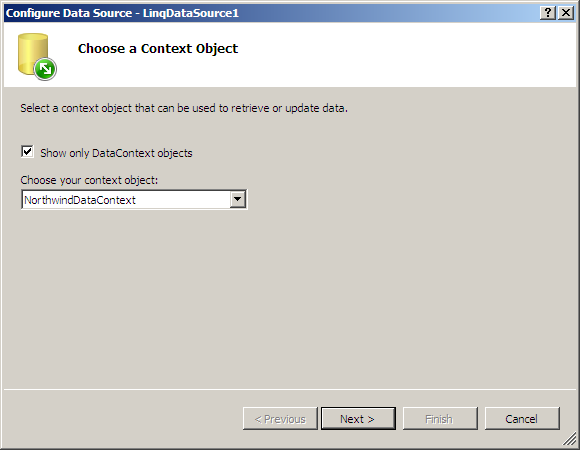
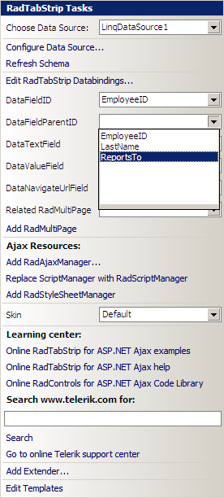
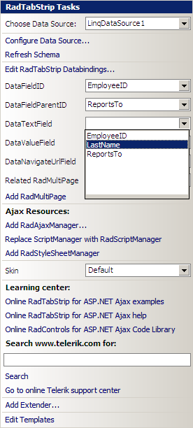
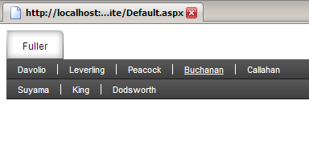

# Binding to LinqDataSource

## 

Since the Q2 2008 SP1 release __RadTabStrip__ supports hierarchical data binding to the [LinqDataSource](http://msdn.microsoft.com/en-us/library/bb547113.aspx) control. This article shows how to do this in Design Time:

1. Create a new Web Site in Visual Studio 2008 and copy the __Northwind.mdf__ database in your __App_Data__ folder.

1. Add a new __"Linq to SQL Classes"__ item named __"Northwind.dbml"__:

1. Open __Northwind.dbml__ in design mode and drag the __Employees__ table from Server Explorer. The __Employees__ table is self referencing and suites perfectly for this example:

1. Open __Default.aspx__ in design mode and drag a new __RadTabStrip__ instance.

1. Open the smart tag and select __"New data source"__:

1. Choose __"LinqDataSource"__ from the "Data Source Configuration Wizard":

1. Configure the newly created data source to use the __NorhtwindDataContext__ object:

1. Select the __"EmployeeID"__, __"LastName"__ and __"ReportsTo"__ columns from the "Configure Data Source" dialog:

1. Click __"Finish"__ and open the __RadTabStrip__ smart tag to complete the configuration.

1. Select __"EmployeeID"__ for the __DataFieldID__ property, __"ReportsTo"__ for the __DataFieldParentID__ property and __"LastName"__ for the __DataTextField__ property:

1. Save your page and run the web site. You should see a page with the following __RadTabStrip__:

# See Also

 * [Overview]()
