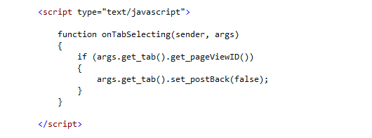

# How To


## 

__Q:__ I get the following error message:*__Multiple controls with the same ID were found. FindControl requires that controls have unique IDs__*. What am I doing wrong?

__A:__ It is very likely that you get this error message when you create your controls at runtime. In general it indicates that you create another control with the same ID on a postback of the page. There are a couple of ways to workaround it:

* To prevent the postback of the page as implemented in our [Load on Demand demo](http://demos.telerik.com/aspnet-ajax/tabstrip/examples/applicationscenarios/loadondemand/defaultcs.aspx) and using the __OnClientTabSelecting__ client side event.

* If you need the page to do a postback you __do not__ need to attach the client-side __OnClientTabSelecting__ event but simply need to check if there is already an existing PageViewId in the __OnTabClick__ server side event handler:

__Q:__ When I use the code below I am able to select the child tab when I click on a parent tab but I cannot load the content of its corresponding page when I use NavigateUrl property:

````JavaScript
	 <script type="text/javascript">
	
	     function ClientTabSelectedHandler(sender, eventArgs) {
	         var tab = eventArgs.get_tab();
	         if (tab.get_tabs().get_count() > 0) {
	             tab.get_tabs().getTab(0).click();
	         }
	     }
	
	     </script>
````


__A:__ You may add this code to your RadTabStrip control so that you can get the desired behavior:

````JavaScript
	
	      <script type="text/javascript">
	
	          function ClientTabSelectedHandler(sender, eventArgs) {
	              var tabStrip = sender;
	              var tab = eventArgs.get_tab();
	              if (tab.get_tabs().get_count() > 0) {
	                  tab.get_tabs().getTab(0).click();
	                  var url = tab.get_tabs().getTab(0).get_navigateUrl();
	                  document.location.href = url;
	              }
	          }
	    </script>
````


````ASPNET
	
	    <telerik:RadTabStrip id="RadTabStrip" runat="server" Skin="Outlook" EnableViewState="False" OnClientTabSelected="ClientTabSelectedHandler">
	      <Tabs>
	        <telerik:RadTab runat="server" Text="RootTabLevel0Tab0" NavigateUrl="~/Tabs/Home.aspx"></ telerik:RadTab>
	        <telerik:RadTab runat="server" Text="RootTabLevel0Tab1">
	         <Tabs>
	            <telerik:RadTab runat="server" Text="ChildTabLevel1Tab0" NavigateUrl="~/Tabs/ChildTabContent0.aspx"></telerik:RadTab>
	            <telerik:RadTab runat="server" Text="ChildTabLevel1Tab1" NavigateUrl="~/Tabs/ChildTabContent1.aspx"></telerik:RadTab>
	            <telerik:RadTab runat="server" Text="ChildTabLevel1Tab2" NavigateUrl="~/ Tabs/ChildTabContent2.aspx"></telerik:RadTab>
	          </Tabs>
	        </ telerik:RadTab>
	      </Tabs>
	    </ telerik:RadTabStrip>
	
````


__Q:__ Can I do Intended-vertical-left align tabs? If so, how can it be done?

__A:__ By using the *OuterCssClass=""* and *CssClass* proprties of the RadTabstrip control along with the right css class selectors you can achieve the desired look. Example:

````ASPNET
	
	    <style type="text/css">
			.border
			{	border-bottom: 1px solid grey; }
			 .RadTabStripVertical li.rtsLI .new, .new
			{	padding-left: 10px !important;}
			.RadTabStripVertical li.rtsLI .new1, .new1
			{	padding-left: 20px !important;	}
			.RadTabStripVertical li.rtsLI .new2, .new2
			{	padding-left: 30px !important;}
		</style>
````


````ASPNET
	    <telerik:RadTabStrip ID="Radtabstrip1" runat="server" SelectedIndex="1" Orientation="VerticalLeft">
			<Tabs>
				<telerik:RadTab ImageUrl="VImg/icon_05.gif" Text="Management" CssClass="border">
				</telerik:RadTab>
				<telerik:RadTab ImageUrl="VImg/icon_02.gif" Text="Scheduling" OuterCssClass="new" CssClass="border">
				</telerik:RadTab>
				<telerik:RadTab ImageUrl="VImg/icon_03.gif" Text="Meetings" OuterCssClass="new1" CssClass="border">
				</telerik:RadTab>
				<telerik:RadTab ImageUrl="VImg/icon_04.gif" Text="Briefcase" OuterCssClass="new2" CssClass="border">
				</telerik:RadTab>
				<telerik:RadTab ImageUrl="VImg/icon_01.gif" Text="Settings">
				</telerik:RadTab>
			</Tabs>
		</telerik:RadTabStrip>
````


