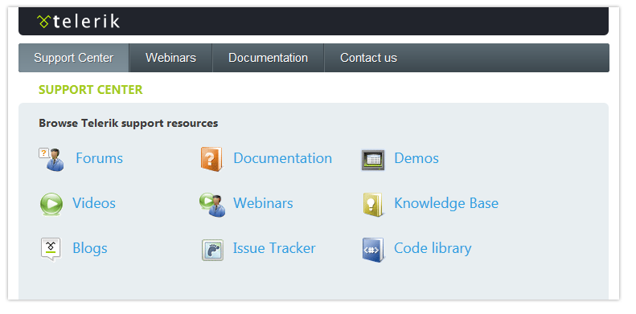

# Integrating with  RadTabStrip

## 

Even if **RadMultiPage** and **RadTabStrip** can be used independently of each other, these controls are best used together. When **RadMultiPage** is used with **RadTabStrip**, it represents the content area of **RadTabStrip**.

The screenshot below shows **RadTabStrip** together with **RadMultiPage**:



To integrate **RadTabStrip** with **RadMultiPage**, set the **MultiPageID** property of **RadTabStrip** to the **ID** of the **RadMultiPage** control.

Once the **RadMultiPage** control is attached to the **RadTabStrip**, its page views are automatically linked to the tabs in the tab strip as follows:

* When selected, the first tab displays the first page view, the second tab displays the second page view, and so on. The order of tabs in the **RadTabStrip** follows a depth first pattern: that is, the children of the first tab are before the second root level tab.

* If the **RadMultiPage** control contains more page views than there are tabs, the last page views are ignored.

* If the **RadTabStrip** contains more tabs than there are page views, the last tabs do not display a page view.

Additionally, each tab in **RadTabStrip** has a property named **PageViewID**, which assigns a specific page in the **RadMultiPage** control that will be switched upon clicking on this tab.

Here is an example definition of **RadTabStrip** connected to a **RadMultiPage**:

````ASPNET	
<telerik:RadTabStrip ID="RadTabStrip1" SelectedIndex="0" runat="server" MultiPageID="RadMultiPage1" skin="Outlook" CssClass="NoBg">
 <Tabs>
   <telerik:RadTab runat="server" Text="Root RadTab1" PageViewID="PageView1">
   </telerik:RadTab>
   <telerik:RadTab runat="server" Text="Root RadTab2" PageViewID="PageView2">
   </telerik:RadTab>
   <telerik:RadTab runat="server" Text="Root RadTab3" PageViewID="PageView3">
   </telerik:RadTab>
 </Tabs>
</telerik:RadTabStrip>
<telerik:RadMultiPage id="RadMultiPage1" runat="server" SelectedIndex="0" Width="400">
  <telerik:RadPageView id="PageView1" runat="server">
      Name: John Smith<br />
      Birthday: October 20th 1976<br />
      Marital Status: Single
      <br />
  </telerik:RadPageView>
  <telerik:RadPageView id="PageView2" runat="server">
      ...
      Content of the Pageview2
      ...
  </telerik:RadPageView>
  <telerik:RadPageView id="PageView3" runat="server" ContentUrl="http://www.telerik.com">
      This text is never shown
  </telerik:RadPageView>
</telerik:RadMultiPage> 	
````


>caution Note that the order of the pages is reversed: the first tab switches to the last page, and the last tab switches to the first page. This is to illustrate that you can assign any page to any tab.
>


You can load any external content into a **RadPageView** control by setting the **ContentUrl** property to the URL for the source of the content. Take a look at the "*Pageview3*" from the example above.

>caution If the **RadPageView** control contains any controls or text, they are discarded when you set the **ContentUrl** property.
>


