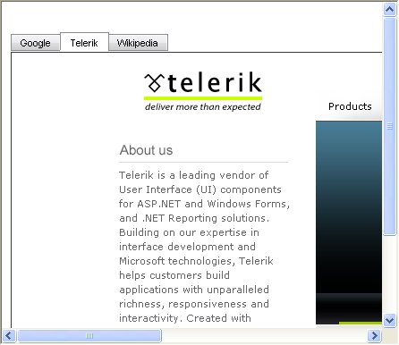

# RadMultiPage Scroll Bars

Set the __ScrollBars__ property of the __RadMultiPage__ control to specify how you want the page views that it contains to handle scrolling:

* When __ScrollBars__ is "None" (the default), the page view expands to fit its content.

* When __ScrollBars__ is "Hidden", the page view clips its content to fit the dimensions of the page.

* When __ScrollBars__ is "Both", the page view displays both horizontal and vertical scroll bars. The scroll bars are disabled if the content fits inside the page.

* When __ScrollBars__ is "Horizontal", the page view displays a horizontal scroll bar, but expands vertically to fit the height of its content.

* When __ScrollBars__ is "Vertical", the page view displays a vertical scroll bar, but expands horizontally to fit the width of its content.

* When __ScrollBars__ is "Auto" the page view displays scroll bars only when the content exceeds the dimensions of the page.

The following screen shots illustrate some of these options:

## ScrollBars is "None": page view expands

## ScrollBars is "Hidden": page view clips

## ScrollBars is "Auto": page view shows scroll bars as necessary

