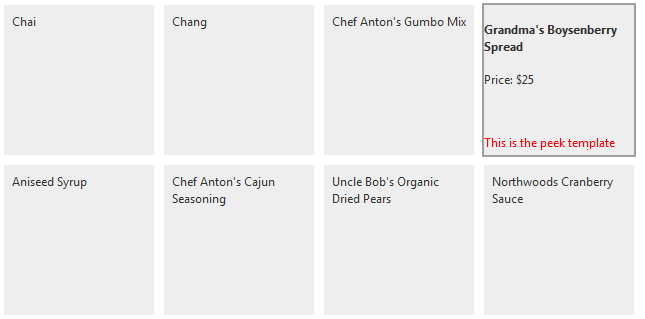

# OnClientTileDataBound


This article demonstrates how the __OnClientTileDataBound__ event can be used to further configure the Tile elements via its client-side API.

## 

The __OnClientTileDataBound__ event is raised when the tile is bound to the fetched data.

The event handler receives two arguments:

1. the [RadTileList object]() that fired the event

1. an event arguments object that exposes the following methods


>caption OnClientTileDataBound event arguments object

|  __Name__  |  __Return type__  |  __Arguments__  |  __Description__  |
| ------ | ------ | ------ | ------ |
|get_dataItem()|object||Gets the data source object.|
|get_tile()|object||Gets the client-side object of the bound tile.|

__Example 1__ demonstrates how to use the __OnClientTileDataBound__ event to configure the	[PeekTemplateSettings]() client-side.	The result of the sample code is shown in __Figure 1__.
>caption Figure 1: Shows the configured Peek Template



__Example 1__: Using __OnClientTileDataBound__ event to define Peek Template settings.

````ASPNET
			<telerik:RadClientDataSource runat="server" ID="RadClientDataSource1" PageSize="8" AllowPaging="true">
				<DataSource>
					<WebServiceDataSourceSettings BaseUrl="http://demos.kendoui.com/service/">
						<Select Url="products" DataType="JSONP" />
					</WebServiceDataSourceSettings>
				</DataSource>
			</telerik:RadClientDataSource>
			
			<telerik:RadTileList runat="server" ID="RadTileList1" Height="400" 
				ClientDataSourceID="RadClientDataSource1" OnClientTileDataBound="OnClientTileDataBound">
				<DataBindings>
					<CommonTileBinding TileType="RadTextTile" DataNameField="ProductID" />
					<TextTileBinding DataTextField="ProductName" />
					<ClientTilePeekTemplate>
						<h4>#=ProductName#</h4>
			            <p>Price: $#=UnitPrice#</p>
						<br/>
						<br/>
						<span style="color:red;">This is the peek template</span>
					</ClientTilePeekTemplate>
				</DataBindings>
			</telerik:RadTileList>
			
			
			<script type="text/javascript">
				function OnClientTileDataBound(sender, args) {
					var tile = args.get_tile();
	
					tile.set_peekShowInterval(0);
					tile.set_peekCloseDelay(0);
					tile.set_showPeekTemplateOnMouseOver(true);
					tile.set_hidePeekTemplateOnMouseOut(true);
					tile.clearPeekShowInterval();
				}
			</script>
````


# See Also

 * [Client-side Data Binding]()
