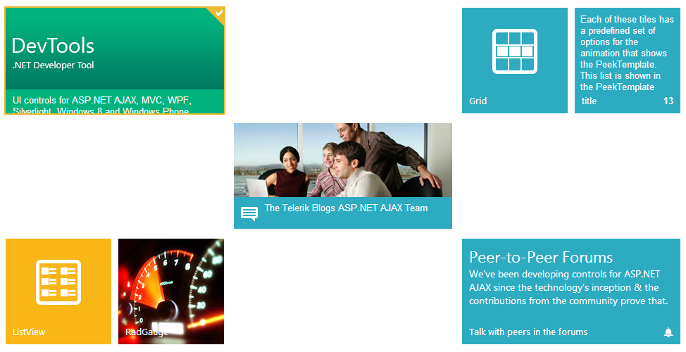

# Tiles Overview

The __RadTile__ is a flexible UI component that brings the new Windows 8 Start Menu interface into the web applications	and sites. In the previous version of Telerik UI for ASP.NET AJAX they were used as a set of components in the [RadTileList]().Since __Q3 2013__ the Tiles can be used as a separate control outsife of [RadTileList]().

## Tile Types

The various tile types that are available are:

* [RadContentTemplateTile]()

* [RadIconTile]()

* [RadImageAndTextTile]()

* [RadImageTile]()

* [RadLiveTile]()

* [RadTextTile]()

## Common settings

The main feature and purpose of the control is [navigation]() andit is controlled through the __NavigateUrl__ and __Target__ properties.

Each Tile has a __Shape__ that controls how its __position and size__ according to the other tiles.The possible values are __Square__ (the default one, 150x150 pixels) and __Wide__(310x150 pixels).

Tiles can be easily designed and positioned in every part of the document.

[Selection]() of tiles is also a major and can be preselected byusing their __Selected__ boolean property.

The __Name__ property can be used to uniquely identify a tile (e.g. to get a reference to it) or to store some relevant informationabout it. It is an arbitrary string that should be unique among the collection of tiles. If duplicates are present onlythe first instance will be returned by the control.

The __general appearance__ of the tiles is primarily controlled throgh the specific content set to each of them,yet there are some common properties for each tile:

* __BackColor__ will set the background of the tile and will override the default color that comes from the skin

* __ToolTip__ can be used to set the title attribute of the tile's HTML element and thus the browser will show a tooltip for it

* Properties like __BorderStyle, BorderWidth, BorderColor, ForeColor, Font-Bold, Font-Size, etc.__ can be usedto change the appearance of the tile as they toggle the basic CSS properties of its content - border, font, etc.

* Setting the __Width__ and __Height__ of each tile will override their default size.

>note Custom dimensions are supported only for __[standalone tiles](http://demos.telerik.com/aspnet-ajax/tilelist/examples/standalonetiles/defaultcs.aspx)__ and they can break the layout when used for tiles inside a __RadTileList__ . Tiles used in a __TileList__ only support the built-in dimensions (the __Wide__ and __Square__ options in the __Shape__ property).
>

The [Peek Template]() inner tag allows the declaration of a secondary content.Its behavior is controlled through the __PeekTemplateSettings inner tag__.

The [Title and Badge]() inner tags allow the developer to control the additional informationeach of these elements shows on the tile.

Here is an example of what you can achieve with the control:

# See Also

 * [RadTileList overview]()
