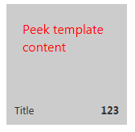

# Peek Template


## Overview

The **PeekTemplate** of each tile is the HTML that replaces the default content at certain intervals or user actions. It can be defined freely by the developer to adapt the control to a variety of scenarios, e.g. show additional information about a product, pricing, more images or even server controls with more complex data, structure and functionality.

Since the template is entirely customizable it has no predefined dimensions, so they can be specified by the developer -the new content can cover the entire tile, go outside of the tile (overflowing content will be clipped) or hide only a part of the tile, starting from the top left corner if its size is smaller than the size of the tile.

You can find examples in the [RadTileList Overview demo](http://demos.telerik.com/aspnet-ajax/tilelist/examples/overview/defaultcs.aspx).

## Configuration

These screenshots:  and  result from the following code when the tile peeks automatically:

**RadTileList** example:

````ASP.NET
<telerik:RadTileList runat="server" id="RadTileList1">
	<Groups>
		<telerik:TileGroup>
			<telerik:RadTextTile Text="Original content of the tile.">
				<Title Text="Title"></Title>
				<Badge Value="123" />
				<PeekTemplate>
					<div style="width: 110px; height: 110px; padding: 20px; background-color: #cccccc; color: #ff0000; font-size: 16px;">
						Peek template content
					</div>
				</PeekTemplate>
				<PeekTemplateSettings CloseDelay="5000" ShowInterval="3000" />
			</telerik:RadTextTile>
		</telerik:TileGroup>
	</Groups>
</telerik:RadTileList>
````


Standalone **Tile** example:

````ASP.NET
<telerik:RadTextTile ID="Tile1" runat="server" Text="Original content of the tile.">
	<Title Text="Title"></Title>
	<Badge Value="123" />
	<PeekTemplate>
		<div style="width: 110px; height: 110px; padding: 20px; background-color: #cccccc; color: #ff0000; font-size: 16px;">
			Peek template content
		</div>
	</PeekTemplate>
	<PeekTemplateSettings CloseDelay="5000" ShowInterval="3000" />
</telerik:RadTextTile>
````


where, of course, the inline styles can be extracted to CSS classes to create uniform look throughout the control, page or even site.

The defauls size of the tiles is 150x150 and 310x150 pixels for the Square and Wide tiles respectively. The dimensions of the peek templatein this example are set to 110x110 so that the 20px padding on each side fills the div to 150x150px.

How and when the peek template is shown can be controlled via the **`<PeekTemplateSettings />`** inner tag in each tile. It exposes the following properties:

* Animation - the type of animation that is used for showing and hiding the Peek Template.See the following section for details on configuring animations and timings.

* AnimationDuration - how long the animation lasts, in milliseconds. Defaults to 500ms.

* CloseDelay - how long the PeekTemplate is shown, in milliseconds. DEfaults to 7000ms. Disabled when set to 0.

* Easing - what is the easing the animation uses. Applicable only for resize and slide types of animation.

* HidePeekTemplateOnMouseOut - if set to true the peek template will hide when the mouse goes out of the given tile,regardless of the automatic timers.

* ShowInterval - how long the original content is shown, before the peek template starts showing. Defaults to 10000ms. Disabled when set to 0.

* ShowPeekTemplateOnMouseOver - if set to true the peek template will be shown when the mouse goes in the given tile,regardless of the automatic timers.

>tip Set CloseDelay and ShowInterval to 0 and the automatic timers will be disabled.
>Set the ShowPeekTemplateOnMouseOver and HidePeekTemplateOnMouseOut	properties to true and the user will see the peek templates only when he/she hovers over the tile, without distracting changes on the page while	his/her attention is elsewhere.


## Controlling Animations and Timing

The **ShowInterval** and **CloseDelay** properties control how long the given templates are shown. These automatic timers start counting down once the transition animations finish, so they are the full time each content is shown. The **AnimationDuration** adds its own amount to the total time each full cycle takes. Here is how the timing of the control work in the simplest case:

1. The control loads initially on the page. The ShowInterval timer starts ticking.

1. The ShowInterval timer finishes and animation starts to show the peek template.

1. The animation finishes according to the AnimationDuration property and the CloseDelay timer starts counting down.

1. The CloseDelay timer finishes and the animation that will show the original content starts.

1. The animation finishes according to the AnimationDuration property and the ShowInterval timer starts counting down. The cycle begins anew.

When **ShowPeekTemplateOnMouseOver** is set to true and the mouse moves over the tile that has this property set its ShowInterval timer is reset and the animation that will show the PeekTemplate starts immediately. Similarly, the **HidePeekTemplateOnMouseOut** property immediately starts showing the original content and resets the CloseDelay timer.

If animations are not enabled their duration can be considered 0 in order to calculate timings with the above logic.

There are three types of animations in the `Telerik.Web.UI.PeekTemplateAnimation` enum:

* None - no animation is used. This is the default value.

* Resize - shows the PeekTemplate container with a size increase from 0 to the size set in its properties, beginning in the top left corner.

* Fade - shows the PeekTemplate container with a change of the opacity from transparent to opaque. Does not support easing.

* Slide - slides the PeekTemplate container from the bottom of the tile and it shifts the original content upwards until it is hidden.

Additional motion effects added to the animation are called easing. For example, instead of smooth scrolling for the Slide animation, the slide can be fast initially and slow down before the end of the animation; or the resize can first reach dimensions larger than	the specified, then swing back to smaller and then reach the original. The available options for the easing are:

* swing

* easeLinear

* easeInQuad

* easeOutQuad

* easeInOutQuad

* easeInCubic

* easeOutCubic

* easeInOutCubic

* easeInQuart

* easeOutQuart

* easeInOutQuart

* easeInQuint

* easeOutQuint

* easeInOutQuint

* easeInSine

* easeOutSine

* easeInOutSine

* easeInExpo

* easeOutExpo

* easeInOutExpo

* easeInCirc

* easeOutCirc

* easeInOutCirc

* easeInElastic

* easeOutElastic

* easeInOutElastic

* easeInBack

* easeOutBack

* easeInOutBack

* easeInBounce

* easeOutBounce

* easeInOutBounce

# See Also

 * [RadTileList Overview demo](http://demos.telerik.com/aspnet-ajax/tilelist/examples/overview/defaultcs.aspx)
