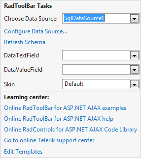

# Smart Tag

The __RadToolBar__ Smart Tag allows easy access to frequently needed tasks. You can display the Smart Tag by right clicking on a __RadToolBar__ control in the design window, and choosing __Show Smart Tag__.

## Unbound Smart Tag

When __RadToolBar__ is unbound, the Smart Tag looks like the following:

Using the unbound __RadToolBar__ Smart Tag you can perform the following:

## RadToolBar Tasks

* __Choose Data Source__ lets you bind the menu declaratively by selecting a data source from a drop-down list of all available data source components. If you select __<New Data Source...>__ the standard Windows [Data Source Configuration Wizard](http://msdn2.microsoft.com/en-us/library/ms247282(VS.80).aspx) appears, where you can create and configure a data source component.

* __Build RadToolBar...__ opens the [RadToolBar Item Editor](), where you can create and configure statically-defined buttons for your toolbar.

## Ajax Resources

* __Add RadAjaxManager...__ adds a RadAjaxManager component to your Web page, and displays the __r.a.d.ajax Property Builder__ where you can configure it.

* __Replace ScriptManager with RadScriptManager__ replaces the default __ScriptManager__ component that is added for AJAX-enabled Web sites with __RadScriptManager__.

* Add __RadStyleSheetManager__ adds a __RadStyleSheetManager__ to your Web page.

## Skin

The __Skin__ drop-down lets you preview the built-in [skins]() and select one for your menu.

## Learning Center

Links navigate you directly to RadToolBar examples, help, or code library. You can also search the Telerik web site for a given string.

## Edit Templates

Clicking the __Edit Templates__ link brings up a [template design surface]() where you can create or edit the [templates]() your __RadToolBar__ uses.

## Bound Smart Tag

When __RadToolBar__ is bound to a data source, the Smart Tag looks like the following:

Using the bound __RadToolBar__ Smart Tag you can perform any task you can perform with the unbound Smart Tag. In addition, you can choose __Configure Data Source...__ to open the standard Windows [Data Source Configuration Wizard](http://msdn2.microsoft.com/en-us/library/ms247282(VS.80).aspx), where you can configure the currently bound data source component.

Once the Data Source is chosen, you can select each of the following - __DataTextField__and __DataValueField__. These should be fields in the Data Source which will serve data respectively for the __Text__ and __Value__ properties of RadToolBar Buttons.
