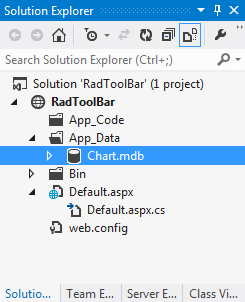

# Binding to a Data Source

## 

This tutorial shows how to bind __RadToolBar__ to an __AccessDataSource__:

1. Locate the file "Chart.mdb" file that appears in the __Live Demos/App_Data__ folder of your __RadControls__ installation. Drag this file to the __App_Data__ folder in the Solution Explorer for your project:
>caption 

1. Drag a __RadToolBar__ component from the toolbox onto your Web page. The __RadToolBar__[Smart Tag](5BB964CF-AA36-443D-824B-60964E411B25) should appear automatically:
>caption 

1. In the __RadToolBar__ Smart Tag, use the __Skin__ drop-down to change the [skin]() for the __RadToolBar__ to "Hay":
>caption 

1. Still in the Smart Tag, open the __Choose Data Source__ drop-down and select __New Data Source__.
>caption 

1. The Data Source Configuration Wizard appears. In the Select a DataSource Type screen, specify an __AccessDataSource__ and click __OK.__
>caption 

1. In the __Choose a Database__ screen, click the __Browse__ button, and select the "Chart.mdb" file. Then choose __Next__ to continue:
>caption 

1. In the __Configure the Select Statement__ screen, choose __Specify columns from a table or view__. Select the "Subcategory" table from the __Name__ drop down, and select the "Id", "Name", and "Category_id" fields:
>caption 

1. Click the __WHERE__ button to add a where clause to your query. In the Add WHERE Clause screen, set the __Column__ to "Category_Id", the __Operator__ to "=", the __Source__ to "None", and set the parameter value to "1":
>caption 

1. Click the __Add__ button to add the WHERE clause, and then click OK.

1. Back in the Configure The Select Statement page, click Next to accept the select statement.

1. Click the Test Query button to see the data from the data source. Then choose Finish to exit the Wizard:
>caption 

1. In the Properties pane for the __RadToolBar__ component:

1. Set the __DataTextField__ property to "Name".

1. Set the __DataValueField__ property to "Id".
>caption 

1. Run the application. Note that the tabs are labelled using the "Name" field of the data source:
>caption 

# See Also

 * [Overview]()

 * [Overview]()
