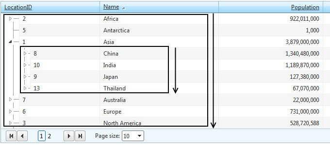

# Sorting

As expected from a sophisticated databound control, __RadTreeList__ offerssorting capabilities that allows the users to conveniently order the items in the desired direction. Toenable this functionality you just have to set __AllowSorting__ property to__true__ and the control will handle the sorting operations automatically.

There are three sort modes:

* __Ascending__ - orders the items in ascending order.

* __Descending__ - orders the items in descending order.

* __None__ - the items are ordered in the way they came from the datasource ("Natural" sort).

__RadTreeList__ also supports sorting by multiple data fields - this is theso-called __Multi-column sorting__. To enable this mode, set the__AllowMultiColumnSorting__ to __true__.

## Sorting in RadTreeList

Due to the self-referencing nature of the control, the sorting takes effect "per-level". Basically,this means that each level of the hierarchical structure is sorted independently. The screenshot belowillustrates this behavior:

## Sorting API

__RadTreeList__ exposes the following properties and methods:

| Property | Description |
| ------ | ------ |
| __AllowMultiColumnSorting__ |Determines whether the multi-column sorting functionality is enabled.|
| __AllowNaturalSort__ |Enables or disables the "natural" sort mode where the items are ordered in the way they came fromthe datasource.|
| __AllowSorting__ |Enables the sorting functionality in RadTreeList.|
| __SortExpressions__ |SortExpressions collection. Contains the expressions that are applied to the control.|
