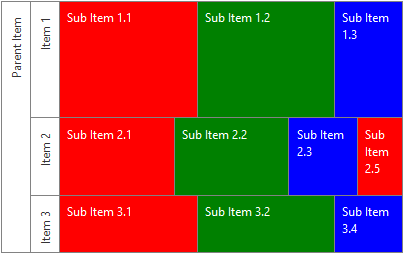

# Colors


The following article demonstrates the usage of the **Colors** property of the **RadTreeMap**.

## 

The **Colors** property of the **RadTreeMap** is a collection of type **System.Drawing.Color**, which provides the ability to set custom colors. The list of colors will be applied on each group of TreeMapItems. If the amount of predefined colors, exceeds the number of items, the coloration stars from the first color all over again.

In the example bellow, you could examine how several colors are assigned to the **Colors** collection of the RadTreeMap and in the **Figure 1**, you could observe how the control is visualized:


````ASPNET
<telerik:RadTreeMap RenderMode="Lightweight" runat="server" ID="TreeMap1"  Height="250" Width="400" AlgorithmType="Horizontal">
    <Items>
        <telerik:TreeMapItem Text="Parent Item">
            <Items>
                <telerik:TreeMapItem Text="Item 1" Value="6">
                    <Items>
                        <telerik:TreeMapItem Text="Sub Item 1.1" Value="2"></telerik:TreeMapItem>
                        <telerik:TreeMapItem Text="Sub Item 1.2" Value="2"></telerik:TreeMapItem>
                        <telerik:TreeMapItem Text="Sub Item 1.3" Value="1"></telerik:TreeMapItem>
                    </Items>
                </telerik:TreeMapItem>
                <telerik:TreeMapItem Text="Item 2" Value="4">
                    <Items>
                        <telerik:TreeMapItem Text="Sub Item 2.1" Value="5"></telerik:TreeMapItem>
                        <telerik:TreeMapItem Text="Sub Item 2.2" Value="5"></telerik:TreeMapItem>
                        <telerik:TreeMapItem Text="Sub Item 2.3" Value="3"></telerik:TreeMapItem>
                        <telerik:TreeMapItem Text="Sub Item 2.5" Value="2"></telerik:TreeMapItem>
                    </Items>
                </telerik:TreeMapItem>
                <telerik:TreeMapItem Text="Item 3" Value="3">
                    <Items>
                        <telerik:TreeMapItem Text="Sub Item 3.1" Value="2"></telerik:TreeMapItem>
                        <telerik:TreeMapItem Text="Sub Item 3.2" Value="2"></telerik:TreeMapItem>
                        <telerik:TreeMapItem Text="Sub Item 3.4" Value="1"></telerik:TreeMapItem>
                    </Items>
                </telerik:TreeMapItem>
            </Items>
        </telerik:TreeMapItem>
    </Items>
</telerik:RadTreeMap>
````

````C#
protected void Page_Load(object sender, EventArgs e)
{
    TreeMap1.Colors.Add(Color.Red); 
    TreeMap1.Colors.Add(Color.Green);
    TreeMap1.Colors.Add(Color.Blue);

    // Another way to populate the Colors collection
    //TreeMap1.Colors.Add(ColorTranslator.FromHtml("Red"));
    //TreeMap1.Colors.Add(ColorTranslator.FromHtml("Green"));
    //TreeMap1.Colors.Add(ColorTranslator.FromHtml("Blue"));
}
````
````VB
Protected Sub Page_Load(sender As Object, e As EventArgs) Handles Me.Load

    TreeMap1.Colors.Add(Color.Red)
    TreeMap1.Colors.Add(Color.Green)
    TreeMap1.Colors.Add(Color.Blue)

    ' Another way to populate the Colors collection
    'TreeMap1.Colors.Add(ColorTranslator.FromHtml("Red"))
    'TreeMap1.Colors.Add(ColorTranslator.FromHtml("Green"))
    'TreeMap1.Colors.Add(ColorTranslator.FromHtml("Blue"))
End Sub
````


**Figure 1**: Demonstrates how the **RadTreeMap** is visualized, when custom colors are set.

**Note** : The sub-items count of **Item 2** exceeds the amount of predefined colors. Therefore, **Sub Item 2.5** has the same color as **Sub Item 2.1**.
